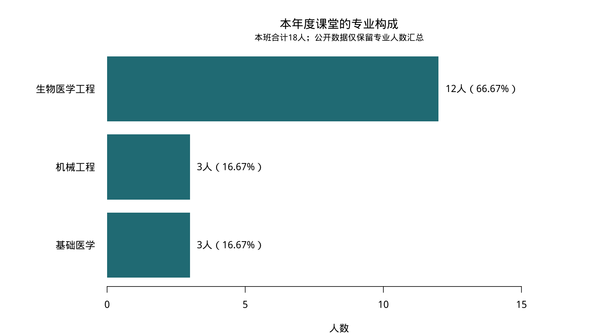
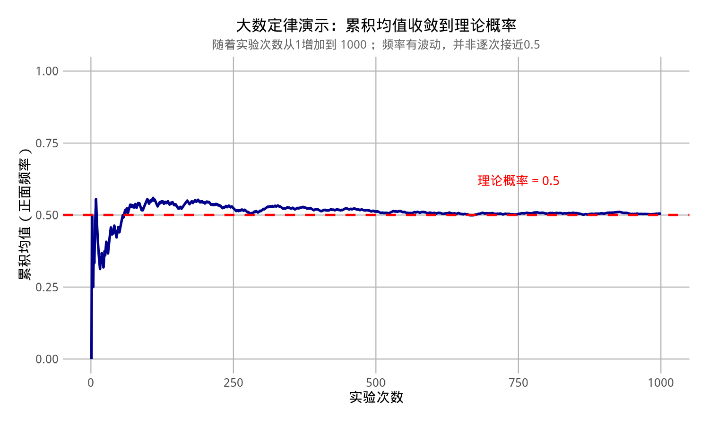

# 明哥的微生物世界 · 统计课堂

本年度医学统计学首课的 R 公开练习：**班级专业构成**与**大数定律的抛硬币模拟**。另附基础语法练习。下载后先完整解压，不要只下载单个脚本。

[下载整个仓库 ZIP](https://github.com/fuyuming/statistics-classroom/archive/refs/heads/main.zip)

## 第二篇：微生物数据的Python与MATLAB入门

新增 [lesson02_microbes](lesson02_microbes/)：人工构造的微生物OD600数据、Python和MATLAB中文注释脚本，以及R对照脚本、基础语法练习和实际结果图。

请先进入该文件夹，再按其README运行。它与下方首课的专业汇总、抛硬币模拟是不同的教学案例。

## 统计课堂（公众号文章配套代码）

统计课堂系列各篇文章的配套代码统一放在 [stats_classroom](stats_classroom/)：

| 公众号 | 主题 | 代码 |
|---|---|---|
| 06 | 变异系数（CV）与几何均数／几何标准差（GM／GSD）——课堂上没展开的两节 | [stats_classroom/article06_cv_geometric_mean](stats_classroom/article06_cv_geometric_mean/) |

请进入对应文件夹，再按该文件夹的 README 运行。

## 首课：开始运行

1. 安装 [R](https://cran.r-project.org/) 和 [RStudio Desktop](https://posit.co/download/rstudio-desktop/)。
2. 双击根目录的 `医学统计学.Rproj`。
3. 第一次在 R Console 安装绘图包：

```r
install.packages(c("showtext", "ggplot2"))
```

4. 在同一个项目中运行：

```r
source("R/00_basics.R", encoding = "UTF-8")
source("R/01_major_composition.R", encoding = "UTF-8")
source("R/02_law_of_large_numbers.R", encoding = "UTF-8")
```

`R/00_basics.R`：类型、向量、列表、数据框、因子、条件、循环与函数。

`R/01_major_composition.R`：读入专业人数汇总表，检查类型和缺失，计算构成比并绘图。

`R/02_law_of_large_numbers.R`：沿用首课的抛硬币模拟逻辑与随机种子，生成每次结果和累计正面频率。

## 数据与结果

`data/major_counts.csv` 每行代表一个专业，列为 `major`（名称）与 `count`（人数）。仅保留3条汇总记录，不包含个人行、原序号、姓名、学号、专业代码、上课方式或联系方式。

| 专业 | 人数 | 构成比 |
|---|---:|---:|
| 生物医学工程 | 12 | 66.67% |
| 基础医学 | 3 | 16.67% |
| 机械工程 | 3 | 16.67% |

分母是人数之和18，不是数据表的3行。比例描述本班，不直接代表全校。四舍五入可能使显示的比例合计为100.01%。



抛硬币模拟使用 `set.seed(2023)`，本次验证环境下1,000次得到504次正面，累计频率0.504。0与1的均值就是正面频率。独立公平模型中，下一次正面的概率始终为0.5；有限次模拟不是大数定律的证明，误差也不保证逐步减少。



`output/01_major_summary.csv` 保存专业构成；`output/02_coin_trials_R.csv` 保存模拟过程。重新运行会更新对应输出，请另存不同参数的结果用于比较。

## 课后练习

- 解释 `nrow(d)` 与 `sum(d$count)` 的区别。
- 改变抛硬币次数与随机种子，解释路径为什么会不同。
- 对照基础练习解释 `if`、`for` 与 `function` 的用途。
- 重新打开项目，从头运行，检查是否依赖旧对象。

## 公开版说明

此版由课堂脚本整理：专业案例改为读取汇总数据，保留统计含义与中文图；概率案例保留模拟逻辑。原始点名册、个人数据、课件文件、个人路径与会话历史未纳入仓库。

运行验证：2026-09-16，macOS、R 4.5.2；三个脚本实际运行，专业合计及模拟结果已核对，中文输出图已检查。软件包版本见 `VALIDATION.md`。Windows安装界面未实机验证。

## 中文显示排查

脚本乱码先按正确编码重新打开，再另存 UTF-8；不要直接覆盖乱码文本。CSV读取要匹配真实编码（本课堂专业CSV为UTF-8 BOM，R使用UTF-8-BOM，Python可用utf-8-sig）。图中中文变方框则检查字体，不要靠修改数据编码处理。R课堂图使用showtext提供的wqy-microhei字体；请从脚本第一行运行。Python与MATLAB中文图需要选本机实际存在的中文字体，分别通过matplotlib字体管理器和listfonts查询。
