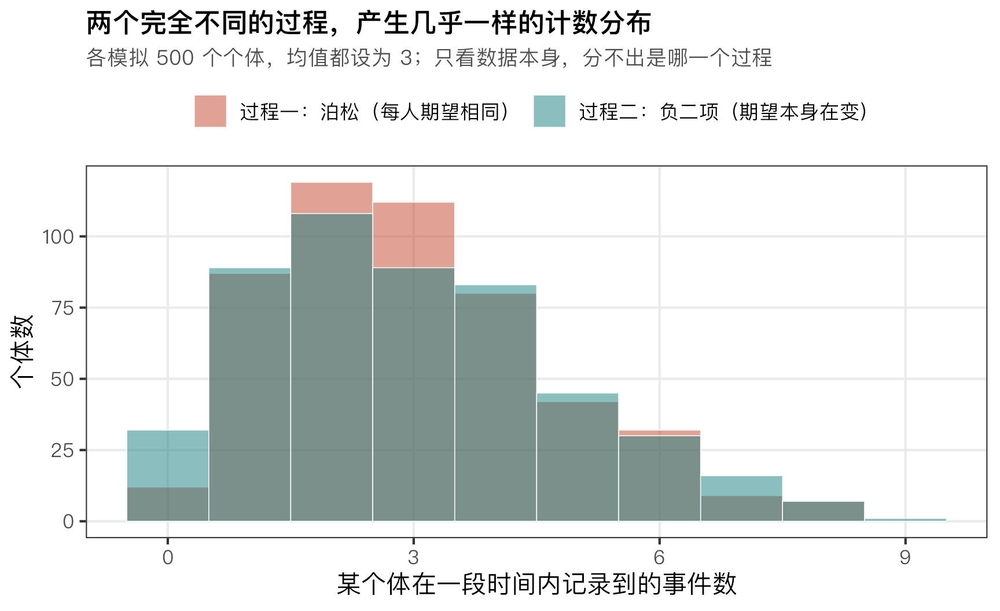
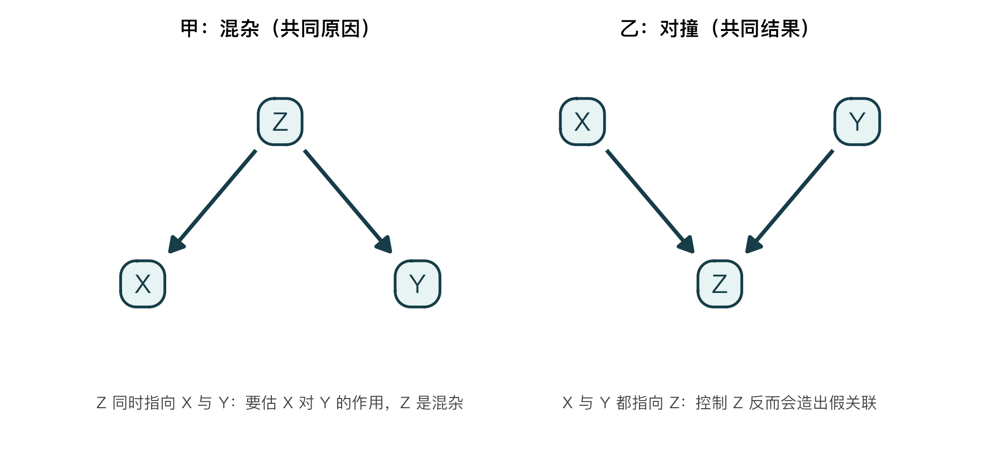
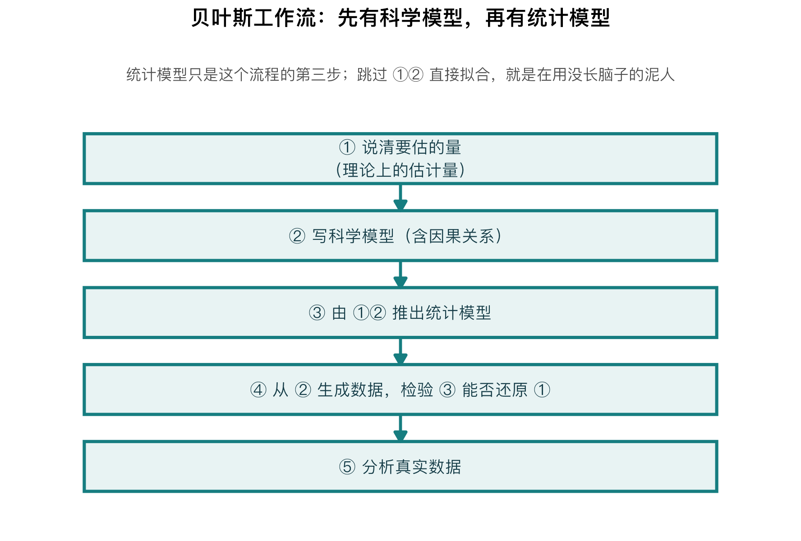
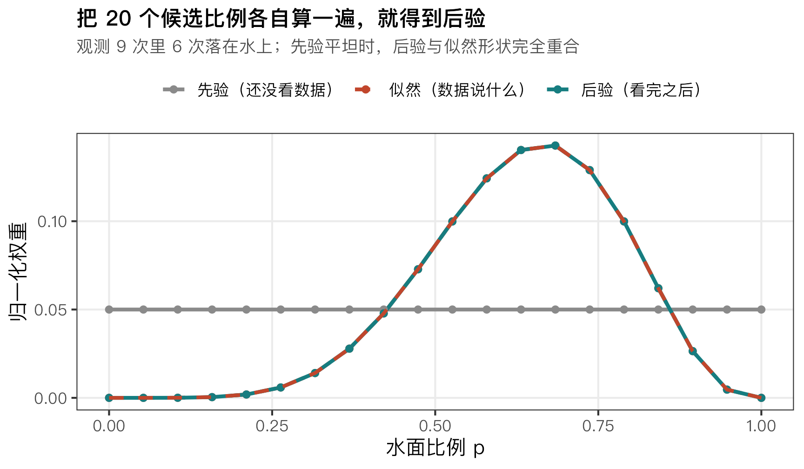
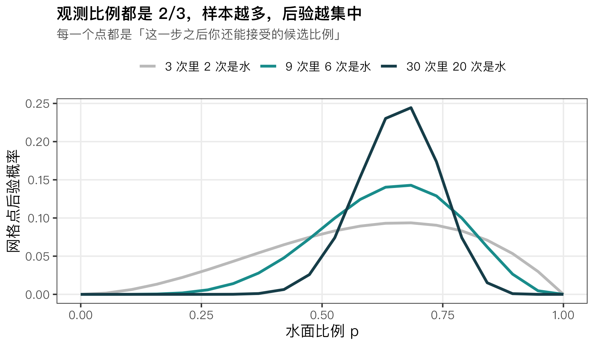

# 接种组长得更好，就能说这株菌有效吗？——统计模型再高级，也分不清是菌还是批次

> 明哥的微生物世界 · Statistical Rethinking 精读 01
>
> 摘要：从一组接种实验讲到地球仪上的 9 个随机点，分清科学假设和统计计算各自负责什么。

大家好，我是明哥。

接种组的植物长得更好，就能说这株菌有促生作用吗？如果接种组全在一批培养，对照组全在另一批，这个差别也可能来自批次。

很多人这时候的反应是换个更复杂的统计模型，把"批次"放进回归，指望软件把两者的贡献分开。第一篇讲的就是为什么这条路走不通：软件本身没毛病，问题是数据里压根没有能让软件把它们分开的信息——这一步得靠你在动手算之前想清楚。

《Statistical Rethinking》精读第一篇，我们就从这个问题开始。它对应第 01 讲，也是全书最"不讲计算"的一讲：它只做一件事——**把统计计算之前该问的问题问清楚。**

学完这一篇，你会知道：为什么拟合得好不等于机制对，为什么"控制变量"不能全加，以及为什么要先造一批自己知道答案的数据。

## 一、模型为什么像一个没有判断力的泥人？

麦氏在第一讲里用一个流传很久的比喻开场。犹太传说中，布拉格的拉比卢尔用泥土捏出一个机器人（Golem），它能干活、力气很大，但没有判断力，也不会预判，只会照着指令办事——所以它危险。

统计模型就是这样：**它能算，而且算得很快，但它不知道你在研究什么。** 你问它什么，它就照答；问题问错了，它也照算不误。

这个比喻有很具体的后果。下面构造一个模拟例子：假设我们记录每片叶片上分离到的某类菌落数，并且用两种不同的生成方式各造一批数据——

- 方式一：每片叶片的期望计数都相同，观测到的波动来自随机计数，按泊松模型产生；
- 方式二：允许叶片之间期望计数本身就有差异，按负二项模型产生。

*图1｜两种生成方式各模拟 500 片叶片，平均事件数都设为 3；两组直方图几乎重合。用配套脚本 篇01_科学先于统计.R 生成。*

两条分布的均值一样、形状接近，**但相近不等于相同**：方式一的方差是 3，方式二的方差是 3.45，只是这点差别在 500 个观测里不显眼罢了。

这里要说清三件不同的事，它们很容易被混成一件：

1. **两个模型都可能产生这份数据**——这很常见，但不说明证据强度相同；
2. **两个模型对单次观测的预测很接近**——上图的直方图确实如此；
3. **两个机制无法由数据区分**——这需要更强的论证，上图给不出这个结论。

**所以，"拟合得好"不能唯一确认机制。** 更多数据可能帮助区分这两个统计模型；即使某个模型拟合更好，也还不能直接确认它背后的生物机制——那要结合实验设计、机制预测和新的观测。这后半句才是麦氏第一讲真正在意的事，下面两节都在讲它。

## 二、为什么说「科学先于统计」？

麦氏有一句话值得抄在实验记录本上：**统计分析的理由不在数据里，而在数据的成因里。**

这话可以拆成三条，每条都对应一个常见的误会：

**第一，统计模型负责"数据长什么样"，科学模型负责"数据为什么会这样"，两者不是一回事。** 一个统计模型当然也包含关于数据生成的假设（比如计数服从泊松），但它不告诉你哪些变量是原因、哪些是结果。

**第二，仅凭变量之间的关联，不能在不加假设的情况下确定因果关系。** 这就是那句 No causes in, no causes out（没有因果进去，就没有因果出来）。你在图 2 里画下的箭头，不画就不会自动出现在结果里。

**第三，即使目标只是描述，也要问清"描述的是谁"。** 算这批样品的生物量均值，是一回事；用它代表全部目标样品，是另一回事。后者要交代这些样品为什么会被采到、哪些样品可能被漏掉。

第三条对我们做实验的人最实际。样品是随手取的，还是按大小、按位置、按存活状态筛过的，直接决定这个均值能代表什么。**取样规则本身就是分析的一部分。**

## 三、因果推断到底在问什么？

因果推断，就是科学模型里必须先说清楚的那一部分。

麦氏给了两个很实在的问法，都不绕：

- **干预的预测**：如果我这样做，会怎样？——预测干预后的结果或结果分布。
- **反事实的填补**：如果我当时那样做，会怎样？——设想没有观察到的那个潜在结果。

要注意后者的边界：**我们通常不能精确恢复某个个体的反事实。** 说"同一株植物如果不接种会怎样"，我们无法真的知道那一株的答案；能做的是在研究设计与假设的支持下，估计一组植物的平均处理效应，或者未观测结果的概率分布。

这正好解释了对照组是干什么用的：**对照组不是某株处理组植物的"另一个自己"。** 合适的随机分组，让两组在平均意义上可比——这就是对照组存在的理由。

## 四、DAG 能帮你什么？

麦氏把有向无环图（DAG，Directed Acyclic Graph）叫"直觉泵"：它不产生答案，它逼你把假设画出来。**箭头代表你提出的因果假设，画出来不等于已经被证明。**

*图2｜左：Z 同时指向 X 与 Y，构成混杂路径；右：X 与 Y 都指向 Z，构成对撞。两图都没有画 X→Y，这里展示的是需要检查的局部路径，实际调整还要看完整因果图。用配套脚本生成。*

这个图最有用的地方，是它直接回答了一个日常问题：**控制变量要不要全部加进去？**

答案是不行，而且两种情况的方向相反。

左图那种结构（混杂），共同原因 Z 打开了 X 与 Y 之间的混杂路径；要估 X 对 Y 的作用，就需要通过合适的设计或调整把这条路径阻断。**注意这里说的是"阻断路径"，不等于"一律把 Z 当协变量加进回归"** ——具体怎么处理，取决于完整因果结构和你要估的效应。

右图那种结构（对撞），则要反过来小心。为什么筛选一个共同结果会制造出关联？举一个假想的例子：

> 假设植株长得好、或者接种确实有效，都可能让它进入"长势优秀"的入选名单。如果我们只分析入选的植株：未接种的那批，往往需要先天长势更好才能入选；接种的那批则不一定。于是"是否接种"和"先天长势"在筛选后的样本里就发生了关联。

问题不在于多测了一个变量，而在于**按一个共同结果筛选了样本**。落到实验操作上就是：不能只保留"长得不错"的植株来比较处理效果，排除和纳入规则同样是分析的一部分。

所以核心句是：**控制变量不能按"测到了就加入"的原则选。** 先说清要估什么效应，再判断哪些路径需要阻断、哪些路径不能因为调整而打开。依据不只来自主观判断——科学知识、时间顺序、实验设计都能提供依据，有些图的可观察含义还可以用数据检验。

## 五、分析真实数据前，为什么要先造一批数据？

假设已经像图 2 那样把因果关系画出来了，接下来的问题是：怎么知道这张图对不对？

第一讲里有一个我打算贴在电脑旁边的流程，麦氏把它画成"贝叶斯猫头鹰"：**它的用途是检查方法，不替读者下结论。**

*图3｜工作流的五个步骤。第 4 步用已知答案的数据检查方法。用配套脚本生成。*

1. **说清目标量**：我们究竟想知道什么？
2. **写科学模型**：把因果假设写进去，包括处理、批次、取样如何影响观测。
3. **由 1、2 推出统计模型**：这一步才轮到我们熟悉的回归、检验。
4. **从第 2 步生成数据，检验第 3 步**：注意模拟需要具体的生成规则，光有一张 DAG 不够。
5. **分析真实数据**。

**第 4 步是这套流程和"跑个回归看看"之间最大的差别。** 它的正确用法是：在设定好的机制和参数下反复生成数据，检查方法能否合理恢复目标量，以及它报告的不确定性是否可信。

如果方法在这些模拟条件下反复失灵，先查清原因，再去解释真实数据。反过来，模拟通过了也只说明它通过了这些设定下的考验——**模拟不是通行证，是一道关。**

## 六、只看 9 个随机点，能知道地球有多少水吗？

概念讲完，需要一次完整的计算。第一讲用的例子特别朴素：在地球仪表面随机取点，判断取到的是水还是陆地，用有限的几个点去估水面占比。

取 9 个点，其中 6 个落在水上。要得到"水面比例可能是多少"，先要交代这套取点的前提：**每次取点相互独立，球面上每个等面积区域被选中的机会相同，而且水陆判定没有错误。** 在这些条件下，单次取到水的概率才等于水面面积比例，落在水上的点数才能按二项模型计算——这就是上一节说的"先写清楚数据怎么来的"。

然后怎么做？把 0 到 1 之间的 20 个候选比例各算一遍：**对每个候选比例，问一次"如果水面比例真是它，出现'9 次里恰好 6 次落在水上'的可能性有多大"；再乘上它事先的权重（先验）；最后归一化。**

为什么要相乘再归一化？

> 给每个候选比例一张"权重票"。先验决定它在看数据之前有多少票；似然决定它对这次观测有多相容。两者相乘，得到看完数据后的相对权重；再除以全部权重之和，让它们加起来等于 1。**贝叶斯更新做的就是这一次有规则的重新分配。**

用一行公式压实：

$$
候选 i 的后验权重 = \frac{先验权重_i \times P(观测 \mid p_i)}{\sum_j 先验权重_j \times P(观测 \mid p_j)}
$$

*图4｜横轴是 20 个候选水面比例。灰线是各候选的先验权重（这里是平坦先验，每个候选一视同仁）；红色虚线是为了便于比较而**归一化后**的似然权重，它衡量"假如候选比例成立，出现 9 次里 6 次是水"的相对可能性；青线是后验权重。先验平坦时，归一化后的似然与后验重合。**似然本身不是参数的概率分布。** 用配套脚本生成。*

跑出来的结果是：

| 观测 | 后验均值 | 最大后验网格点 | 89% 等尾可信区间（20 点网格近似） |
|---|---|---|---|
| 3 次里 2 次是水 | 0.598892 | 0.684211 | 0.2632 – 0.8947 |
| 9 次里 6 次是水 | 0.636382 | 0.684211 | 0.4211 – 0.8421 |
| 30 次里 20 次是水 | 0.656250 | 0.684211 | 0.5263 – 0.7895 |

三点说明：

**第一，连续后验的众数就是 2/3**，但 20 点网格没有包含 2/3 这个点。逐点比较后，最大后验权重落在 13/19 ≈ 0.6842，也就是网格里的第 14 个点。加密网格会让这个计算结果更接近连续后验的众数——**它不会凭空增加数据提供的信息。** 至于 MCMC，那是参数多起来、后验形状复杂起来之后才必须用的工具，本系列后面再讲。

**第二，三组观测比例都是 2/3，但样本量不同，后验的集中程度不同。** 均值从 0.598892 挪到 0.656250，89% 区间从 0.26–0.89 收窄到 0.53–0.79。

*图5｜三条曲线对应上表三行，观测比例相同、样本量不同。纵轴是网格点上的后验概率。用配套脚本生成。*

注意这里的措辞要有限定：**在这三组观测比例相同、使用同一个先验的数据中**，样本量越大，后验越集中。一般来说，新数据既可能移动后验的位置，也可能改变它的宽度——如果数据与原来的判断冲突，后验不会"越来越窄"这么简单。

**第三，89% 区间是什么意思？** 贝叶斯分析用概率分布表达我们对未知水面比例的不确定性。后验是连续的，把两端各留出 5.5% 的后验概率、中间保留 89%，就得到等尾可信区间。它可以读作：**在这一篇所用的模型、先验和这 9 个点的条件下，水面比例落在这个区间内的后验概率是 89%。** 这不意味着地球的水面比例在随机变化，而是我们还不知道它。

不过这里用的网格只有 20 个点，离散概率不能随意切开：端点取整后，上面三段区间实际包含的后验概率分别是 **92.67%、91.88%、95.05%**，不是正好的 89%。网格加密会让它更接近 89%——**计算精度和统计推断是两件事，前者能算得更细，后者取决于数据本身给了多少信息。** 完整数字与复算记录见配套的 VALIDATION.md。

现在可以回答开头的问题了。数据做的事，是在这几组观测下**让后验更集中**。但集中不等于问对了问题：如果取点装置特别容易碰到地球仪朝上的那一面，后验照样会随着观测增加而变窄，而我们估的是这台装置取到水的概率，未必是全球水面比例。

实验里也是一样。**如果处理组全在一个批次、对照组全在另一个批次，重复测量更多次，并不能自动把处理效应和批次效应分开。** 事后把"批次"加进回归，也补不回缺失的比较——更有用的做法是在批次内安排处理与对照，并随机分配。回想第一节那句"拟合得好不等于机制对"，说的就是这件事。

## 七、动手：改动数据和先验，后验会怎样？

配套脚本里都写好了，先记下你的预测，再跑。

1. **把一个较低的观测比例代进去**，比如 9 个点里只有 3 个落在水上。看看后验均值和 89% 区间往哪边动——先猜，再跑。
2. **把先验从平坦换成一个偏向 0.5 的三角形先验**（脚本里有一行可以直接启用）。观测仍是 9 次里 6 次落在水上，看后验被拉动了多少；**再把观测改成 30 次里 20 次落在水上**（注意：次数和总数要一起改，否则观测比例也变了），看看还拉得动吗。

第 2 个练习值得认真做一遍：它会让你直接看到，在这个例子里，固定用同一个先验、让观测比例保持相近，样本量增加通常会减弱先验对结果的影响。

## 结尾

一句可以带走的话：**先说清要估哪个因果效应、数据是怎么来的，再用模拟数据把方法考一遍，最后才轮到真实数据说话。**

这里是"明哥的微生物世界"。这个系列按 McElreath 公开课 2023 版的顺序走，一讲一篇，从基础到高级，共 20 篇；下一篇从这里最核心的一步讲起：**分岔数据的花园**（the garden of forking data）——贝叶斯推断为什么可以看成"数路径"。欢迎把跑出来的数字，或者觉得没讲清楚的地方发给我。

---

### 教材与资料

- McElreath, R. (2020). *Statistical Rethinking: A Bayesian Course with Examples in R and Stan*（第 2 版）. CRC Press. 本篇主体对应第 1 章 The Golem of Prague 与第 2 章 Small Worlds and Large Worlds；可信区间的讨论在第 3 章；DAG 与混杂、对撞的系统展开在第 5、6 章，本篇只作预览。
- 中文版：《统计反思：用R和Stan例解贝叶斯方法》，林荟 译，机械工业出版社，2019 年。**中文版译自英文第 1 版，章节顺序与代码和第 2 版有出入，本系列按第 2 版讲。**
- 想完全用 tidyverse 语法和 brms 复现书里的代码，看这本配套书：Kurz, A. S. (2023). *Statistical Rethinking with brms, ggplot2, and the tidyverse: Second Edition*. <https://bookdown.org/content/4857/>。
- 运行环境：R 用 RStudio，Python 用 Spyder（安装说明见后续第 03 篇）。
- 本篇三个语言的脚本与运行结果放在公开仓库：<https://github.com/fuyuming/statistics-classroom/tree/main/rethinking/article01_bayesian_workflow>（仓库 ZIP：<https://github.com/fuyuming/statistics-classroom/archive/refs/heads/main.zip>）。三份输出逐位一致，对照记录见该目录的 VALIDATION.md。
- 课程主页与全部讲义：<https://github.com/rmcelreath/stat_rethinking_2023>；教材配套的 R 包与全部代码：<https://github.com/rmcelreath/rethinking>。

*配图由配套脚本生成。表格里的数字是确定性计算，三个语言完全一致；涉及随机模拟的图（图1）形状一致即可，不逐位相同。*
