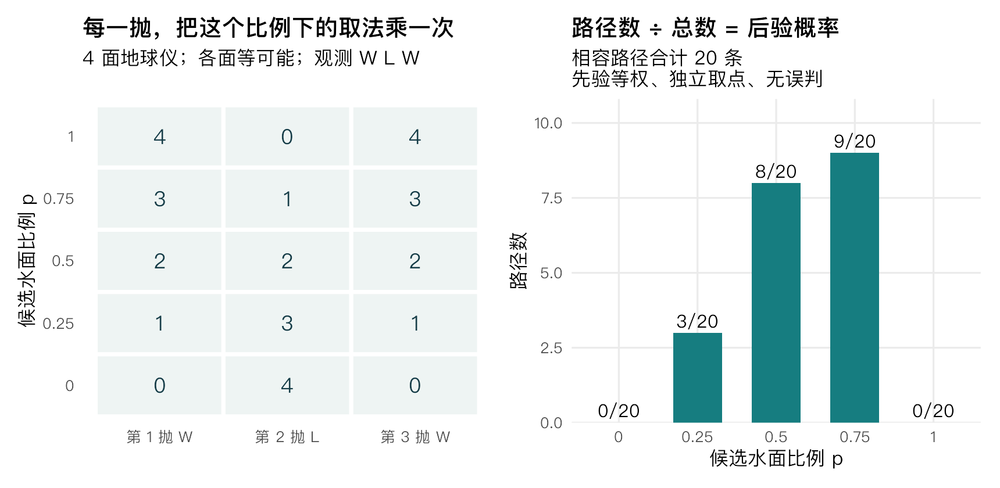
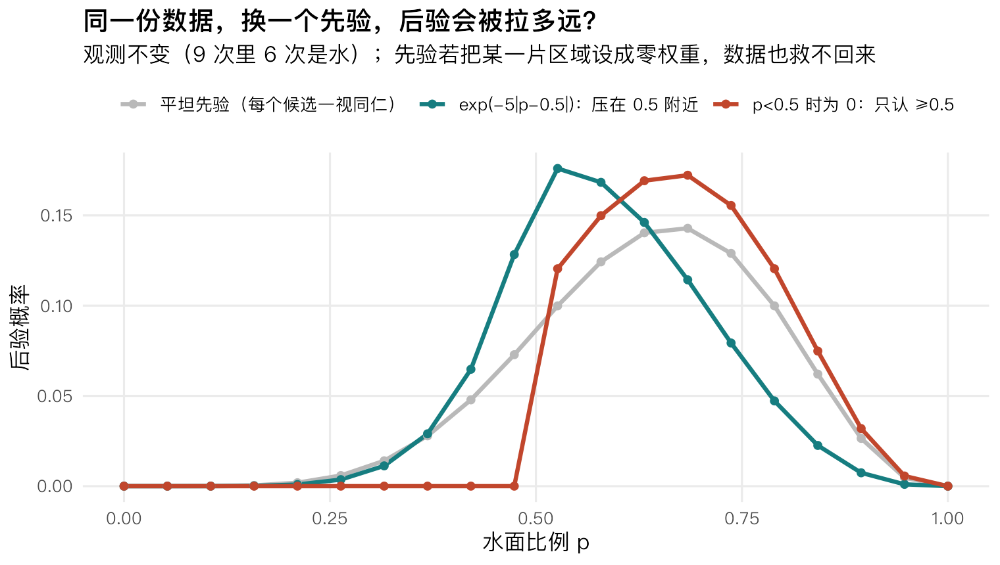
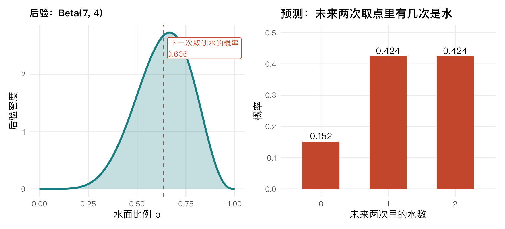
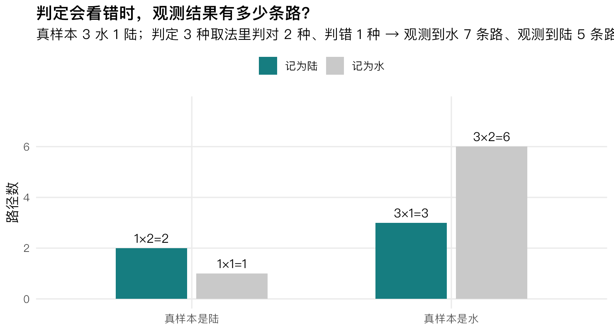

# 9 次里 6 次是水，水面比例就是三分之二吗？——从数路径理解贝叶斯

> 明哥的微生物世界 · Statistical Rethinking 精读 02
>
> 摘要：用四面地球仪把后验亲手数出来，再看"眼睛会看错"这件事怎样改变结论。

大家好，我是明哥。

在地球仪上随机取 9 个点，6 个落在水上。水面比例就是三分之二吗？只有 9 次，能知道多少，又还有多不确定？

上一篇留下了"数路径"三个字。今天先把球缩成四个面，用"水、陆、水"三次记录，把后验亲手数出来。等允许眼睛看错，刚被我们排除的那些候选，还会重新回来。

## 一、一个四面地球仪，为什么能算出后验？

先约定模型：**每次取点相互独立，四个面被取到的机会相同，水陆不会认错，而且看数据之前五个候选各占同样的权重。**

现在换个问法。别问"水面比例是 0.75 的概率有多大"，改问：**如果水面比例真是 0.75，有多少条路能走出我看到的这个结果？**

四面的球，水面占 3 面、陆面占 1 面。取到水，有 3 种取法；取到陆，有 1 种取法。三次观测是水、陆、水，路径数就是这三个数乘起来：

3 × 1 × 3 = 9

把五个候选比例都数一遍：

| 候选水面比例 | 水面数 | 陆面数 | 水-陆-水的路径数 |
|---|---|---|---|
| 0 | 0 | 4 | 0 × 4 × 0 = 0 |
| 0.25 | 1 | 3 | 1 × 3 × 1 = 3 |
| 0.5 | 2 | 2 | 2 × 2 × 2 = 8 |
| 0.75 | 3 | 1 | 3 × 1 × 3 = 9 |
| 1 | 4 | 0 | 4 × 0 × 4 = 0 |

五个候选加起来是 20 条路。**这个 20，是"五个候选下与观测相容的路径数之和"**（每个候选完整的三次取点路径其实都是 64 条，这一点下一节会说清）。在前面那几条约定之下，后验概率就是各自的路径数除以 20：0、0.15、0.40、0.45、0。



*图1｜左：每个候选比例下，三次观测各自有几种取法，乘起来就是路径数；右：路径数除以 20 得到后验。前提是每次独立取点、四面等可能、水陆不会认错、五个候选先验等权。*

两个候选的后验是 0。**在不会误判的模型里**，全水的球不可能记录出"陆"，全陆的球不可能记录出"水"——它们没有一条路能走到这次的观测。这句话先记住，第六节会回来找它。

## 二、为什么数完路径，还要乘先验、再归一化？

上一篇给过一个比喻：每个候选比例拿一张"权重票"，先验决定它在看数据之前有多少票，似然决定它对这次观测有多相容。

这一节把两件事对上：

- **先验**给候选一个起始权重。这一篇用平坦先验，相当于五个候选一开始一样重。
- **似然**告诉我们：在这个候选成立时，出现所见数据的概率有多大。**等可能的路径可以直接数；不等可能的路径，就要按概率加权。**

第一次数出来的"9"是整数计数，公式里的"先验 × 似然"是权重——两者在本例中**只差一个对五个候选都相同的常数**：每个候选都有 64 条等可能的三次取点路径（4 × 4 × 4），五个候选的先验权重又相同。这两个共同因子在归一化时会被约掉，所以最后要比较的确实就是与观测相容的路径数。写下来还是上一篇那条式子：

$$
候选 i 的后验权重 = \frac{先验权重_i \times P(观测 \mid p_i)}{\sum_j 先验权重_j \times P(观测 \mid p_j)}
$$

**能数条数的时候就数条数，不能数的时候就按概率加权**——这就是"相乘再归一化"在计数语言里的样子。

## 三、没有候选被淘汰，后验还会变吗？

前面三个观测，两次是水、一次是陆。把观测顺序调一下：先看"水"，再看"陆"，这时候五个候选的路径数是 0、3、4、3、0。

再看到第三个观测"水"，路径数变成 0、3、8、9、0。

注意这里发生的事：**中间那三个候选一条路都没被淘汰，可是它们的相对支持已经大不一样了**——从 3、4、3 变成 3、8、9，比例是 0.5 的那个候选从领先变成了落后。

所以数据做的不止"把不可能的路划掉"。它既能让某些候选直接归零，也能**在仍然可能的候选之间重新分配权重**。上一节说"数完路径还要乘先验再归一化"，归一化这一步就是重新分配。

麦氏给这张图起的名字是 **the garden of forking data（分岔数据的花园）**：候选在开头就分好了岔，数据不断剪掉走不通的岔路，同时调整剩下那些路的宽窄。

严格说，剩下的**路径数占总数的比例**，才是各候选的后验概率——别把它和"候选的水面比例"混起来。

## 四、比例能取连续值，怎么数？

上面的玩具只有五个候选比例，真问题里水面比例是 0 到 1 之间的连续值。路数没法一个整数一个整数地数了，怎么办？

办法是：**在网格上算出每个候选的似然与后验权重**，也就是上一篇那张 20 点网格。按教材第 2 章的网格近似方法，可以写成下面四行：

```
p_grid     <- seq(0, 1, length.out = 20)   # 20 个候选比例
prior      <- rep(1, 20)                   # 每个候选先给同样的权重
likelihood <- dbinom(6, size = 9, prob = p_grid)   # 这个候选成立时出现 9 次里 6 次水的概率
posterior  <- likelihood * prior / sum(likelihood * prior)
```

观测仍用开头那组：**9 次里 6 次落在水上**。

这里有一个小跳步值得点一下。第一节记的是有顺序的"水、陆、水"，这四行代码只统计"6 次是水"、不管顺序。在各次独立、同一个水面比例的模型下，二项似然比某个指定序列的概率多出一个组合数；**这个组合数对所有候选都一样**，归一化时同样被约掉，所以两者的参数后验相同。


*图2｜横轴是 20 个候选水面比例。灰线是各候选的先验权重（平坦先验，人人一样）；红色虚线是为便于比较而归一化后的似然权重；青线是后验。平坦先验下，归一化后的似然与后验重合。*

那先验到底在干什么？换一个先验就看出来了。**以下三个数都是同一组 20 点网格上的结果**，数据完全不变：

| 先验 | 后验均值（约） | 后验最大的网格点 |
|---|---|---|
| 平坦先验（每个候选一样重） | 0.636 | 0.684211 |
| exp(-5×\|p-0.5\|)（压在 0.5 附近） | 0.586 | 0.526316 |
| p<0.5 时权重为 0（只认 0.5 以上） | 0.681 | 0.684211 |



*图3｜同一份观测（9 次里 6 次是水），三种先验给出的三条后验。灰：平坦先验；青：压在 0.5 附近的先验；红：只认 0.5 以上的先验。用配套脚本生成。*

**先验是模型的一部分，用来表达已有知识、约束或暂定假设。用它不是作弊**；关键是说明依据，并检查合理的其他先验会不会改变结论。

第三种先验还给出一个硬边界：它把 p<0.5 的区域权重设成 0，**那么无论来多少数据，这些候选的后验都会是 0**。数据能重新分配权重，却救不回被先验排除掉的区域。反过来，在先验没有排除数据支持的区域时，更多**独立且携带信息**的观测通常会减弱先验对后验的影响。

"独立"这两个字值得在实验里多想一想。同一份样品多测几次，能帮我们了解测量波动，却不算增加了同样多的独立生物学样本；如果批次之间有差异，多设几个批次内重复和多取几个独立批次，回答的也不是同一个问题。

顺带一个可以核对的结论。回到"连续参数上均匀先验、独立取点、不会误判"的二项模型，6 次水、3 次陆对应的解析后验是 Beta(7, 4)，均值 0.636364；而 20 点网格给出的均值是 0.636382，两者相差约 0.00001873。

**因为有解析结果，这个误差我们才能直接核对**——但要注意，核对的只是均值。同一组网格的 89% 等尾区间下端是 0.4211，解析值是 0.400320，差约 0.0207。**均值很准，不代表 20 点网格处处都准。**

## 五、有了后验，能回答什么问题？

McElreath 在第 02 讲里用四句话提醒我们怎么读后验（课件第 78–81 页），每一句都比字面更窄：

1. **没有统一的起算样本量门槛。** 本例里 3 次观测也能更新后验；但要达到研究所需的精度，仍要规划样本量。
2. **后验形状反映数据提供的信息。** 相同模型与先验下，2 水 1 陆也有后验，只是比 6 水 3 陆的那条更分散；需要报告宽度时，仍可计算标准差或区间。
3. **点估计只是摘要。** 均值、中位数、众数回答不同的概括需求，都不能替代整个后验。
4. **没有适合所有任务的唯一区间。** 报区间要说明覆盖概率和构造方式（例如 89% 等尾区间）。

后验还有一个直接用途：往下预测。



*图4｜左：9 次里 6 次是水时的后验 Beta(7, 4)，虚线处是均值 0.636。右：据此预测"未来两次取点里有几次是水"的概率——深色用整条后验，浅色把后验均值当成固定 p。用配套脚本生成。*

**下一次取到水的概率是 0.636364**，正好等于后验均值。这不是巧合：只预测一次时，用平均值代入就能得到同一个答案。

但预测两次就不一样了。未来两次里出现 0、1、2 次水的概率，用整条后验算是 0.151515、0.424242、0.424242；**把后验均值当成固定 p 去算是 0.132231、0.462810、0.404959**。两次都取到水这一项，两者差了将近 0.02。

差别出在哪？要算的是"两次都是水"的概率，也就是 p² 的平均值——**不能先把 p 平均掉再平方**。整条曲线的宽度就这样一路传进了预测里，这也是为什么只报一个点估计会丢掉预测需要的不确定性信息。

## 六、如果水陆会认错，前面的排除还成立吗？

回到第一节那两个被归零的候选：全水的球、全陆的球。它们真的不可能产生"水、陆、水"吗？

取决于你怎么看测量。**把判定过程表示成三个等可能的分支：两个判对、一个判错**，也就是水被错认成陆、陆被错认成水的概率都是 1/3。这时，观测到"水"这件事就不再只有一条来路：

- 先固定一个候选：四个等可能取到的面里，三个是水、一个是陆。真实为水、判对记录成水：3 个样本 × 2 种取法 = 6 条路；
- 真实为陆、判错也记录成水：1 个样本 × 1 种取法 = 1 条路。

合计 7 条路。同理，记录到"陆"有 3 + 2 = 5 条路；7 + 5 = 12，正好等于 4 个样本 × 3 种取法。**在这个候选下，记录到水的概率是 7/12。**



*图5｜真实 3 水 1 陆，判定分三个等可能分支（两个判对、一个判错）。记录到"水"共 7 条路（6 + 1），记录到"陆"共 5 条路（3 + 2）。用配套脚本生成。*

数完路径，还差一步才能得到后验：**对每个候选比例都这样算出"记录到水"和"记录到陆"的概率，再按实际观测构造似然，乘先验、归一化。**（本篇只数到路径这一步，完整的误判后验留给教材。）

而这一步带来的反转，正是第一节那句话的答案：**允许误判之后，全水的球和全陆的球也能产生"水、陆、水"了。数据一点没变，关于测量过程的假设变了，结论就跟着变了。**

这就是"科学先于统计"最具体的一次演示：同样的数字，能不能用、怎么解释，取决于你先把数据怎么产生的那一层写清楚。要补一句边界：这里把误判率当成已知；真实实验里，它通常需要校准数据来支持（教材对测量误差的系统讨论在第 15 章）。

## 七、动手：先数，再跑

两个小实验，都写在配套脚本里，建议先在纸上数完再跑。

1. **把四面地球仪换成六面。** 也就是把脚本里的 `n_faces <- 4` 改成 `n_faces <- 6`（Python、MATLAB 里同名）。先自己算出三次观测（水、陆、水）各自的路径数，再跑脚本对照。
2. **把误判率从 1/3 改成 1/10。** 也就是判定分成 10 个等可能分支、判对 9 个、判错 1 个。这时观测到"水"的路径数是 3×9 + 1×1 = 28 条。想两个问题：总路径数变成多少了？记录为水的概率（原来的 7/12，还是现在的 28/40）哪一个更接近真实的水面比例 3/4？为什么不能直接拿 7 条和 28 条比大小？

## 结尾

一句可以带走的话：**先写清数据是怎样产生的，再比较各个候选能多大概率产生它。**

这里是"明哥的微生物世界"。这个系列按 McElreath 公开课 2023 版的顺序走，一讲一篇，从基础到高级，共 20 篇。下一篇展开怎么用后验去算预测、又怎么检查这些预测靠不靠得住。

---

### 教材与资料

- McElreath, R. (2020). *Statistical Rethinking: A Bayesian Course with Examples in R and Stan*（第 2 版）. CRC Press. 本篇对应第 2 章 Small Worlds and Large Worlds；测量误差的系统讨论在第 15 章，本篇第六节只按第 02 讲的附加内容作入门。
- 2023 年第 02 讲课件（Garden of Forking Data）：<https://speakerdeck.com/rmcelreath/statistical-rethinking-2023-lecture-02>
- 课程主页与全部讲义：<https://github.com/rmcelreath/stat_rethinking_2023>；教材配套的 R 包与全部代码：<https://github.com/rmcelreath/rethinking>。
- 中文版：《统计反思：用R和Stan例解贝叶斯方法》，林荟 译，机械工业出版社，2019 年。**中文版译自英文第 1 版，章节顺序与代码和第 2 版有出入，本系列按第 2 版讲。**
- 想用 tidyverse 语法和 brms 走一遍书里的代码，可参考 Kurz, A. S. (2023). *Statistical Rethinking with brms, ggplot2, and the tidyverse: Second Edition*. <https://bookdown.org/content/4857/>。
- 本篇三个语言的脚本与运行结果放在公开仓库：<https://github.com/fuyuming/statistics-classroom/tree/main/rethinking/article02_counting_paths>（仓库 ZIP：<https://github.com/fuyuming/statistics-classroom/archive/refs/heads/main.zip>）。三份输出逐位一致，对照记录见该目录的 VALIDATION.md。

*配图由配套脚本生成。本篇所有数字都是确定性计算（整数路径计数、20 点网格、解析 Beta、beta-二项预测），三个语言逐位一致，没有随机模拟。*
