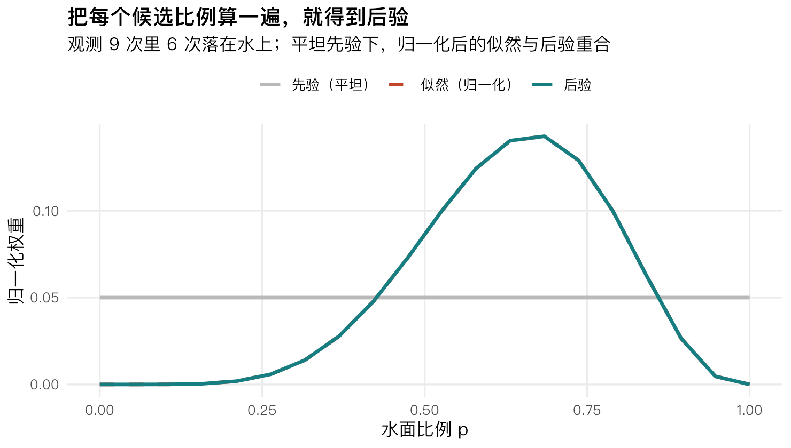
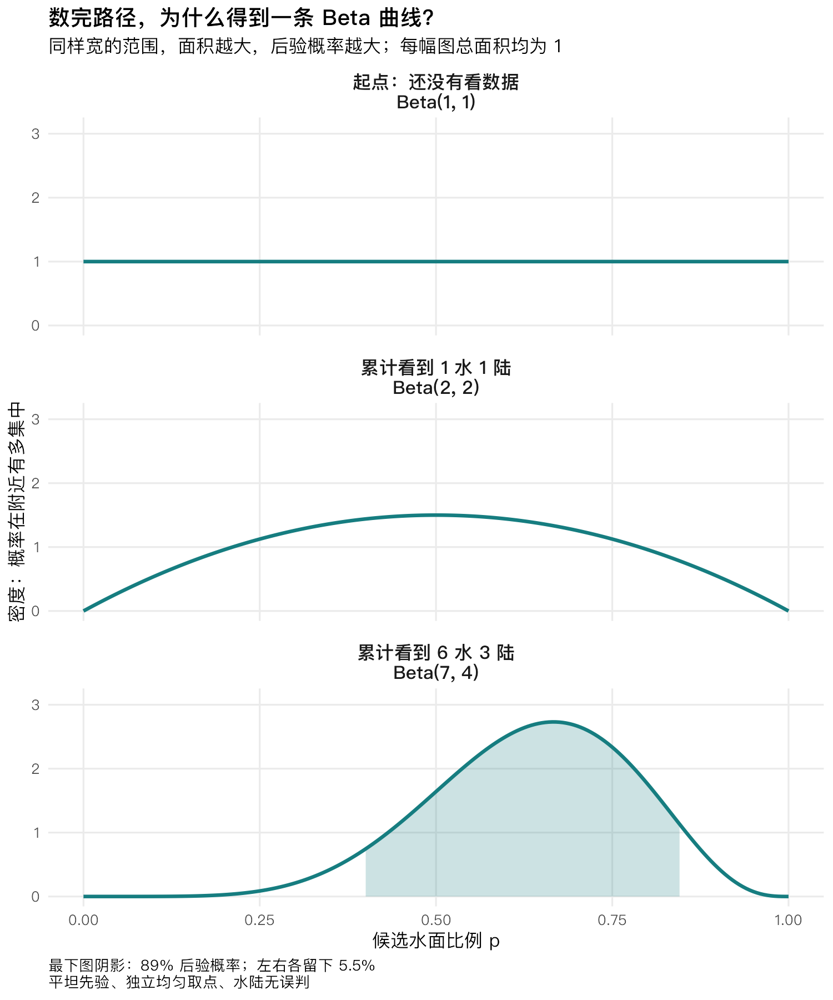
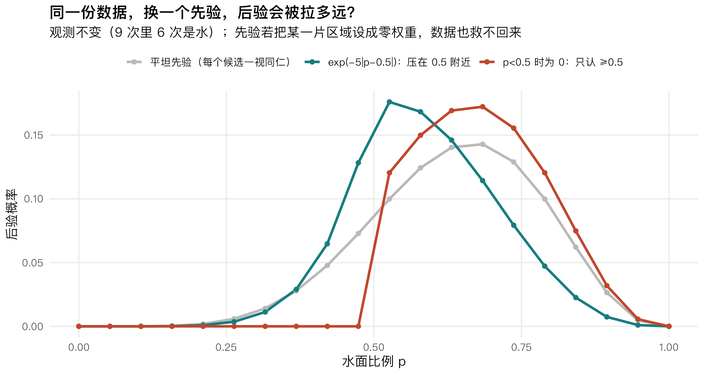
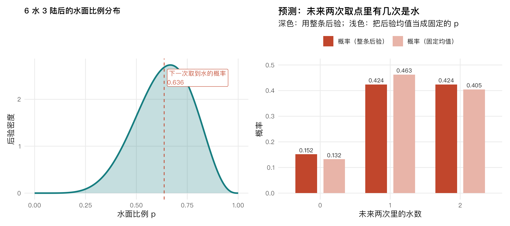
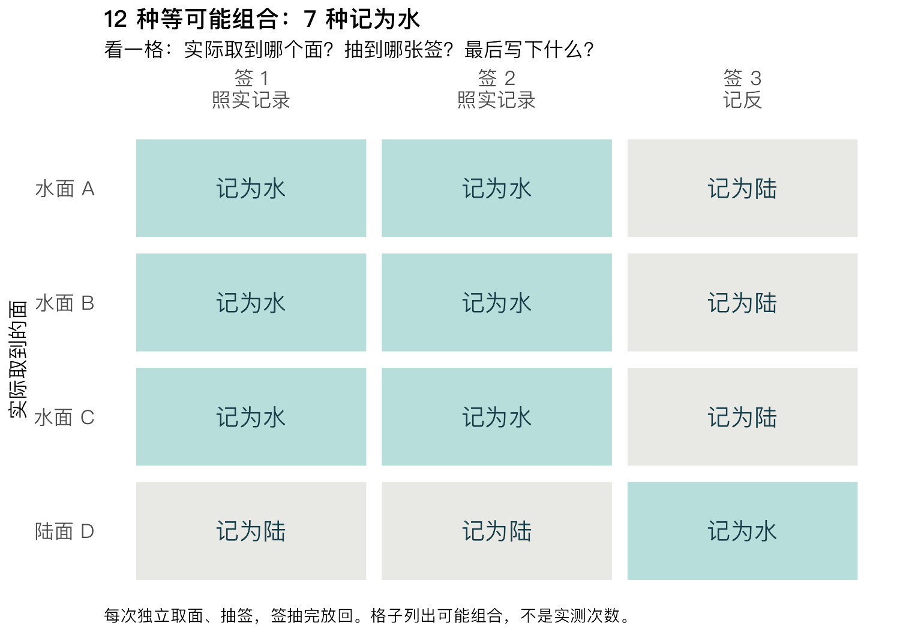

# 9 次里 6 次是水，水面比例就是三分之二吗？——从数路径理解贝叶斯

> 明哥的微生物世界 · Statistical Rethinking 精读 02
>
> 摘要：从三次“水、陆、水”开始，亲手算出后验；再把候选点连成曲线，看懂 Beta 分布为什么会出现在这里。

大家好，我是明哥。

在地球仪上随机取 9 个点，6 个落在水上。你大概会先算：6 ÷ 9，水面比例约为三分之二。

这个答案很自然。但如果再取 9 次，还会恰好遇到 6 次水吗？可能是 5 次，也可能是 7 次。**观测比例会波动，只拿这一次的三分之二，还没有告诉我们：真实比例可能离它多远。**

今天就从这里往下想。我们先把地球仪简化成只有四个等面积面的玩具，数清三次观测有哪些来路。然后再回到真正连续的比例，看看一串计算怎样变成一条曲线。读到最后，你应该能自己说明：这条曲线在表达什么，为什么它会变，以及测量出错时为什么要重新算。

## 一、一个四面地球仪，为什么能算出后验？

四个面中，水可以占 0、1、2、3、4 面，所以候选比例只有五个：0、0.25、0.5、0.75、1。**“候选”就是我们暂时都保留着、等数据来比较的几种可能。**

为了能直接数，我们先约定：每次独立取点，四个面被取到的机会相同，水陆不会认错。看数据之前，也不偏向这五个候选中的任何一个。

现在换个问法。别问"水面比例是 0.75 的概率有多大"，改问：**如果水面比例真是 0.75，有多少条路能走出我看到的这个结果？**

四面的球，水面占 3 面、陆面占 1 面。取到水，有 3 种取法；取到陆，有 1 种取法。三次观测是水、陆、水，路径数就是这三个数乘起来：

3 × 1 × 3 = 9

把五个候选比例都数一遍：

| 候选水面比例 | 水面数 | 陆面数 | 水-陆-水的路径数 |
|---|---|---|---|
| 0 | 0 | 4 | 0 × 4 × 0 = 0 |
| 0.25 | 1 | 3 | 1 × 3 × 1 = 3 |
| 0.5 | 2 | 2 | 2 × 2 × 2 = 8 |
| 0.75 | 3 | 1 | 3 × 1 × 3 = 9 |
| 1 | 4 | 0 | 4 × 0 × 4 = 0 |

能走出“水、陆、水”的路径，五个候选合起来有 20 条。按刚才的约定，把各自的路径数除以 20，就得到 **0、0.15、0.40、0.45、0**。

这组数就是**后验概率**：“后”指看过这份数据之后。比如 0.45 的意思是，在这五个候选和上述假设下，看过“水、陆、水”后，水面比例为 0.75 这个候选获得 45% 的后验概率。**0.75 是候选的水面比例，0.45 是我们目前给这个候选的概率，别把它们混成一个数。**


*图1｜左：每个候选比例下，三次观测各自有几种取法，乘起来就是路径数；右：路径数除以 20 得到后验。前提是每次独立取点、四面等可能、水陆不会认错、五个候选先验等权。*

两个候选的后验是 0。**在不会误判的模型里**，全水的球不可能记录出"陆"，全陆的球不可能记录出"水"——它们没有一条路能走到这次的观测。这句话先记住，后面讨论“眼睛会看错”时，还要回来检查它。

## 二、为什么 9 条路就对应 45%？

这一步值得慢一点。为什么能把不同候选的路径数放在一起比较？

无论球上有几面水，每次都能取到四个面中的一个。三次独立取点，完整路径都是 4 × 4 × 4 = 64 条，而且条条等可能。水面占三面的候选，其中有 9 条能产生“水、陆、水”，所以出现这份记录的概率是 **9/64**；占两面的候选，则是 **8/64**。

这种“假如候选成立，所见数据有多大概率出现”的数，叫作**似然**。这里 9/64 回答的是数据怎样出现，还没有直接回答水面比例是多少。

我们还需要起点：看数据之前，各候选有多少权重。这叫**先验**。五个候选一视同仁时，每个先验概率都是 1/5。

以水面比例 0.75 为例，先验乘似然是 (1/5) × (9/64)。其他候选也都这么乘。最后让所有结果加起来等于 1：

> 0.75 这个候选的后验概率
>
> = [(1/5) × (9/64)] ÷ [(1/5) × (0/64)+(1/5) × ( 3/64) +(1/5) × ( 8/64) + (1/5) × (9/64) +(1/5) × (0/64)]
>
> = 9/20 = **0.45**。

你看，1/5 和 1/64 都是共同因子，约掉之后，就只剩下数路径了。最后这一步“除以总和”，叫作**归一化**。

把这件事写成一般规则，就是：**先验 × 似然，得到更新后的相对权重；再除以所有候选的权重之和，得到后验概率。** 如果候选的先验不同，或者路径不再等可能，就不能只比较条数，要把各自的概率权重带上。

## 三、没有候选被淘汰，后验还会变吗？

前面三个观测，两次是水、一次是陆。按顺序先看前两次：先看到"水"，再看到"陆"，这时候五个候选的路径数是 0、3、4、3、0。

再看到第三个观测"水"，路径数变成 0、3、8、9、0。

注意这里发生的事：**中间三个候选都仍然可能，但它们获得的相对支持变了**——从 3、4、3 变成 3、8、9，比例是 0.5 的那个候选从领先变成了落后。

所以数据做的不止"把不可能的路划掉"。它既能让某些候选直接归零，也能**在仍然可能的候选之间重新分配权重**。新观测通过似然改变候选之间的相对权重；归一化把这些权重换成加起来等于 1 的概率。

这就是麦氏所说的“分岔数据的花园”：每个候选可以产生不同的数据路径，我们拿实际记录去比较它们。数据有时排除候选，有时只改变它们之间的支持比例。


## 四、真实比例不止五个，还能这样算吗？

当然可以。先把候选排得密一点：在 0 到 1 之间放 20 个等间隔的点，逐个计算。这叫**网格近似**。好比先在尺子上标出一些刻度，暂时只比较这些刻度代表的比例。

现在回到开头的 9 次观测：6 次水、3 次陆。用 p 表示候选水面比例。在独立、均匀取点、不会误判的模型下，一次取到水的概率是 p，取到陆的概率是 1−p。

一个具体的九次记录里，有六个“水”、三个“陆”。它出现的概率，就是：

> p × p × p × p × p × p × (1−p) × (1−p) × (1−p)
>
> = **p⁶ × (1−p)³**。

p⁶ 表示六个 p 相乘，(1−p)³ 表示三个 1−p 相乘。这里的 6 和 3，直接来自我们数到的水和陆。

**所以不论候选是 0.5、0.63，还是 0.731，都能把它代进去，算出这份数据对它的支持。** 先验一样时，再把这些数除以总和，就得到了网格上的后验。

如果只记“九次里六次水”，不要求某个固定顺序，还要把不同顺序的可能性加起来。不过排列数对每个 p 都一样，不会改变这些候选之间的相对支持。R 的 `dbinom()` 会把这些顺序一起计入；只关心参数后验时，两种记法得到相同结果。

```r
p_grid     <- seq(0, 1, length.out = 20)    # 在 0 到 1 上放 20 个候选点
prior      <- rep(1, 20)                    # 每个候选先给相同权重
likelihood <- dbinom(6, size = 9, prob = p_grid)
posterior  <- likelihood * prior / sum(likelihood * prior)
```

第三行依次计算“候选比例是它时，9 次里恰好有 6 次水的概率”；第四行做的仍然是“乘先验，再除以总和”。不熟悉 R 也没关系，先看下面这张图。



*图2｜横轴是候选水面比例。灰线表示起点时一样重；青线表示看过 6 水 3 陆后，哪些候选获得更多支持。红色虚线是除以总和后的似然，因先验等权而与青线重合。这里画的是 20 个网格点上的概率。*

候选点越来越密，我们就越来越接近对全部连续比例的计算。同一小段范围里的候选变多了，概率会分给更多的点，单个点的权重也就不能照搬原来那张图来读。连续计算中，我们关心的是一段范围总共容纳了多少概率：**我们要看曲线下面的面积，而不能把某一点的高度直接当成概率。** 为什么？下一节就把这件事和 Beta 分布一起说清。

## 五、Beta 分布是什么，为什么突然出现在这里？

其实，计算已经把它带到我们面前了。

刚才我们对每个 p 算出 p⁶ × (1−p)³。现在让 p 从 0 连续变到 1，把每个位置的计算结果画出来，就有了一条曲线。再把整条曲线按同一比例放大，让它下方的总面积等于 1，这就是连续比例的后验密度曲线。

**密度可以理解为：概率在某个位置附近有多集中。** 比较两段同样宽的范围，曲线较高的那一段，通常容纳更多后验概率；准确的概率，要看这段范围下方的面积。高度可以超过 1，总面积仍然是 1。

这条曲线有一个数学上的名字：**Beta 分布，中文常译为贝塔分布。它是一族取值限于 0 到 1 的连续概率分布，因此常用来表达对未知比例或概率的不确定性。** “一族”说明它不只有一种形状：可以平坦，可以偏向较小或较大的比例，也可以在中间隆起。

在本例中，真实水面比例并没有随着曲线来回变。变的是我们看过数据后，对它可能在哪里的判断。

Beta 用两个正数 a、b 描述形状，记成 Beta(a, b)。这两个数怎样认？看曲线中这两项：

> **Beta(a, b) 的密度与 p 的 (a−1) 次方 × (1−p) 的 (b−1) 次方成正比。**

“成正比”的意思是，各处再乘同一个数，把总面积调到 1。无需先背这个数，我们只看两个幂次。

本例里是 p⁶ × (1−p)³。对上之后，a−1 = 6，b−1 = 3，所以 **a = 7，b = 4，这条后验就叫 Beta(7, 4)**。

那么，两个“加 1”从哪里来？我们一开始用的是 0 到 1 上平坦的先验，也就是 Beta(1, 1)。因为 a−1 和 b−1 都是 0，曲线在内部各处一样高。每看到一次水，就再乘一个 p；每看到一次陆，就再乘一个 1−p。于是两个形状参数分别从 1 增加到 1+6 和 1+3。

**这没有多观察到一次水、一次陆；那两个 1 是先验的参数。** 如果从 Beta(2, 2) 起步，同样看到 6 水 3 陆，得到的就会是 Beta(8, 5)。



*图3｜同一规则的三个阶段：还没看数据时是 Beta(1,1)；累计看到 1 水 1 陆后是 Beta(2,2)；累计看到 6 水 3 陆后是 Beta(7,4)。各图横轴、纵轴尺度相同，总面积都为 1。最下面的阴影区域容纳 89% 的后验概率。这里展示累计计数，不要求九次记录按某个特定顺序出现。*

现在，0.636 也有来处了。前面五个离散候选的“后验均值”，就是每个候选比例乘以它的后验概率，再相加。第一节里两个端点的权重为零，所以只需算 0.25×0.15 + 0.5×0.40 + 0.75×0.45 = 0.575。连续曲线做的是同样的加权平均，只是要把所有细小范围都计入。

对 Beta(a,b)，这个平均值可以直接算成 **a/(a+b)**。本例就是 7/(7+4) = 7/11 ≈ **0.636**。它把整条后验都考虑进来，而曲线的峰顶仍在 2/3；峰顶所在的位置叫作**众数**。一条不完全对称的曲线，平均位置与最高位置本来就不必重合。

只有 9 次，我们知道得有多准？从这条曲线左右两端各留出 5.5% 的面积，中间就留下 89%。对应的范围约为 **0.400–0.845**，这叫 89% 等尾可信区间：“等尾”就是左右两端留下同样多的概率。

在这套模型、先验与数据下，真实比例落在这段范围内的后验概率是 89%。它还很宽。**6/9 给出了观测比例，却没有把真实比例确定在三分之二附近。** 89% 也不是唯一正确的选择，报告区间时要说明留了多少概率、用什么方式取的区间。

Beta 的密度、均值及 R 函数说明：https://stat.ethz.ch/R-manual/R-devel/library/stats/html/Beta.html

> **想核对计算的读者，可以再看这一小步。**
>
> 本例的 Beta 后验能直接用公式和相应函数计算，因此可以检查 20 点网格近似。两种算法的均值只差约 0.000019，但 89% 等尾区间下端分别约为 0.421 和 0.400，相差约 0.021。均值接近，不代表区间也一样准。加密网格改善的是计算近似，没有替这 9 次观测增加信息。

## 六、换一个起点，结论会变多少？

刚才提到从 Beta(2,2) 起步会得到另一条后验。那么先验到底能影响多少？现在换三种起点来比较。**以下三个数都是同一组 20 点网格上的结果**，数据完全不变：

| 先验 | 后验均值（约） | 后验最大的网格点 |
|---|---|---|
| 平坦先验（每个候选一样重） | 0.636 | 0.684 |
| 随 p 离 0.5 的距离指数衰减（见图4） | 0.586 | 0.526 |
| p<0.5 时权重为 0（只认 0.5 以上） | 0.681 | 0.684 |

这里最大的网格点约为 0.684，因为这 20 个候选里没有恰好等于 2/3 的点。把网格加密，才能更细地定位连续曲线的峰顶。



*图4｜同一份观测（9 次里 6 次是水），三种先验给出的三条后验。灰：平坦先验；青：压在 0.5 附近的先验；红：只认 0.5 以上的先验。用配套脚本生成。*

先验集中在 0.5 附近，就会把后验往那里拉；如果先排除了 0.5 以下的区域，留下的后验平均值就会更高。**先验是模型的一部分，要说明它依据什么，也要看看换成其他合理起点后，结论会不会明显改变。**

这里用网格方法计算，所以先验不必都选成 Beta 分布。第五节的 Beta 参数相加规则，对应的是 Beta 先验与无误判二项观测的组合，不能套在任何先验、任何测量模型上。

第三种先验还给出一个硬边界：它把 p<0.5 的区域权重设成 0，**那么无论来多少数据，这些候选的后验都会是 0**。数据能重新分配权重，却救不回被先验排除掉的区域。反过来，在先验没有排除数据支持的区域时，更多**独立且携带信息**的观测通常会减弱先验对后验的影响。

同一份样品反复测量，主要帮助我们了解测量波动；它并不等于增加了同样多的独立生物学样本。实验里说“多收集一些数据”，也要先想清楚多的是哪一层的信息。


## 七、预测下两次，为什么不能只用平均值？

前面一直在问：“真实水面比例可能是多少？”现在换一个实际问题：“接下来再取两次，会不会两次都是水？”

这两个问题有联系。不同的真实比例，对未来的预测不同；既然真实比例还没确定，我们就得把仍然可能的情况都考虑进去。

作者在第 02 讲 PPT 第 87—92 页讨论了如何用整个后验做预测，原例预测未来十次投掷。下面的两个袋子，是本文补充的手算例子，用来解释为什么不能只代入一个平均值。

先把地球仪放一边，做一个能亲手数的抽球游戏。用蓝球代表水，黄球代表陆，桌上有两个袋子：

| 袋子 | 里面装着什么 | 一次抽到蓝球的概率 |
|---|---|---|
| A | 1 个蓝球、3 个黄球 | 1/4 |
| B | 3 个蓝球、1 个黄球 | 3/4 |

随机把其中一个袋子交给你，拿到 A 和 B 的机会各占一半，但不告诉你拿到的是哪个。**接下来两次都从这个袋子抽；每次抽完把球放回、混匀，再抽下一次。** 放回是为了让袋子里的比例不变。

先预测一次。拿到 A 时，抽到蓝球的机会为 1/4；拿到 B 时，为 3/4。两种袋子机会一样，所以综合起来：

> 第一次抽到蓝球的概率 = 一半 × 1/4 + 一半 × 3/4 = **1/2**。

这个 1/2 容易让人产生一个误会：手里的袋子是不是就等于“2 个蓝球、2 个黄球”？

**没有。你手里始终是 A 或 B，只是还不知道是哪一个。** 两种可能的平均比例是 1/2，并没有把袋子里的球重新配成一半蓝、一半黄。

这个区别，在预测“两次都是蓝球”时就显出来了。我们先分别算两种袋子：

- **如果拿到 A：** 每次抽蓝的概率都是 1/4，两次都抽蓝的概率是 1/4 × 1/4 = **1/16**。
- **如果拿到 B：** 每次抽蓝的概率都是 3/4，两次都抽蓝的概率是 3/4 × 3/4 = **9/16**。

不知道拿到哪个袋子，就把这两种情况各按一半的机会计入：

> 两次都是蓝球的概率
>
> = 一半 × 1/16 + 一半 × 9/16
>
> = **5/16 = 31.25%**。

还可以直接数：每个袋子两次放回抽球都有 4×4 = 16 条等可能路径。A 有 1 条连续抽蓝的路径，B 有 9 条。选袋子的机会又相同，合起来就是 **(1+9)/(16+16) = 10/32 = 31.25%**。

如果用平均比例 1/2，直接算 1/2 × 1/2 = 25%，算到的其实是另一个情形：**已经确定手里有一个蓝黄各半的袋子。** 这与“可能拿到 A，也可能拿到 B”不是同一种不确定性。

也许你还会问：两次都放回抽，为什么不能说它们各有一半机会，再相乘？关键是，**放回保证了在袋子已确定时，两次抽球互不影响；袋子还未知时，两次结果共享着同一个未知条件。** 第一次若抽到了蓝球，我们会更倾向于手里是蓝球较多的 B，第二次抽蓝的预测也会随之改变。

现在回到地球仪。假设只有 p=0.25 和 p=0.75 两个候选，各有一半后验概率，就对应这个游戏里的两种袋子。这个两候选例子是为了说明计算方法，实际那组 6 水 3 陆的后验仍是前面的一整条曲线。把两个数平均，能正确预测下一次，却未必能正确预测接下来两次的组合。

而看过 6 水 3 陆后，我们保留的是一整条连续的后验。做法仍然一样：**先按每个可能的水面比例预测，再按它获得的后验权重把预测合起来。** 这就是“加权平均”：支持多的候选，其预测占得多；支持少的候选，其预测占得少。



*图5｜左：6 水 3 陆后的后验，虚线标出均值。右：未来两次取点中出现 0、1、2 次水的概率。深色先在各个候选比例下预测，再按后验权重合起来；浅色把均值当成已经确定的比例。*

只预测下一次，合起来的取水概率约为 **0.636**，恰好等于后验均值。预测两次都是水，用整条后验得到约 **0.424**；直接把均值平方，则约为 **0.405**。它们的差别，与刚才两个袋子的道理相同。

所以，保留整条后验有实际用途：它保留了“真实比例还可能是多少”这份信息，让我们在预测时也能把这份不确定性算进去。

小样本也可以这样计算，只是许多候选还没被充分区分。能算出后验，还要继续问它够不够精确；实验前仍需考虑样本量，报告时也要把不确定范围说出来。

## 八、如果水陆会认错，前面的排除还成立吗？

回到第一节那两个被归零的候选：全水的球、全陆的球。它们真的不可能产生"水、陆、水"吗？

先分清两件事：**取到的地方实际上是什么，以及我们最后在纸上记下了什么。** 前面默认这两件事完全一致：取到水，就记“水”；取到陆，就记“陆”。

现在给记录过程加一点错误。例如，取到的明明是水，却被记成了“陆”。这样一来，即使整个球都是水，纸上也可能出现一个“陆”。第一节据此排除全水候选的理由，就需要重新检查了。

错误有多常见？这里沿用作者 PPT 第 110—115 页的教学设定：**每次记录有三分之一的机会记反。** 这个三分之一是本例给定的条件，不是从前面那几次观测算出来的，也不代表真实检测的错误率。

我们可以真的用三张签来模拟这个规则：两张写“照实记录”，一张写“记反”。每次取完一个点，再随机抽一张签，每张签被抽到的机会一样。

- 如果实际取到水：抽到“照实记录”就写水，抽到“记反”就写陆。
- 如果实际取到陆：抽到“照实记录”就写陆，抽到“记反”就写水。

三张签只有一张让我们记反，所以每一次记反的概率都是 1/3。**这不要求每做三次就恰好错一次**，就像掷六次骰子不一定恰好出一次六点。

每次抽完都把签放回，重新混匀再抽。上次抽到哪张，不改变下次的抽签机会。这才是这里“各次记录错误相互独立”的意思。

接下来仍然选那个 **3 面水、1 面陆** 的候选。把三个水面分别叫作水面 A、B、C，陆面叫作陆面 D。一次取点后再抽签，会有多少种组合？

**4 个面 × 3 张签 = 12 种。** 取到每个面的机会相同，之后抽到每张签的机会也相同，所以这 12 种组合等可能。逐格写出最终记录，就得到下面这张图。



*图6｜每一行是实际取到的一个面，每一列是抽到的一张签，格子里写最终记录。前两列照实记录，第三列记反。12 个等可能的格子中，7 个写“水”，5 个写“陆”。这张图列的是可能组合，不是已经完成的 12 次实验。*

现在只数最终写着“水”的格子：

- 水面 A、B、C，每一行都有两张签让它照实记为水：**3 × 2 = 6 格**。
- 陆面 D，有一张“记反”签让它被错记为水：**1 × 1 = 1 格**。

所以，最终记录为水共有 6 + 1 = **7 格**，记录为水的概率就是 **7/12 ≈ 58.3%**。剩下的 5 格记为陆，概率为 5/12。

这里发生了一件值得留意的事：**真实水面占 3/4，也就是 75%；按这套会出错的记录规则，写下“水”的概率却只有约 58.3%。** 因而我们不能再直接把“记录中水的比例”当作“真实水面比例”。我们需要把记录错误也放进计算。

现在把第一节的计算再走一遍。五个候选仍然先验等权，观测仍是“水、陆、水”；改变的只有判定过程。

以 3 水 1 陆的候选为例，刚才图中有 7 格记为水、5 格记为陆。每次重新取点、抽签，三次依次记录为“水、陆、水”的组合数就是 **7 × 5 × 7 = 245 条路**。每次有 12 种等可能组合；每个候选完整的三次路径都有 12 × 12 × 12 = 1728 条，这个共同分母在归一化时会约掉。

| 候选水面比例 | 允许误判后的相容路径数 | 不会误判时的后验 | 误判率为 1/3 时的后验（约） |
|---|---|---|---|
| 0 | 4 × 8 × 4 = 128 | 0 | 0.125 |
| 0.25 | 5 × 7 × 5 = 175 | 0.150 | 0.172 |
| 0.5 | 6 × 6 × 6 = 216 | 0.400 | 0.212 |
| 0.75 | 7 × 5 × 7 = 245 | 0.450 | 0.240 |
| 1 | 8 × 4 × 8 = 256 | 0 | 0.251 |

这次相容路径合计 1020 条，各行除以 1020，就是新的后验。**全水和全陆的候选都回来了。数据一点没变，关于测量过程的假设变了，结论就跟着变了。**

甚至全水候选的后验现在最高，但也只有约 0.251。原因并不神秘：如果球上全是水，判错率又是 1/3，记录为水的概率恰好就是 2/3；“两次水、一次陆”完全可能由它产生。这组很少的观测，对各个候选的区分已经很弱。

这里也要分清两种“零”：第一节的全水、全陆被排除，是因为**不会误判的模型给了它们零似然**；换一个测量模型，它们就可能回来。第六节若事先把某个候选的**先验设为零**，只修改误判模型仍然救不回它。

放到微生物检测里，道理相通：记录为阳性，可能来自真正的阳性，也可能来自假阳性；真实阳性也可能漏检。因此，检测阳性比例与真实阳性比例之间，还隔着检测过程这一层。实际检测的假阳性率和假阴性率未必相等，不能直接照搬这里对称的 1/3。

这就是“科学先于统计”的一次具体演示：先写清样本怎样被取到、结果怎样被记录，再解释数字告诉了我们什么。本例把误判率当成已知；真实实验通常需要校准数据来支持它。只看到一组阳性、阴性计数，往往不足以同时弄清真实比例和检测误差。

## 九、动手：先数，再跑

先别急着运行。合上前面的解释，试着回答一句：**为什么 6 水 3 陆在这里对应 Beta(7,4)，而不是 Beta(6,3)？** 如果能从平坦先验和两个幂次说起，这一段就真正接上了。

再做两个小实验，配套脚本里已经留好参数，建议先在纸上数完再跑。

1. **把四面地球仪换成六面。** 也就是把脚本里的 `n_faces <- 4` 改成 `n_faces <- 6`（Python、MATLAB 里同名）。先自己算出三次观测（水、陆、水）各自的路径数，再跑脚本对照。
2. **把误判率从 1/3 改成 1/10。** 也就是判定分成 10 个等可能分支、判对 9 个、判错 1 个。这时观测到"水"的路径数是 3×9 + 1×1 = 28 条。想两个问题：总路径数变成多少了？记录为水的概率（原来的 7/12，还是现在的 28/40）哪一个更接近真实的水面比例 3/4？为什么不能直接拿 7 条和 28 条比大小？

和前面的统计课堂一样，这次也准备了 **R、Python 和 MATLAB 三套脚本**。用自己熟悉的一种跑通即可：第一次核对正文结果，第二次再改面数或误判率，看看后验怎样变化。

- R：打开 `数路径.Rproj`，运行 `代码/篇02_数路径.R`。
- Python：在 Spyder 打开 `代码/篇02_数路径.py`，按 F5 运行。
- MATLAB：打开 `代码/counting_paths.m`，点击 Run。

正文、三套脚本、结果表和配图放在同一个公开项目中，下载后先看 `README.md`。`06_误判后验对照*.csv` 对应第八节，`07_Beta读图*.csv` 保留 Beta 曲线的坐标与参数，`08_两候选预测*.csv` 对应第七节的手算例子；`09_误判抽签*.csv` 逐行列出图6的十二种组合。

项目与运行说明：https://github.com/fuyuming/statistics-classroom/tree/main/rethinking/article02_counting_paths

完整仓库 ZIP：https://github.com/fuyuming/statistics-classroom/archive/refs/heads/main.zip （解压后进入 `rethinking/article02_counting_paths`。）

## 结尾

9 次里 6 次是水，告诉我们的是这次的观测比例。真实水面比例还有多不确定，可以由整条后验来表达；如果水陆还会认错，连这条后验也要重新计算。

从五个候选数路径，到连续比例上的 Beta 曲线，我们一直在做同一件事：先设想某个比例是真的，再看它多容易产生眼前的数据，最后更新各个比例的支持程度。

以后再看到 Beta(7,4)，希望你能想起那六个 p、三个 1−p，以及最初的平坦先验。名字可以慢慢熟悉，这条推理应该能自己走一遍。

这里是"明哥的微生物世界"。这个系列按 McElreath 公开课 2023 版的顺序走，一讲一篇，从基础到高级，共 20 篇。下一篇对应第 03 讲 Geocentric Models，进入连续变量与回归建模。

---

### 与原课的对应范围

本文围绕第 02 讲的数路径、连续后验、预测与误分类展开，并非逐页翻译。Beta 分布和三分之一的误分类设定均来自原课；两个袋子、抽签解释和三语言实现是本文的教学补充。本文采用 20 个网格候选点，原 PPT 的二十面体示例有 21 个候选比例，两者不能混称。

原课还用模拟数据检验估计方法，并通过后验抽样生成预测；当前配套脚本着重于枚举和直接计算，尚未复现这两段模拟流程。

### 教材与资料

- McElreath, R. (2020). *Statistical Rethinking: A Bayesian Course with Examples in R and Stan*（第 2 版）. CRC Press. 本篇对应第 2 章 Small Worlds and Large Worlds；测量误差的系统讨论在第 15 章，本篇第八节只按第 02 讲的附加内容作入门。
- 2023 年第 02 讲课件（Garden of Forking Data）：<https://speakerdeck.com/rmcelreath/statistical-rethinking-2023-lecture-02>
- 课程主页与全部讲义：<https://github.com/rmcelreath/stat_rethinking_2023>；教材配套的 R 包与全部代码：<https://github.com/rmcelreath/rethinking>。
- 中文版：《统计反思：用R和Stan例解贝叶斯方法》，林荟 译，机械工业出版社，2019 年。**中文版译自英文第 1 版，章节顺序与代码和第 2 版有出入，本系列按第 2 版讲。**
- 想用 tidyverse 语法和 brms 走一遍书里的代码，可参考 Kurz, A. S. (2023). *Statistical Rethinking with brms, ggplot2, and the tidyverse: Second Edition*. <https://bookdown.org/content/4857/>。

*科学配图由配套脚本生成，封面为 AI 辅助插画。正文例子均为教学设定；三种语言采用同样的参数与计算方法，没有随机模拟。*
