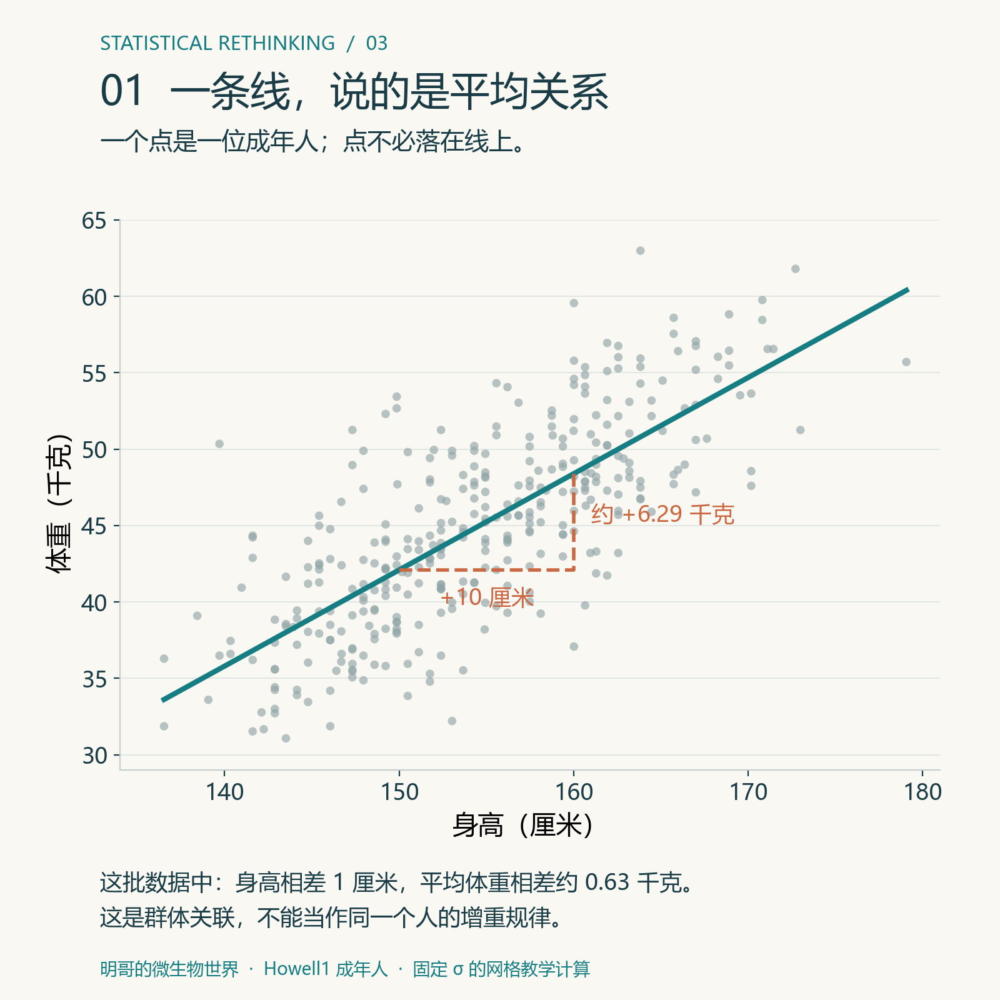
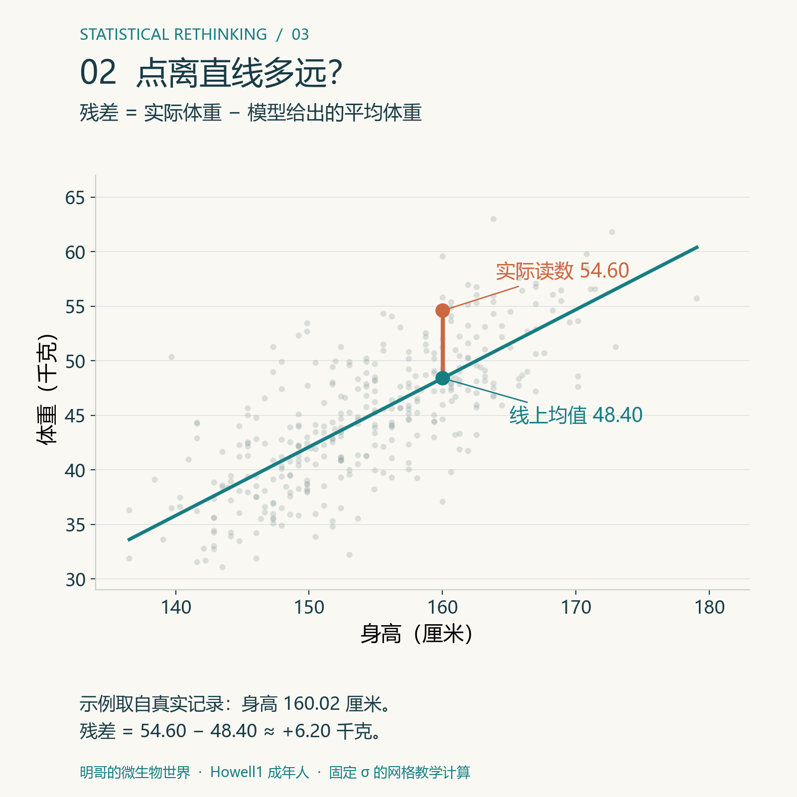
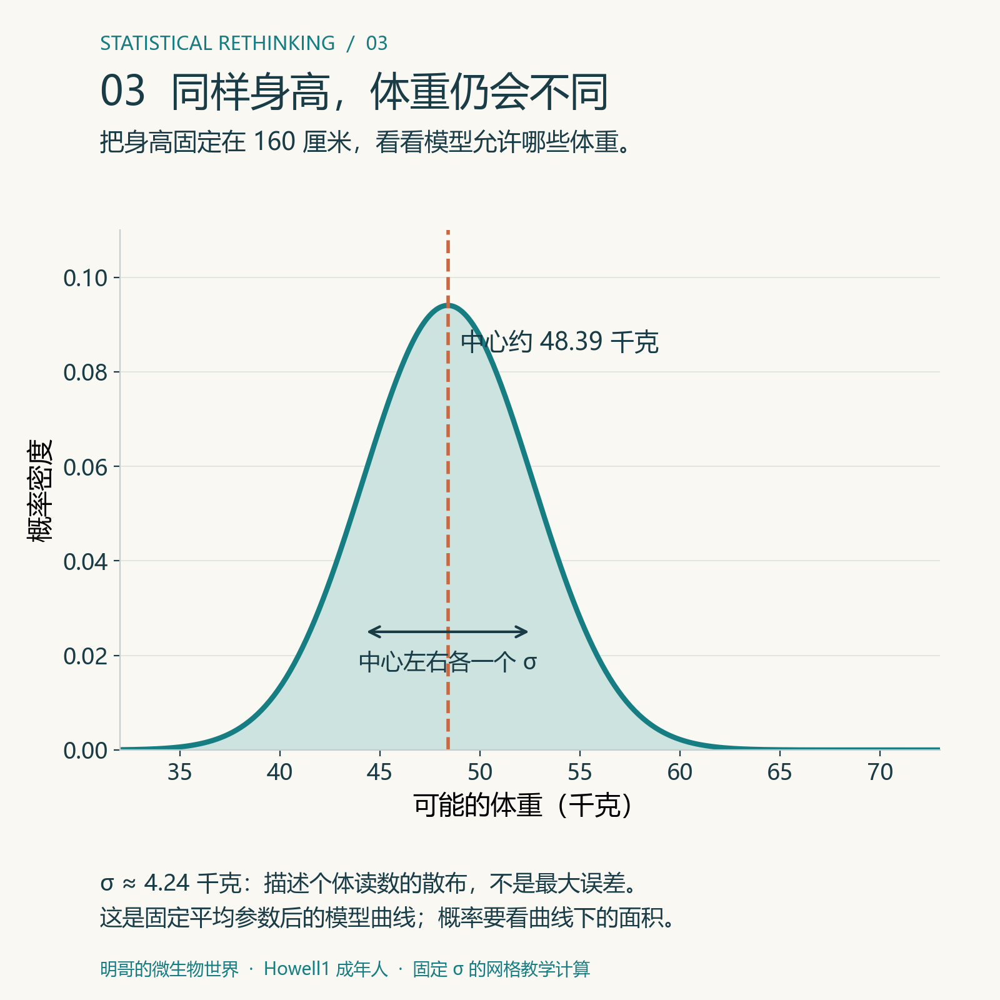
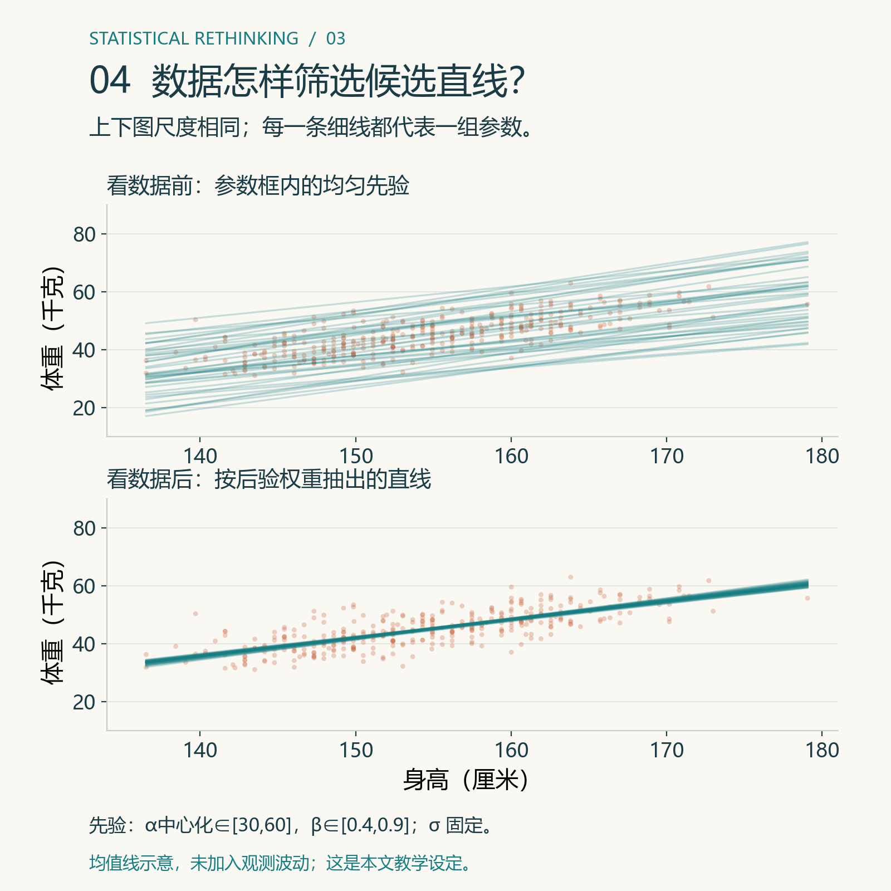
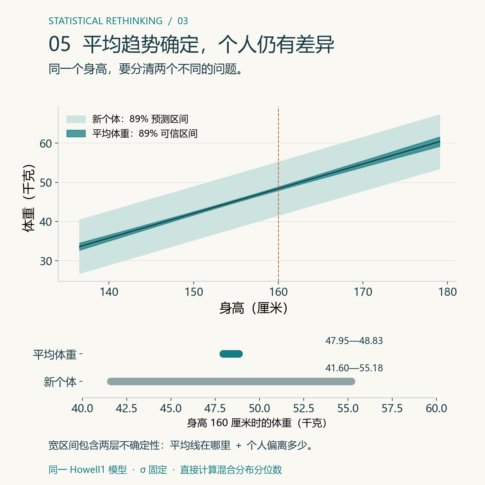

# 身高每高 1 厘米，体重平均会多多少？——从地心模型到线性回归


> 明哥的微生物世界 · Statistical Rethinking 精读 03
>
> 摘要：用作者课程里的 Howell1 身高—体重数据，走一遍线性模型：一条线怎样描述平均关系，数据怎样给它更新权重，以及为什么平均趋势的区间和下一次测量的区间不是一回事。

大家好，我是明哥。

如果手里有一批成年人的身高和体重，能不能画一条直线回答：**身高每增加 1 厘米，体重平均增加多少？**

可以。但这条线能回答的是“两个变量怎样一起变化”，不能自动回答“身高增加会不会导致体重增加”。这正是作者第 03 讲想先讲清楚的边界。

作者把这类模型叫作 **geocentric model，地心模型**：它可以描述关联，也可以做预测，但对背后的机制保持沉默。[原课第 03 讲 PPT](https://speakerdeck.com/rmcelreath/statistical-rethinking-2023-lecture-03)

## 一、先看作者的原始数据

作者使用 Howell1 数据中的 352 名成年人，记录了每个人的身高和体重。下面的图不是一条已经被证明正确的规律，而是数据点的整体趋势。



*图1｜352 名成年人的身高和体重。青色线是本文模型的平均关系。橙色折线把斜率拆成“身高相差 10 厘米、平均体重相差约 6.29 千克”。图上显示原始身高。*

图上可以看到：个子较高的人，体重通常也较大，但同样身高的人体重并不完全相同。饮食、年龄、性别、肌肉量和其他没有测量的因素，都会造成差异。

所以我们先把问题说窄一点：

> **在人群中，身高增加 1 厘米时，平均体重怎样变化？**

这句话里的“平均”很重要。我们要描述的是一条平均趋势，不是预测每一个人的精确体重。

## 二、一条直线到底在说什么？

把身高记作 H，体重记作 W。线性模型先假设，给定一个人的身高后，他的平均体重可以写成：

> **平均体重 = 截距 + 斜率 × 身高**

作者用 α 表示截距，用 β 表示斜率：

> μᵢ = α + βHᵢ

这里的 μᵢ 不是第 i 个人真正称出来的体重，而是模型对这个身高给出的**平均体重**。

- **β（斜率）**：身高每增加 1 厘米，平均体重改变多少公斤；
- **α（截距）**：当身高取 0 时，直线的数学起点。成年人不可能身高为 0，所以它通常不直接具有生物学解释。

为了让截距更容易解释，计算时把身高减去成年人的平均身高。这个动作叫**中心化**：

> 中心化身高 = 原始身高 − 平均身高。

这样，中心化身高为 0，就代表“平均身高的人”，此时 α 是平均身高处的预测体重。本组平均身高约 154.60 厘米；中心化后的公式是 μᵢ = α中心化 + β×(Hᵢ−154.60)。后面的网格计算使用这一形式。

取一位真实记录中的成年人：身高 160.02 厘米，体重 54.60 千克；本文平均直线在该身高给出约 48.40 千克。实际值减去线上均值，就是残差：54.60−48.40≈6.20 千克。



*图2｜橙点是实际体重，青点是同一身高处的模型平均值。竖线表示两者相差多少；残差包含模型尚未解释的个体差异和测量因素，不能全部当作仪器误差。*

### 为什么同样身高的人体重不同？

如果所有人的体重都严格落在直线上，β 就能完全决定每个人的体重。但真实数据不会这样。我们在平均值周围加上一个波动：

> **实际体重 = 平均体重 + 个体和测量带来的波动**

写成统计模型是：

> Wᵢ ∼ Normal(μᵢ, σ)
>
> μᵢ = α + β × Hᵢ

读法是：给定身高和参数后，体重围绕平均值 μᵢ 波动，波动的标准差是 σ。

σ 越大，同样身高的人体重越分散。它不是“最大误差”，也不是斜率；它描述的是一条平均线周围的散布程度。

## 三、先算一个最容易理解的数：斜率

把 352 名成年人的身高和体重放进这个模型，得到的斜率后验均值约为：

> **β = 0.6294 千克/厘米**

它的直观读法是：在这批成年人中，身高相差 1 厘米的人，平均体重相差约 0.63 千克。

这里有三个词不能省略：

- **这批成年人**：结论来自这组人；
- **平均**：说的是群体趋势，不是每一个人的变化；
- **相差**：这是关联描述，不等于把同一个人拉高 1 厘米后，他一定增加 0.63 千克。

身高和体重可能同时受到年龄、性别、营养和发育等因素影响。线性回归把它们造成的复杂差异先放进 σ 和未观测因素里，并没有自动识别机制。

这就是“预测得准，不等于解释正确”。托勒密的地心模型曾经可以预测行星位置，模型的预测能力却没有证明它描述的宇宙机制是正确的。

## 四、正态分布放在这里做什么？

正态分布在这里不是说“身高必须正态”或“所有体重混在一起必须是钟形”。它只是在说：**给定身高以后，个体体重围绕平均体重怎样散开。**

作者给出两个使用正态误差的理由：

1. 很多小的、近似独立的扰动加在一起，结果常会接近钟形；
2. 当变量允许取遍实数且只给定均值与方差时，正态分布具有最大微分熵。这是一个建模起点，不保证实际误差就是正态；非负边界、重尾等已知特征仍需考虑。

这次继续用同一个身高—体重例子读正态曲线。把身高固定在 160 厘米，代入本文后验平均参数，曲线中心约为 48.39 千克，观测标准差约为 4.24 千克。



*图3｜横轴是可能的体重，纵轴是概率密度。曲线描述给定参数后的个体波动，并非 160 厘米人群的实测直方图；它尚未计入参数不确定性。某段体重范围的概率要看曲线下的面积。*

## 五、看数据之前，先允许哪些直线？

在看数据之前，α、β、σ 都未知。我们需要先说明：哪些数值组合是合理的，哪些组合一开始就不太可信。这就是**先验**。

作者原课针对**未中心化身高**用的一个起点是（Normal 的第二个参数是标准差）：

> α ∼ Normal(0,10)
>
> β ∼ Uniform(0,1)
>
> σ ∼ Uniform(0,10)

不用先被符号吓住：

- α 以 0 为中心，但允许很宽的范围；
- β 的先验限定为 0 到 1 千克/厘米，表达作者对该案例斜率方向与量级的教学设定，并非适用于所有人群的定律；
- σ 必须为正，所以用 0 到 10 的均匀范围。

先验不是为了直接给出答案，而是为了检查：**如果还没看数据，这套假设会允许我们画出什么样的身高—体重关系？**

这一步叫**先验预测**。从先验中抽出许多组 α、β、σ，画出相应的直线和数据波动。如果大量结果明显荒谬，就要回头检查先验。

先验预测的重点不是先看哪条线最漂亮，而是检查：在还没有数据时，这套先验会不会产生明显不合理的身高—体重关系。作者 PPT 也把这一步作为正式分析前的检查。

注意：身高中心化后，截距的含义变了，不能仍直接套用上面的 α 先验。本文配套网格计算使用另一套明确的教学设定：α中心化 在 [30,60] 千克内均匀，β 在 [0.4,0.9] 千克/厘米内均匀，先验独立；σ 用残差标准差估计后固定为约 4.24 千克。正文数值和下图均来自这一模型，并非作者 `quap` 完整模型的结果。



*图4｜上下使用相同坐标尺度，各选 40 条候选均值线；上图按本文先验抽取，下图按本文网格后验权重抽取。橙点是同一组 Howell1 观测，放在上图只作参照，没有用于生成先验线。细线没有加入个体波动，不能把这两束线当作完整的新观测预测分布。*

## 六、数据怎样给不同的直线分配权重？

假设现在有一条候选直线。它对每个人都会给出一个平均体重，实际体重与平均体重之间的差叫**残差**：

> 残差 = 实际体重 − 这条线给出的平均体重

如果一条线让 352 个残差整体较小，在 σ 相同的情况下，它就更容易产生我们手里的数据；如果残差普遍很大，它得到的权重就会变小。

把这句话写成贝叶斯更新，就是：

> **后验权重 ∝ 先验权重 × 似然**

似然回答：“给定这些身高，如果这条线是真的，眼前这 352 个体重读数与它有多相容？”连续读数用概率密度计算似然。

配套脚本没有只挑一条线，而是在 α、β 的参数平面上铺网格：每个参数组合都算一次似然，再归一化。主线计算使用 200×200 个网格点，也就是 40000 条候选直线。

在本项目的固定 σ 网格计算中，得到：

| 量 | 斜率结果（千克/厘米） |
|---|---:|
| 最小二乘斜率 | 0.6294 |
| 后验均值斜率 | 0.6294 |
| 斜率 89% 等尾可信区间 | 0.5834—0.6764 |

最小二乘是在找“让残差平方和最小”的一条线；后验均值则是把所有候选线按后验权重平均。这个例子里两者非常接近，是因为数据较多、模型简单、先验影响有限。它们的统计含义仍然不同。

## 七、平均体重的区间，不等于下一次体重的区间

这一步特别容易混淆。

后验告诉我们：α 和 β 还有哪些可能。对每一组可能的 α、β，我们都可以计算某个身高对应的**平均体重**。把这些平均体重汇总，就得到平均趋势的不确定性。

但如果现在来了一个新的成年人，即使我们完全知道平均趋势，他的实际体重也不会恰好落在平均线上。个体差异和测量误差仍然存在。

所以预测新观测要加两层不确定性：

1. α、β 还没有完全确定；
2. 新个体的体重会在平均值附近波动。

这就是为什么：

> **单个新人的预测区间，会比平均体重的可信区间更宽。**



*图5｜深带只表达平均关系的不确定性，浅带还加入了 σ 所代表的个体波动。下方单独截取身高 160 厘米的位置，将两段区间放在同一刻度上比较。*

在身高 160 厘米处，本文模型的平均体重约为 48.39 千克：平均体重的 89% 可信区间约 **47.95—48.83 千克**，新个体的 89% 预测区间约 **41.60—55.18 千克**。两个范围是直接由同一网格后验计算的，均以 σ 固定及观测条件独立、同方差为前提。

## 八、换一个先验，结果会怎样？

先验不是越宽越好，也不是越窄越好。关键是它是否有科学依据，以及换成其他合理先验后结果是否稳定。

在配套的固定 σ 网格计算中，可以只改变斜率先验，重新计算后验。数据量较大时，合理先验通常不会把结果拉得很远；样本更少、噪声更大或参数更多时，先验的影响会增加。真正应该报告的是：用了什么先验，以及换成其他有科学依据的先验后，结论是否稳定。

## 九、这个模型能回答什么，不能回答什么？

它可以回答：

- 这批成年人中，身高与体重的平均关联方向和大小；
- 给定一个身高，平均体重的大致范围；
- 新个体体重为什么会有比平均趋势更宽的预测区间。

它不能单靠一条回归线回答：

- 把同一个人增高 1 厘米会不会增重；
- 身高和体重之间的生物学机制是什么；
- 这条关系能否无条件推广到其他年龄、性别或人群。

同样的模型结构也可以用于生物膜：把“身高”换成培养时间，把“体重”换成厚度，就能描述平均厚度随时间的变化。但如果要解释生物膜为什么变厚，仍然需要增殖、基质分泌、脱落等机制测量或干预实验。

## 十、代码与练习

配套项目提供 R、Python 和 MATLAB 三套脚本。第一次运行时，先复核斜率 0.6294 和 89% 区间；第二次再改参数。

- R：`代码/篇03_一条直线.R`
- Python：`代码/篇03_一条直线.py`
- MATLAB：`代码/篇03_一条直线.m`

新版五张图的统一入口为 `代码/howell_figures_v4.py`，读取项目已有的 Howell1 共享 CSV。运行：

```bash
python 代码/howell_figures_v4.py
```

它重新计算身高—体重网格后验，并生成 `文章配图_v4/` 中的图，以及 `运行结果/v4/` 中的后验权重、预测区间和绘图参数。候选线示意使用固定随机种子；后验权重和区间为确定性计算。

原 R、Python、MATLAB 综合脚本保留作旧版练习，它们还包含生物膜案例。其中 `02_后验摘要*.csv` 的 Howell1 行可核对斜率；旧 `05_后验预测*.csv` 与 `06_先验敏感性*.csv` 属于生物膜案例，不能拿来核对本版图5。新图的生成入口目前为 Python，未声称三套旧脚本已全部改写为本版配图。

完整说明见项目 README：

https://github.com/fuyuming/statistics-classroom/tree/main/rethinking/article03_geocentric_line

## 结尾

线性回归先回答一个有限的问题：**在这批数据中，身高和体重的平均关系是什么？**

它可以描述趋势，也可以做预测；它不会自动把关联变成因果机制。贝叶斯方法做的，是把不同的直线按先验和数据重新分配权重，再把参数和观测本身的不确定性带进预测。

上一篇数的是不同水面比例的路径，这一篇数的是不同直线获得数据支持的程度。模型变复杂了，基本问题没有变：**先说清楚数据怎样产生，再说清楚模型究竟回答了什么。**

这里是“明哥的微生物世界”。下一篇进入类别变量与曲线。

### 教材与资料

- McElreath, R. (2020). *Statistical Rethinking*（第 2 版），第 4 章 Geocentric Models。
- 作者 2023 年第 03 讲 PPT：https://speakerdeck.com/rmcelreath/statistical-rethinking-2023-lecture-03
- 课程主页：https://github.com/rmcelreath/stat_rethinking_2023
- 教材配套 R 包与 Howell1 数据：https://github.com/rmcelreath/rethinking
- R 正态分布说明：https://stat.ethz.ch/R-manual/R-devel/library/stats/html/Normal.html

*主线数据是作者课程中的 Howell1 成年人数据。配套项目用固定 σ 的二维网格近似帮助读者复算；它是教学实现，不等同于作者原课中同时估计所有参数的完整模型。*
