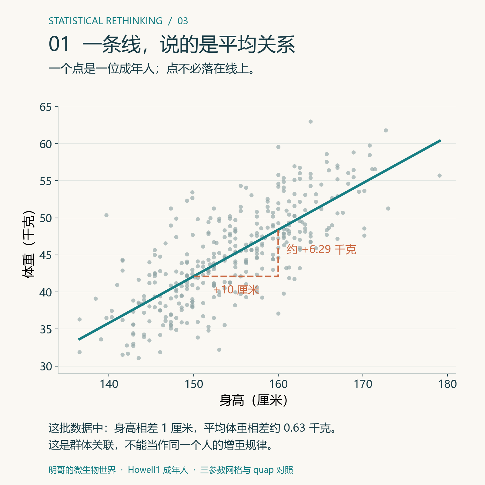
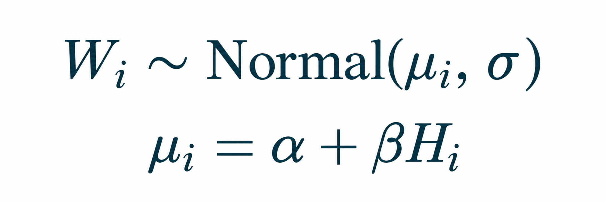
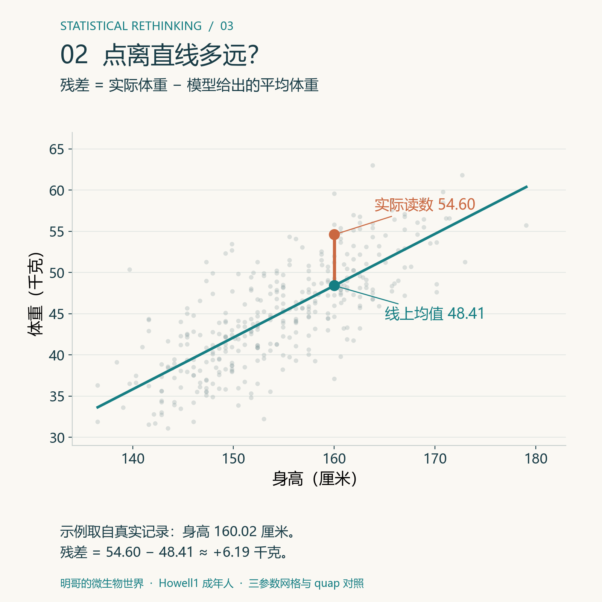
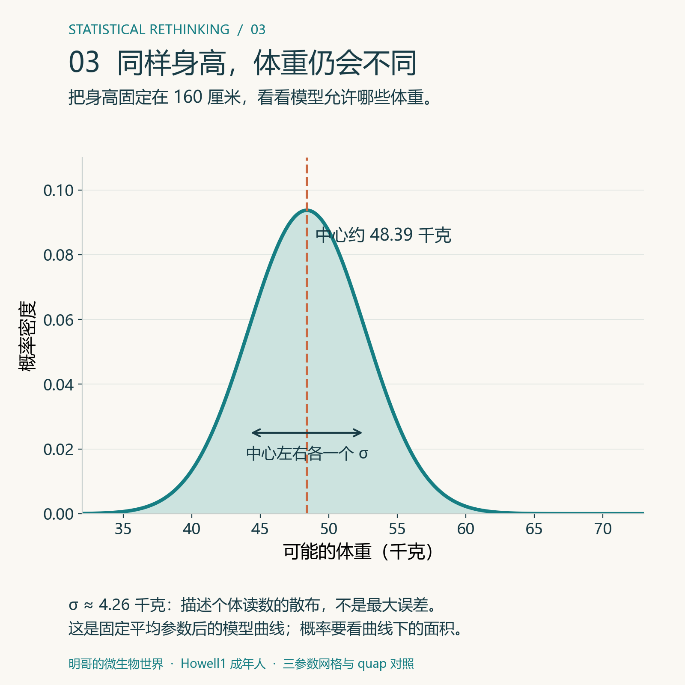
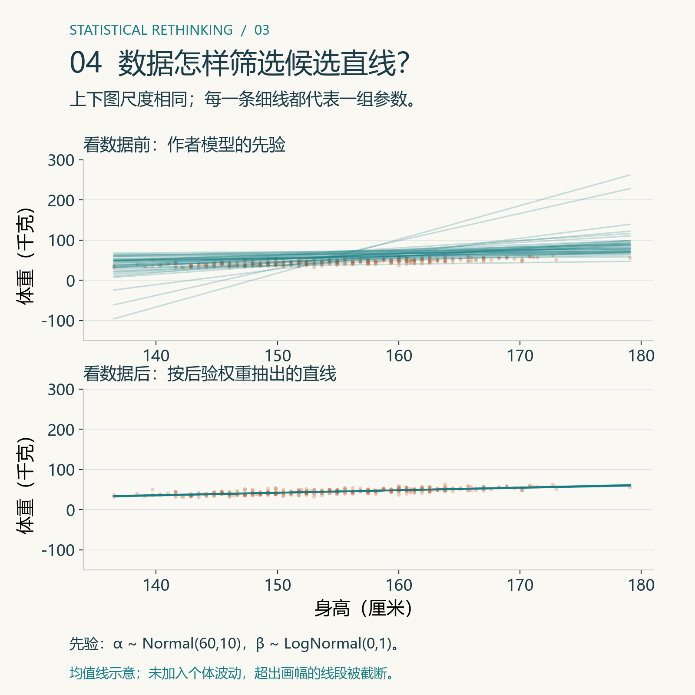
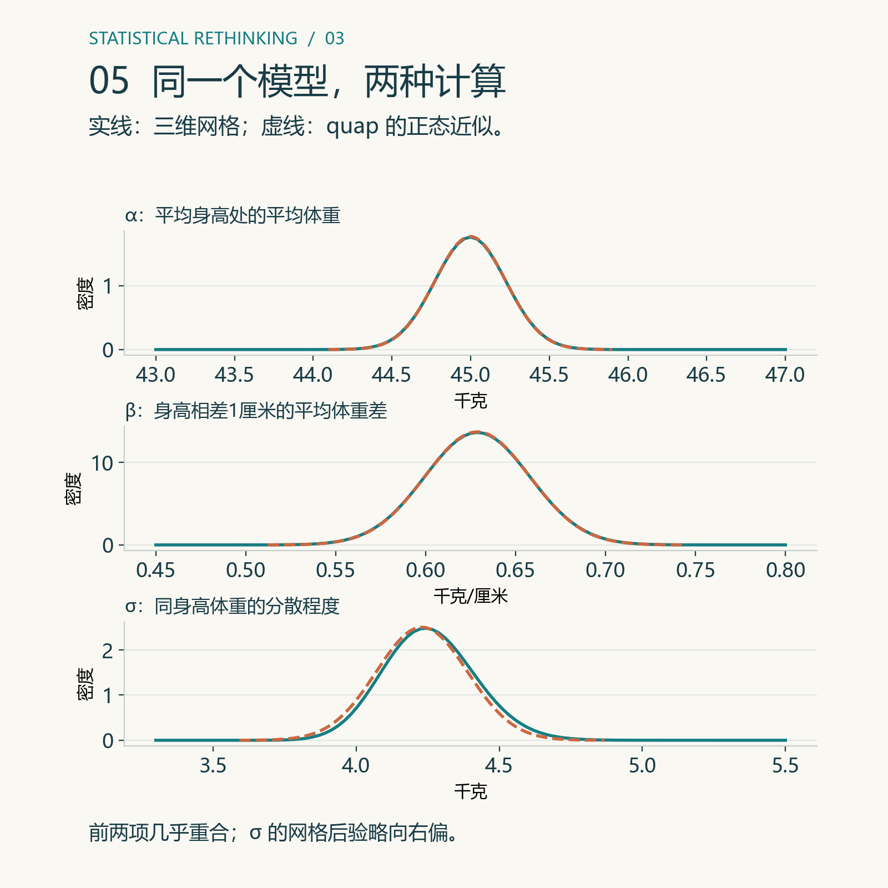
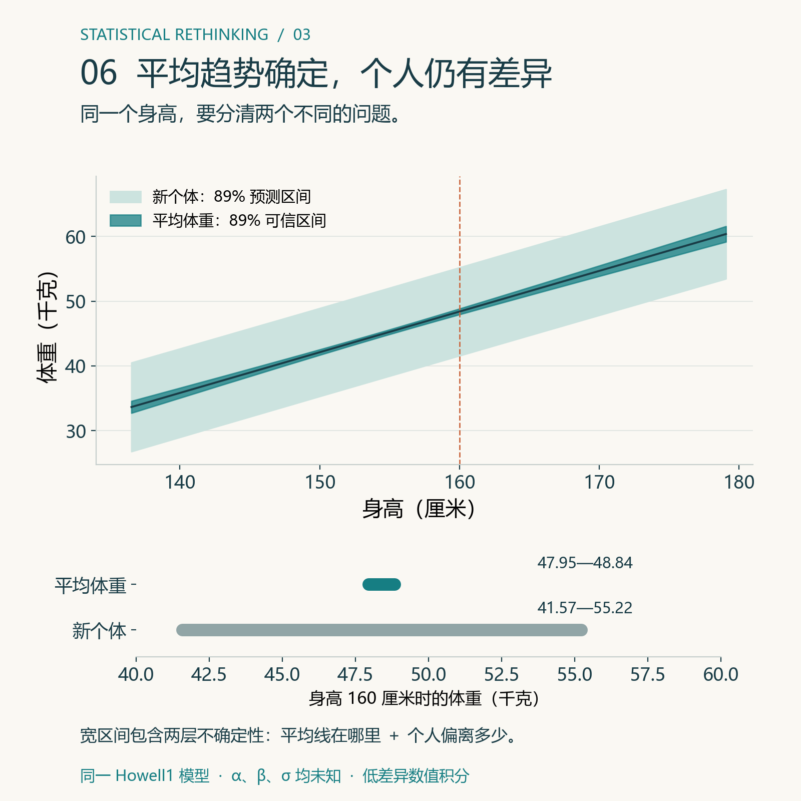

# 身高每高 1 厘米，体重平均会多多少？——从一条直线理解贝叶斯回归


> 明哥的微生物世界 · Statistical Rethinking 精读 03
>
> 摘要：沿着作者的身高—体重例子，先读懂一条直线，再用网格和 quap 两种方法计算同一个模型。最后分清：平均体重有多确定，与一个人的体重有多难预测。

大家好，我是明哥。

上一课，我们把可能的水面比例列出来，看看哪些比例更受数据支持。这一课，问题变成了：**知道一个人的身高，能不能估计他的体重？**

直觉上可以。个子较高的人，体重通常也较大。但同样高的两个人，体重可能差不少。所以我们要同时回答两个问题：平均来看差多少？具体到一个人，又可能偏离多少？

作者在第 03 讲把这类描述关联的模型称为“地心模型”。这个名字提醒我们：一个模型可以描述数据、帮助预测，却未必解释了背后的原因。就像地心模型曾经可以预测行星位置，预测有用不等于机制正确。

原课 PPT：https://speakerdeck.com/rmcelreath/statistical-rethinking-2023-lecture-03

## 一、先看点，再看线

作者使用 Howell1 数据中的 352 名成年人。每个人有一个身高、一个体重，在图上就是一个点。



*图1｜横轴是原始身高，纵轴是实际体重。青线是本文三参数网格后验给出的平均关系。橙色折线表示：身高相差 10 厘米，平均体重相差约 6.29 千克。*

点大致朝右上方延伸，但没有整整齐齐落在一条线上。我们先用直线描述它们的平均趋势：

> **平均体重 = 截距 + 斜率 × 身高。**

其中，**斜率**回答“身高每相差 1 厘米，平均体重相差多少千克”。假如斜率是 0.63，身高相差 10 厘米，平均体重就相差约 6.3 千克。

这里说的是不同身高的人之间的平均关联。它不表示把同一个人拉高 10 厘米，他就一定增加 6.3 千克。

## 二、两行公式，分别在说什么？

把身高记作 H，实际体重记作 W，模型给出的平均体重记作 μ。i 表示第 i 个人。

先用原始身高写出模型：



**从第二行开始读：μᵢ = α + βHᵢ。** 给出一个身高 Hᵢ，就可以沿着直线找到对应的平均体重 μᵢ。

- **α 是截距**：在这张原始身高公式中，它是身高为 0 时的直线高度。它只是数学起点，不能拿来解释真实成年人的体重。
- **β 是斜率**：身高每增加 1 厘米，线上平均体重增加多少千克。

**第一行再补上人与人之间的差异。** 即使身高相同，实际体重 Wᵢ 也不会都等于 μᵢ。模型用正态分布描述这种散开方式：体重围绕 μᵢ 波动，标准差是 σ。

**σ 越大，同样身高的人体重越分散。** 它不是最大误差，也不是说每个人都恰好偏离 σ 千克。

所以这个模型有三个待了解的参数：**α 和 β 决定平均线，σ 描述个体在平均线周围的分散程度。**

### 让截距变成一个有意义的数

“身高为 0 时的体重”不容易理解。作者计算时把身高减去平均身高，叫作**中心化**。

> 中心化身高 = 原始身高 − 平均身高。
>
> 平均体重 = α + β × 中心化身高。

这组人的平均身高约为 154.60 厘米。身高 160 厘米的人，中心化身高约为 5.40 厘米；平均身高的人，中心化身高就是 0。

这样一来，**α 就变成了平均身高处的平均体重**。后文沿用作者的记号，把这个中心化后的截距仍记作 α；它与上面原始身高公式中的截距含义不同。

后面的网格和 quap 都使用中心化身高。图上的横轴仍标原始身高，方便直接读出“160 厘米”这样的实际数值。

## 三、线没有解释的差异，放在哪里？

取数据中一位身高 160.02 厘米、体重 54.60 千克的成年人。平均线在这个身高给出约 48.41 千克。

> 残差 = 实际体重 − 线上平均体重
>
> 54.60 − 48.41 ≈ 6.19 千克。



*图2｜橙点是实际体重，青点是模型平均值，竖线是残差。残差包含尚未解释的个体差异和测量因素，不能全部当成仪器误差。*

一个人的残差，是这个点离线多远；σ 描述的则是模型中同身高个体的整体分散程度。两者不是同一个量。

把身高固定在 160 厘米，代入后面算出的后验平均参数，可以画出下面这条曲线。



*图3｜曲线中心约为 48.39 千克，σ 约为 4.26 千克。横轴是可能的体重，纵轴是概率密度；某段体重范围的概率要看曲线下的面积。这是固定在后验平均参数处的模型示意，还没有合入参数不确定性。*

这里的正态假设，说的是**给定身高以后，体重围绕平均值怎样分散**。它没有要求身高本身必须正态，也没有要求把所有人的体重混在一起必须呈钟形。

很多小因素相加，常会产生接近钟形的波动，这是选择正态分布的一种理由。但实际数据是否适合这种假设，还需要检查；写下公式不等于已经证明公式正确。

## 四、看数据之前，先允许哪些可能？

现在我们知道三个参数分别做什么，但还不知道它们是多少。贝叶斯分析先给它们设定**先验分布**，表达看这组体重数据之前允许的数值范围及相对权重。

本文跟随作者公开脚本中成年人的 `m_adults` 模型：

> α ∼ Normal(60, 10)
>
> β ∼ LogNormal(0, 1)
>
> σ ∼ Uniform(0, 10)

三者在先验中相互独立。逐项翻译成普通话：

**α 的先验**：平均身高处的平均体重以 60 千克为中心，标准差为 10 千克。它允许偏离 60，并没有把答案固定为 60。这个 10 也不是上下限。

**β 的先验**：斜率只能为正，但允许大小不同。这里新出现的 LogNormal 叫**对数正态分布**：如果先抽一个服从 Normal(0,1) 的数 z，再计算 e 的 z 次方，得到的正数就服从 LogNormal(0,1)。这两个参数描述的是 ln(β)，不能读成“β 的均值为 0、标准差为 1”。对数正态曲线向右拖着较长的尾巴，因此也允许较大的正斜率。

**σ 的先验**：标准差在 0 到 10 千克之间，等长小区间获得相同的先验权重。它仍然未知，需要用数据更新。

这些是本例的教学设定，不是所有人群通用的先验。



*图4｜上下坐标尺度相同，各画 40 条候选均值线。上图从作者模型的先验抽取，下图从三维网格后验抽取。橙点仅作共同参照，上图抽线时没有用它们更新权重。这里只画平均线，没有加入 σ 所代表的个体波动。*

上图里有些线过于陡峭，甚至在图示身高范围内给出负体重。这正是先验检查要暴露的问题：**这套先验允许哪些不合常理的结果？** 为了对照作者的计算，本篇保留这套设定；真正开展新研究时，应结合研究对象重新检查。

作者的原始模型代码：
https://github.com/rmcelreath/stat_rethinking_2023/blob/main/scripts/03_howell_new_weight_model.r

## 五、第一种算法：把参数组合列出来，逐组算权重

上一课只有一个未知的水面比例，现在有 α、β、σ 三个未知数。但思路没有变：先列候选，再看数据支持谁。

例如，一组候选可以是：

> α = 45 千克，β = 0.63 千克/厘米，σ = 4.3 千克。

它的意思是：平均身高处的平均体重为 45 千克；身高每相差 1 厘米，平均体重相差 0.63 千克；同身高的个体体重围绕平均值散开，标准差为 4.3 千克。

换一个 α，直线上下移动；换一个 β，直线倾斜程度改变；换一个 σ，直线周围允许的散布宽度改变。**所以我们比较的是“直线加波动”的整套参数组合。**

每一组都做相同的四步：

1. 用它的 α 和 β，算出 352 个身高各自对应的平均体重。
2. 用它的 σ，计算每个实际体重在相应正态曲线上的密度；在给定身高和参数后观测相互独立的假设下，把这些密度相乘，得到这组参数的似然。
3. 把似然乘以这组参数对应的先验权重。
4. 把所有组合的结果加起来，每一组再除以这个总和。

最后一步的分母不能省略：

> **某组的后验权重 = 该组的“先验权重 × 似然” ÷ 所有候选组的“先验权重 × 似然”之和。**

例如，如果只有三组候选，乘出来分别是 2、3、5，分母就是 2+3+5=10，归一化后就是 0.2、0.3、0.5。这只是演示归一化的小例子，不是本数据的计算结果。

在连续参数上，先验密度乘以小格子的体积，近似得到该格的先验权重。配套代码使用等大的格子，共同体积会在分子、分母中约掉。最后所有后验权重加起来等于 1。

这就叫**网格计算**。本例每个参数取 101 个候选值，一共计算 101×101×101，也就是 **1,030,301 组**。

为了把计算花在后验主要集中的地方，脚本使用有限窗口，并检查加密网格、扩大窗口以后结果是否稳定。这个窗口是计算安排，不是偷偷换成另一套先验。具体范围和检查结果放在配套 README 中。

## 六、第二种算法：quap 怎样省下逐组计算？

网格的好处是步骤直观。但未知参数一多，组合数会迅速增加：三个参数各取 100 个值，需要算 100 万组；六个参数就需要 1 万亿组。

作者使用的 **quap，是配套 R 包里的一个计算函数**。它使用“二次近似”来近似后验分布。

先想象只有一个未知参数：把参数值放在横轴，后验密度放在纵轴，就得到一条曲线。quap 先寻找曲线最高的位置，再看峰顶附近是尖是平，用一条正态曲线近似这一带的形状。峰越尖，参数越集中；峰越平，不确定性越大。

当三个参数一起变化时，它做的是类似的事，只是需要同时保留参数之间的关联。数学上，这叫**用多元正态分布近似联合后验**。“二次”指的是对数后验在峰附近的二次近似，并不是把身高改成平方。

所以，quap 的结果不只有一组“最佳参数”，还包括这些参数的不确定性与共同变化的关系。我们可以从这个近似后验中抽出许多组 α、β、σ，再用它们做预测。

**它也有适用范围。** 后验像一个平滑的单峰时，近似可能很好；如果明显偏斜、有多个峰，或者挤在参数边界上，就可能不够准确。网格本身也受范围和步长影响，两种方法都需要检查。

本篇比较时，数据、中心化方式、先验、三个待估参数完全相同。**变化的只有计算办法。** R 脚本实际调用作者的 quap；Python 和 MATLAB 则实现同样的二次近似原理，供不同语言的读者复算。



*图5｜青色实线是三维网格得到的各参数后验，橙色虚线是 quap 的近似。每一小图只看一个参数，另外两个参数的可能性已经合并进去；实际计算仍保留三者的联合分布。各小图横轴含义不同，不能直接比较曲线高度。*

## 七、两种计算，得到的答案有多接近？

先看三个参数的后验均值：

| 量 | 三维网格 | quap |
|---|---:|---:|
| α：平均身高处的平均体重（千克） | 44.998 | 44.998 |
| β：斜率（千克/厘米） | 0.6287 | 0.6287 |
| σ：个体波动的标准差（千克） | 4.257 | 4.230 |

前两项非常接近。σ 有小幅差异，因为网格保留了它略向右偏的后验形状，而 quap 用对称的正态分布近似它。后验均值不是峰值；对偏斜分布，这两个位置可以不同。

读者先抓住一个结果就够了：

> **在这批成年人中，身高相差 1 厘米，平均体重相差约 0.63 千克。**

但斜率并没有被完全确定。两种方法得到的 89% 等尾可信区间都约为 **0.58—0.68 千克/厘米**。这表示在给定数据和模型后，我们仍然为一段斜率保留了后验概率；区间两端各留下约 5.5%。89% 是沿用本课展示习惯，不是一个特殊的正确率门槛。

我们给出两种算法，并不是为了把同一个数字算两遍，而是把上一课看得见的“候选与权重”，接到作者实际使用的计算工具上。

## 八、平均体重的范围，为什么比一个人的范围窄？

现在有人告诉我们：“我身高 160 厘米。”

如果他问的是“这个身高的人，**平均体重**大约多少”，我们只需要看不同参数组合画出的直线，在 160 厘米处各有多高。

如果他问的是“**我自己的体重**可能多少”，还要加上人与人之间的差异。即使平均线已经知道得很清楚，同样身高的人仍然有胖有瘦。



*图6｜上图深带表示平均体重的不确定性，浅带还加入个体波动；两者都来自三参数网格后验。下图截取身高 160 厘米的位置，在相同刻度上比较两个区间。*

两种算法给出的对照是：

| 身高 160 厘米时的问题 | 三维网格 | quap |
|---|---:|---:|
| 平均体重的后验均值 | 约 48.39 千克 | 约 48.39 千克 |
| 平均体重的 89% 可信区间 | 约 47.95—48.84 千克 | 约 47.96—48.83 千克 |
| 新个体体重的 89% 预测区间 | 约 41.57—55.22 千克 | 约 41.62—55.17 千克 |

平均趋势的范围很窄，具体一个人的范围却宽得多。**知道群体平均值，不等于知道每个人会落在哪里。**

预测可以这样做：先从联合后验取出一组 α、β、σ；用 α、β 算出 160 厘米对应的平均体重；再以这个均值和本组 σ 模拟一个人的体重。重复很多次，便得到新个体的预测分布。每轮都使用同一组参数，不能把三个参数的后验拆开、各自独立乱配。

配套 R 代码给出实际抽样过程。正文区间用低差异数值积分减少抽样波动，结果均为近似值；σ 也随参数组合变化，没有固定为一个数。

## 九、自己跑一次，看看数字从哪里来

本版提供 R、Python、MATLAB 三种入口。选择熟悉的一种即可：

- R：`代码/howell_v5.R`，运行网格计算，并实际调用 `rethinking::quap`，再模拟身高 160 厘米的新个体。
- Python：`代码/howell_v5.py`，运行网格与二次近似，自动生成本版全部统计配图、对照表和预测区间。
- MATLAB：`代码/howell_v5.m`，运行同一网格与二次近似，输出三个参数的对照表。

R 中的模型定义与作者相同，核心代码是：

```r
fit <- quap(
  alist(
    W ~ dnorm(mu, sigma),
    mu <- a + b * (H - Hbar),
    a ~ dnorm(60, 10),
    b ~ dlnorm(0, 1),
    sigma ~ dunif(0, 10)
  ),
  data = dat,
  start = list(a = 45, b = 0.63, sigma = 4.2)
)
```

代码里的 a、b 对应正文的 α、β；Hbar 是平均身高。`start` 只是让优化程序从哪里开始找，不是先验，也没有把参数固定在那里。完整脚本已经包含数据读取、网格计算与输出步骤，不需要自己拼接这段代码。

第一次运行，先核对斜率约 0.6287。第二次把每维网格从 101 加密到 151，观察候选组合多了多少、结果改变多少。先让计算可复现，再尝试改变模型。

最新结果统一保存在 `运行结果/v5/`。旧脚本和旧版本保留作历史记录，不能用其中固定 σ 或生物膜案例的输出核对本版。

完整项目与运行说明：
https://github.com/fuyuming/statistics-classroom/tree/main/rethinking/article03_geocentric_line

整库 ZIP 下载后，进入 `rethinking/article03_geocentric_line`：
https://github.com/fuyuming/statistics-classroom/archive/refs/heads/main.zip

## 结尾：线能告诉我们的，究竟是什么？

这条线告诉我们，在这批成年人中，身高与体重的平均关系怎样变化；线周围的波动提醒我们，具体到一个人，还存在相当大的差异。

网格把参数组合列出来、逐组算权重。quap 则近似后验的形状，让计算更方便。两者都服务于同一个问题：哪些参数组合受数据支持，以及这些不确定性怎样影响预测。

同样的思路可以用于生物膜厚度与培养时间。但要解释厚度为什么变化，还需要增殖、基质分泌、脱落等机制测量或干预实验。一条回归线本身不会自动把关联变成因果。

上一篇比较的是水面比例，这一篇比较的是直线与波动。**先说清数据怎样产生，再说清数字回答了什么。**

这里是“明哥的微生物世界”。

### 教材与资料

- McElreath, R. (2020). *Statistical Rethinking*，第 2 版，第 4 章。本篇具体数据方向与先验跟随下面的 2023 年课程脚本。
- 作者第 03 讲 PPT：https://speakerdeck.com/rmcelreath/statistical-rethinking-2023-lecture-03
- 本文对应的作者代码，定位 `m_adults`：https://github.com/rmcelreath/stat_rethinking_2023/blob/main/scripts/03_howell_new_weight_model.r
- quap 官方帮助：https://rdrr.io/github/rmcelreath/rethinking/man/quap.html
- Howell1 数据与配套 R 包：https://github.com/rmcelreath/rethinking

*本版统一采用作者的中心化三参数模型。参数表是网格后验与 quap 近似的对照；两类预测区间统一展示 89%，便于比较，不照搬作者图中平均趋势 99%、新个体 89% 的不同覆盖率。*
