# 同一份数据，为什么要问三个问题？——分类变量、因果对比与曲线

> 明哥的微生物世界 · Statistical Rethinking 精读 04
>
> 摘要：跟着作者第四讲，先画清性别、身高和体重之间的关系，再用模拟检验模型，计算总体差异与同身高处的差异。最后，把儿童放回数据，看看直线为什么不够，以及样条能做什么、不能做什么。

大家好，我是明哥。

上一课，我们用一条直线描述身高和体重。这一课，作者在数据里再加入一个变量：性别。

看起来只是多分了两组，问题却变了。我们可能想知道：身高对体重有什么影响？性别对体重的总体影响有多大？如果排除经过身高的那部分影响，还剩多少？

**同一份数据，这三个问题不能用同一个回归系数回答。** 这正是第四讲的主线。分类编码、组间相减和后面的曲线，都是为回答具体问题服务的。

本文以作者 2023 年第 04 讲《Categories & Curves》为主线，按原课的顺序和例子展开。各节括号标注幻灯片页序，包含封面；原书用于补充解释。正式公式均已制成图片。

原课：https://speakerdeck.com/rmcelreath/statistical-rethinking-2023-lecture-04

## 一、先别急着回归：这三个变量可能怎样联系？（第4—20页）

作者先展示成年人的身高、体重与性别，却没有马上让软件拟合。

他先问：**我们认为这些变量之间，什么可能影响什么？**

一张散点图只能让我们看到身高和体重共同变化，不能单凭点的排列就确定因果箭头的方向。画箭头，还需要关于身体发育的知识。

第四讲用的是下面这套简化的因果结构：性别影响身高；身高影响体重；性别也可能通过身高之外的途径影响体重。

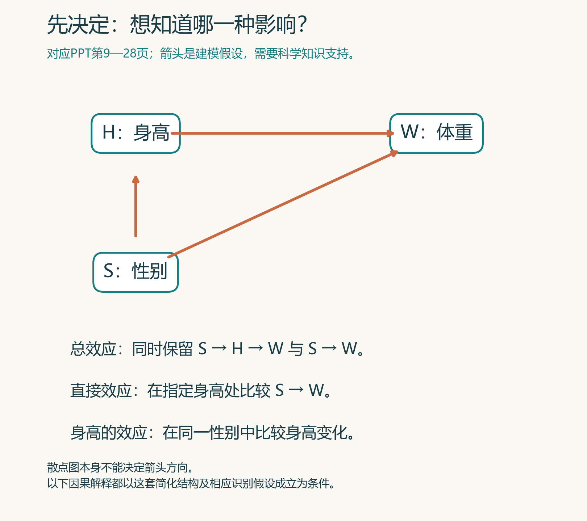

*导图｜按 PPT 第15、24—28页重绘。S 表示性别，H 表示身高，W 表示体重。箭头是需要科学依据支持的假设，不是软件从散点中自动发现的结论。*

沿着图走，性别到体重有两条路：一条先经过身高，再到体重；另一条直接到体重。这里的“直接”，只是说**没有经过图中这个身高变量**，不表示完全没有其他生物学过程。

于是，三个问题就可以说清楚了。

**第一，身高对体重的影响。** 在图中，性别同时影响身高和体重。如果我们想研究身高的作用，就不能忽略这条共同来源。在这套假设下，可以在每个性别内分别比较身高不同的人。

**第二，性别对体重的总效应。** 两条路都要保留。经过身高的影响也是总效应的一部分，不能先把它扣掉。

**第三，不经过身高的直接效应。** 这时才把身高固定在同一个值，比较两组的平均体重。

这解释了作者为什么把因果问题放在统计公式前面：**是否加入身高，取决于我们要保留哪一部分影响。** 多加一个变量，并不自动意味着答案更完整。

下面的因果解释都以这套简化结构成立、没有遗漏会妨碍比较的共同原因等假设为前提。真实数据中的组间差异本身，不能证明这些假设。

## 二、先造一批“人”，看看模型能不能找回已知答案（第21—38页）

真实数据有个困难：我们通常不知道正确答案是多少。模型给出一个数，也就不容易判断它有没有回答我们想问的问题。

作者先造了一个小小的模拟世界。在这个世界里，规则由我们写，因此可以事先知道答案。

给女性编号 1，男性编号 2。先生成身高，再根据身高和性别生成体重：

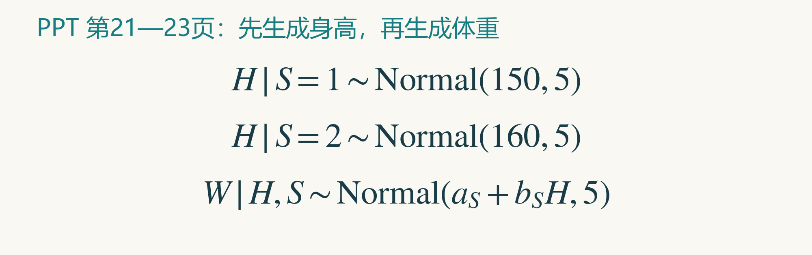

前两行说：女性模拟身高围绕 150 厘米分散，男性围绕 160 厘米分散，标准差都为 5 厘米。

第三行说：给定身高和组别以后，体重围绕“该组的起点，加该组斜率乘身高”分散，标准差是 5 千克。图中 Normal 括号的第二项都是**标准差**；竖线表示“给定右边这些条件”。

这里的小写 a、b 是我们给模拟世界指定的参数。后面拟合真实数据时使用的中心化截距，是另一套模型里的参数，不能把数值直接混用。

先按 PPT 第23页设置：两组起点都是 0，女性斜率是 0.5，男性是 0.6。因为随机波动的平均值为零，两组的平均体重可以事先算出来：

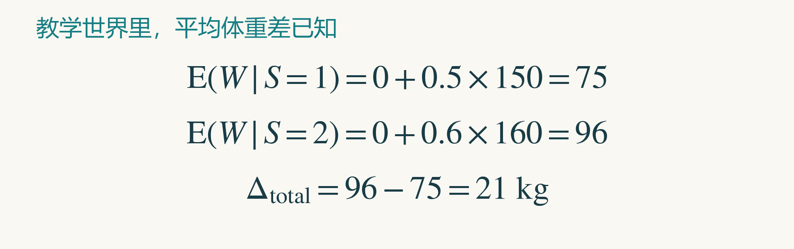

E 在这里表示平均值。女性平均体重为 75 千克，男性为 96 千克，差 21 千克。

这些数字是作者特意设定的教学世界，**不是真实样本的体重结论**。随机生成有限人数以后，样本差值不会每次都恰好等于 21。

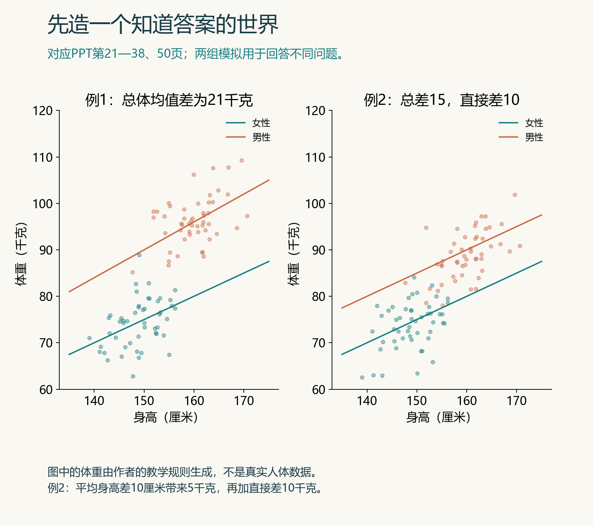

*教学图｜左图使用第23页的规则；右图使用第50页的规则。点是本文按固定随机种子重新生成的模拟个体，线是已知的生成均值。随机点不要求与 PPT 截图完全相同。*

右图换了一套规则，对应 PPT 第50页。先把左图的数字放下，单独看右图。

女性的平均身高仍设为150厘米，男性仍设为160厘米。这一次，**两组的斜率都设为0.5千克/厘米**：在同一组内，身高每增加1厘米，模型给出的平均体重增加0.5千克。

此外，女性的体重均值按“身高乘0.5”计算，男性则在这个结果上再加10千克。比如同样是150厘米，女性的模型均值是75千克，男性是85千克。

这就是前面“起点不同”的具体意思：起点在数学上叫截距。右图把女性截距设为0、男性截距设为10，于是男性整条线比女性高10千克。**它不表示男性出生时重10千克，也不表示真实人群必然有这个差异；这是我们为模拟指定的规则。**

先比较两组各自的平均体重。把各组的平均身高代入上述规则，就得到：

| 比较对象 | 代入的身高 | 怎样算出平均体重 | 模型给出的平均体重 |
|---|---|---|---|
| 女性组 | 150厘米 | 150乘0.5 | 75千克 |
| 男性组 | 160厘米 | 160乘0.5，再加10 | 90千克 |

男性组的90千克减去女性组的75千克，得到**15千克的总体均值差**。这里保留了两组本来就不同的身高。

接着换一个问题：**如果两组都按150厘米来比较，差多少？** 女性还是75千克；男性改用150厘米计算，得到85千克。两者相差**10千克**。右图的两条线平行，所以换成其他相同身高来比较，线与线之间也都差10千克。

那么，总差里的另外5千克去了哪里？男性组原先按160厘米计算，现在改成150厘米，少了10厘米。每厘米对应0.5千克，所以模型均值随之减少5千克，从90变成85。这5千克，就是这套规则中经过身高差异带来的部分。

因此，在这个已知的模拟世界里，15千克的总差包含两部分：身高不同带来的5千克，以及同身高时仍保留的10千克。后者才是这里说的“不经过身高的直接差”。这里比较的始终是**模型给出的平均值**，并不是说任意两个人都恰好相差这些重量。

**如果把“同身高处的差”算出来，却拿它当作“总差”，即使计算一行没错，也回答错了问题。** 模拟的意义就是提前发现这种错误。

## 三、给每组一个编号，让模型取出对应的参数（第29—39页）

作者接着讲分类变量怎样放进模型。先不用害怕“编码”这个词：这里的 1 和 2，只是两个标签。

1 号抽屉放女性组的参数，2 号抽屉放男性组的参数。看到某个人的组别，就打开对应抽屉。**2 号不表示它是 1 号的两倍。**

如果以后有三组、四组，就增加对应的抽屉。这叫索引编码。作者选择它，是因为它方便为各组参数指定先验，也容易扩展到更多组和后面的多层模型。

先回答总效应对应的比较问题，暂时不把身高放进体重模型。每组一个平均体重：

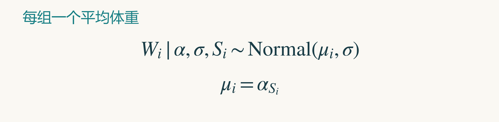

Wᵢ 是第 i 个人的体重，Sᵢ 是他的组别，μᵢ 是模型为他选用的平均体重。

**第二行负责选均值：** 女性用 α₁，男性用 α₂。**第一行负责描述个体差异：** 同组的人不会一样重，他们的体重围绕这个均值分散，标准差是 σ。给定参数后，模型将各人的观测视为独立。

完整计算还需要先验。按 PPT 第38—39页：

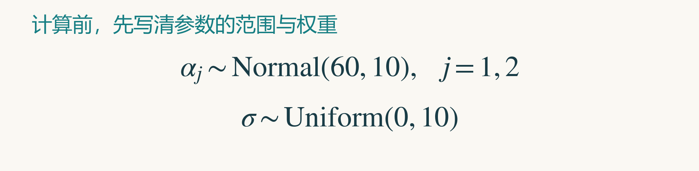

两个组均值各有一份均值为 60、标准差为 10 千克的正态先验；σ 在 0 到 10 千克之间采用均匀先验。三项参数先验独立。

这不等于强迫两组均值相等，也不等于把所有人的体重限定在 0～10 千克。后者限制的是**组内标准差 σ**。

作者先把模型用于模拟数据，检查能否找回已知差异，再用于真实数据。真实数据仍是 Howell1 的 352 名成年人：女性 187 人、男性 165 人。

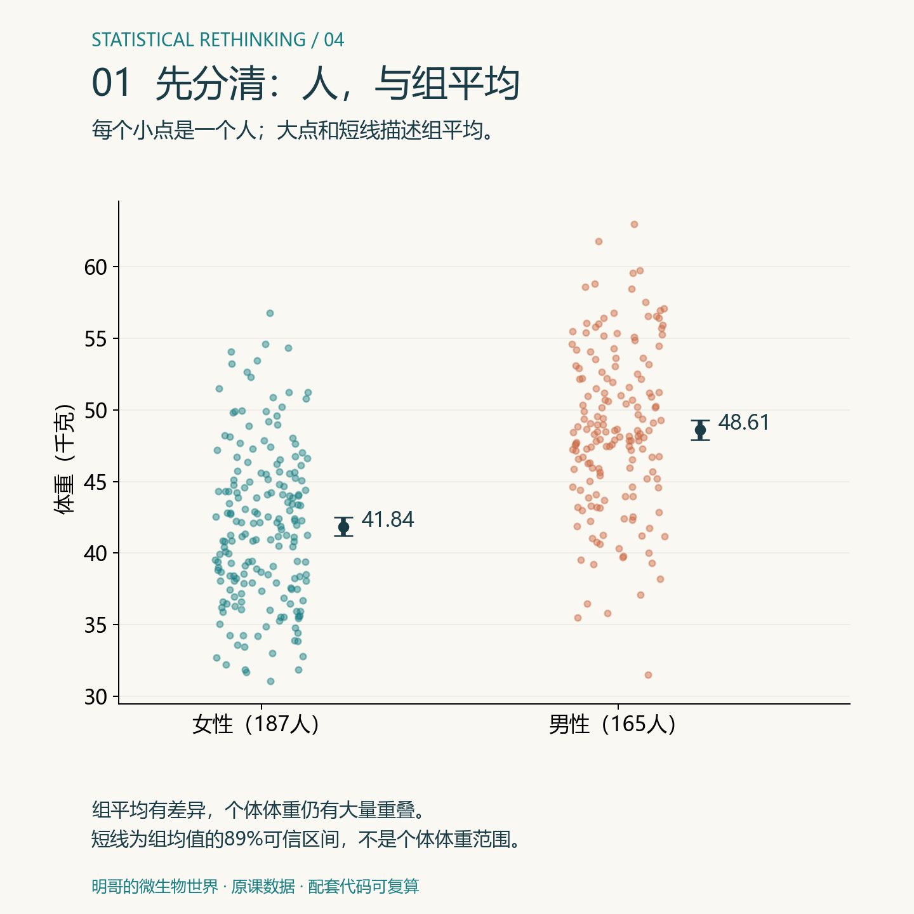

*图1｜小点是实际体重；大点和短线是组均值的后验均值及 89% 可信区间。短线描述组平均值的不确定性，不是这一组所有人的体重范围。*

复算得到：女性组的平均体重约为 41.84 千克，男性约为 48.61 千克。

这里使用前一课介绍的 quap，对包含两个均值和 σ 的联合后验作二次近似。**σ 仍然是需要估计的参数，没有先估出来再固定。**

## 四、比较两组，要算差值，不能只看曲线有没有重叠（第40—48页）

看到两个组均值，读者自然会想相减。但我们还得保留“均值没有完全确定”这件事。

把一次联合后验抽样想成取出一套参数：这套里面同时有女性均值、男性均值和 σ。先在这一套里面做“男性减女性”，再换下一套，继续相减。

Δ 表示差值；右上角的 s 表示第几次抽样，不是乘方。先得到一大批差值，最后再算它们的平均值和区间。

本例总体均值差约为 **6.77 千克，89% 可信区间为 5.83～7.70 千克**。按作者前面设定的因果结构，它被用来估计总效应；如果只接受统计模型、不接受相应因果假设，它表达的就是两组平均体重的差异。

PPT 第42—44页特意提醒：不能只看两个参数的分布或区间重不重叠，来代替差值的分布。两个参数可能一起变大或变小；这种共同变化会影响差值的不确定性，单独看两条边缘曲线容易漏掉它。

所以，每次相减要使用**同一套联合后验参数**，不能打乱两列后重新配对。

### 两组的均值差，与两个新个体的差

如果问题变成“各随机抽一个人，谁更重”，仅有两个均值还不够。每一套参数下，还需要从各组的体重分布中独立模拟一个新个体，然后相减。

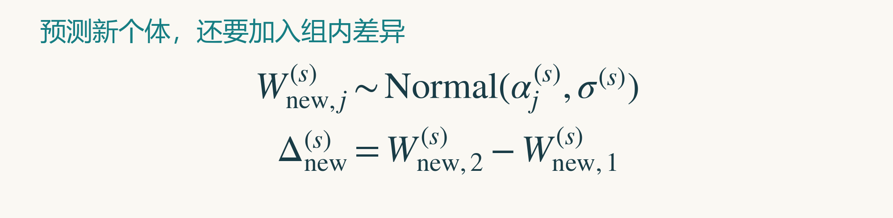

new 表示新个体，j 表示组别。第一行分别对两个组做一次；第二行算两个模拟体重的差。

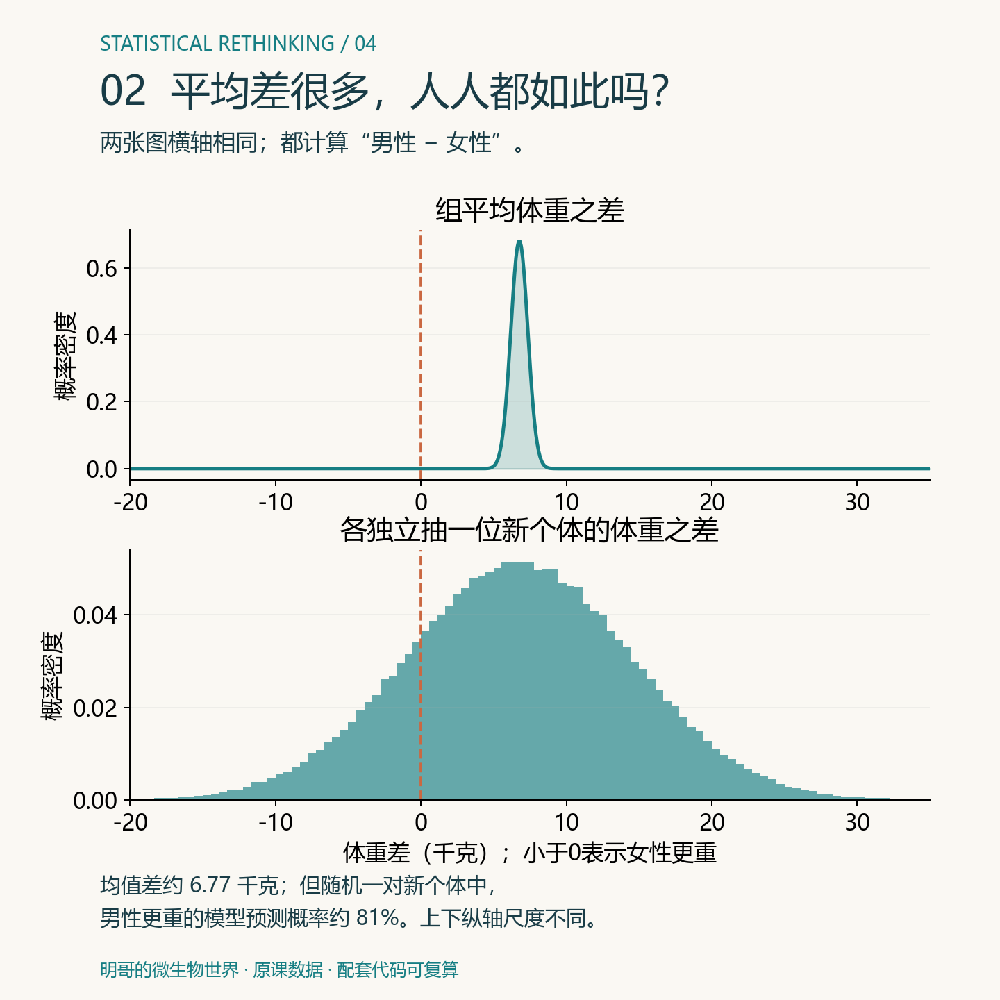

*图2｜上图是组平均体重差的后验，下图是两个独立新个体的体重差预测。都按男性减女性计算；横轴相同，纵轴尺度不同。*

均值差比较集中，但个体差宽得多。因为除了参数的不确定性，我们又加入了同组人之间本来就存在的差异。

本文计算得到，男性更重的预测概率约为 **81%**。PPT 第47页一次模拟显示约 82%；数值近似及模拟的抽样次数、种子不同，比例会略变，不能把截图里的比例当作必须精确重现的常数。

这一步回答的是两个独立新个体的比较，不是“同一个人如果出生时性别不同，体重会相差多少”的个体反事实问题。

## 五、要看直接效应，就在同一个身高处比较（第49—63页）

现在回来回答第三个问题：不经过身高的那部分影响有多大？

按照前面的因果图，我们把身高固定在同一个值，比较女性和男性的平均体重。于是模型需要两条线：每组有自己的截距，也有自己的斜率。

先把原始身高减去这 352 人的平均身高，约 154.60 厘米。这样截距就有了容易解释的位置。

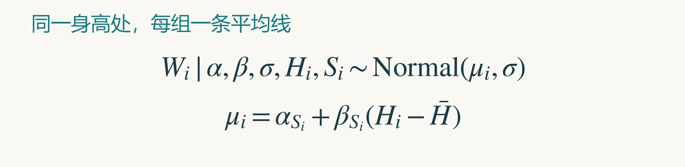

Hᵢ 是原始身高，H 上方的横线是全体样本平均身高。

α₁、α₂ 分别表示在参考身高 154.60 厘米处，两组的平均体重。它们**不再是上一节不限制身高时的组平均体重**。

β₁、β₂ 分别表示各组身高相差 1 厘米时，线上平均体重相差多少千克。σ 则继续描述个体围绕平均线的分散程度。

这里严格采用 PPT 第59页的先验：

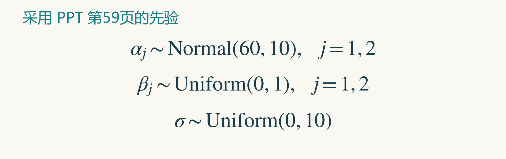

每组斜率在 0～1 千克/厘米之间采用均匀先验。作者公开脚本中还有对数正态斜率先验的版本，本篇按 PPT 计算，公式、图片和三个语言的代码保持一致。

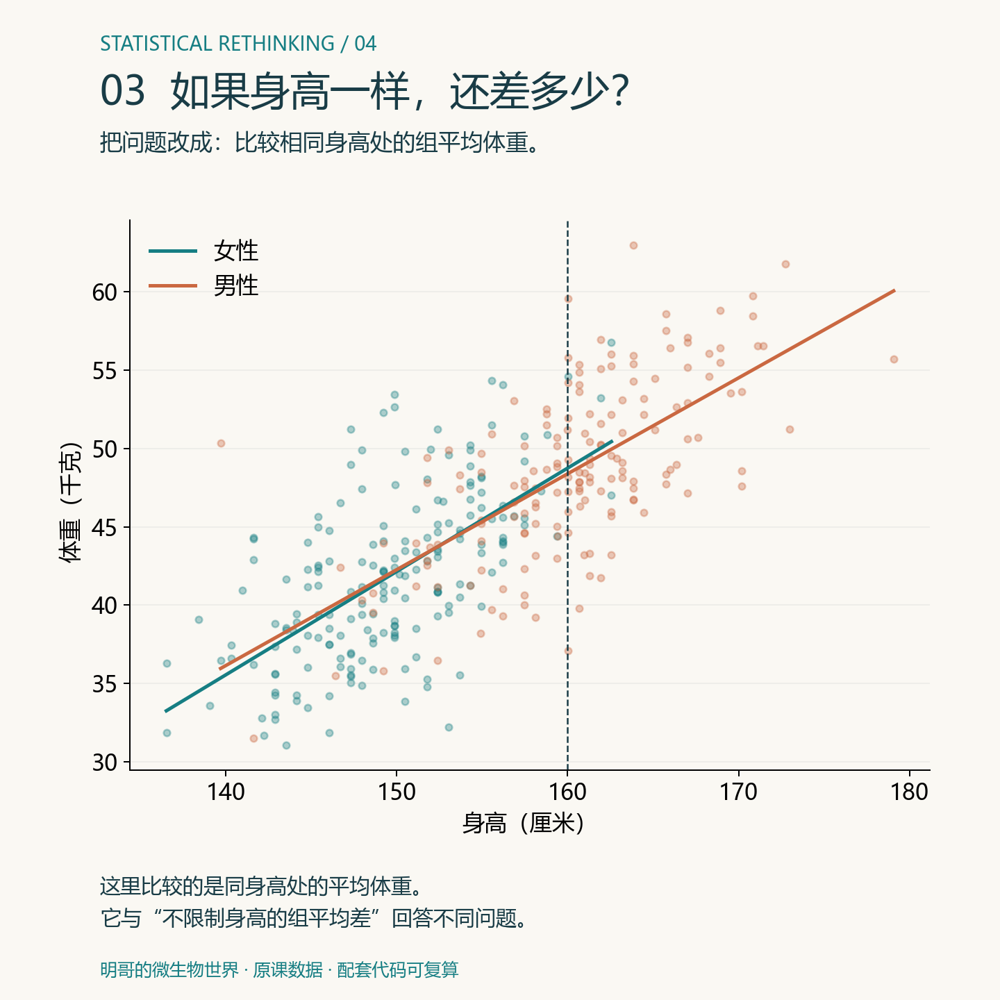

*图3｜横轴标原始身高，计算使用中心化身高。两条线画在各组实际观测到的身高范围内。虚线标出 160 厘米。*

### 同一个身高，先找到两个均值，再相减

这一段跟随 PPT 第61页，采用**女性减男性**。注意它与前面总体比较的方向相反，方向换了，正负号也会换。

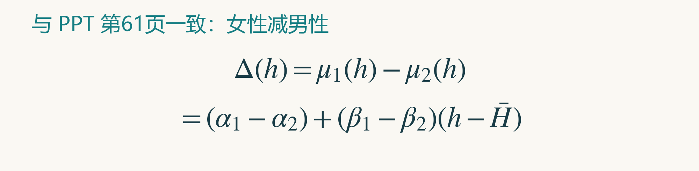

h 是我们想比较的身高。第一行就是两条线在 h 处的高度相减；第二行把两条直线展开。

对每一套后验参数都这样算，就可以画出各身高处差值的分布。

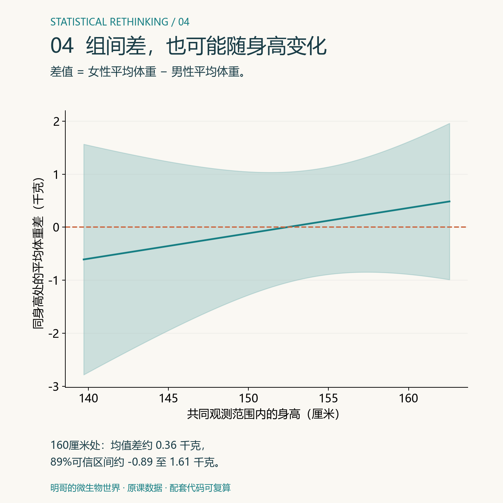

*图4｜实线是女性减男性的平均体重差，阴影是差值逐点的 89% 可信区间。为减少外推，这里只画两组共同观测到的身高范围；PPT 第61页画到 130～190 厘米。*

在 160 厘米处，女性减男性的平均体重差约为 **0.36 千克，89% 可信区间约为 −0.89～1.61 千克**。

这与前面约 6.77 千克的总体差异不是同一个问题。总体比较保留了身高差异；这里比较的是两组身高相同的位置。

作者据此给出的解释是：在这套因果模型下，总体差异主要沿着身高这条路径传递。我们要把这个判断和假设一起读，不能说“做完回归就证明了生物学原因”，也不能因为区间跨过 0 就认定直接效应严格等于 0。

到这里，分类变量部分就完成了作者第63页的要求：**先为每套参数算出所关心的对比，最后才总结平均值和区间。**

## 六、把儿童放回数据，直线还能用吗？（第65—71页）

前面只看成年人。现在按照 PPT，把儿童也放回 Howell1，一共 544 人。

身高与体重的关系明显弯曲了：从儿童到成人，很难让一条直线同时描述整个范围。

作者先展示多项式的做法。除了原来的身高项，再加入身高的平方，就可以产生弯曲：

x 是预测变量；计算时可以先标准化身高，以避免平方后数值过大。β₁ 控制一次项，β₂ 控制平方项。它们要一起看，单独一个系数不再直接等于“任意位置的斜率”。

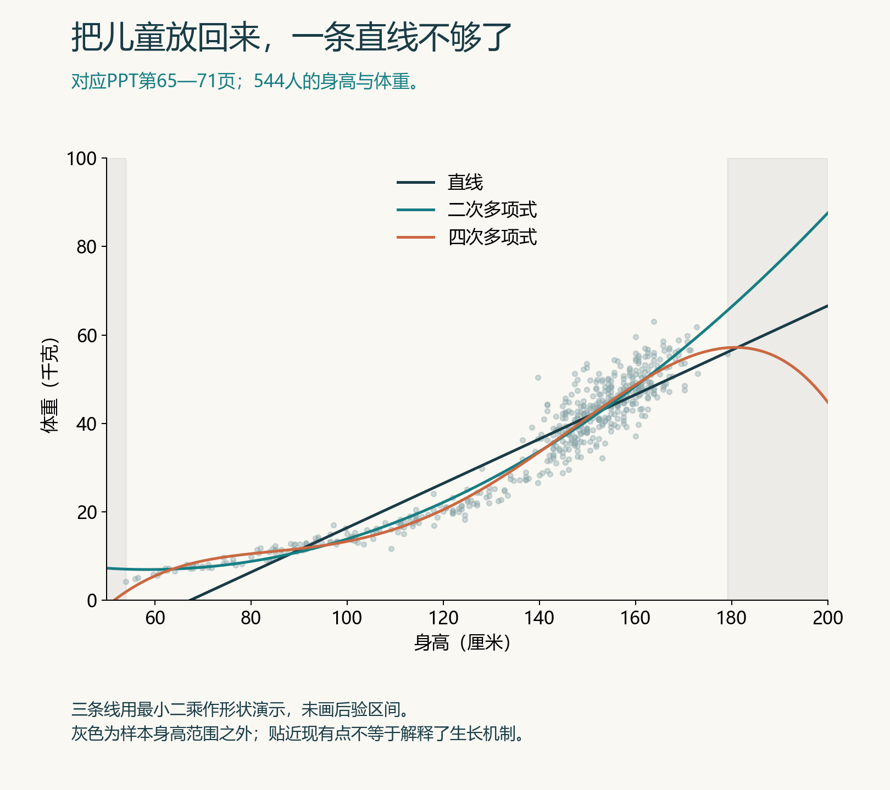

*教学图｜对应 PPT 第65—70页的比较思路。本文用最小二乘重绘函数形状，不把它称为作者原图的后验复刻，也未绘制不确定性区间。灰色部分超出样本身高范围。*

加上平方、立方甚至更高次项，曲线会更灵活。作者却在第67页给了很强的反对意见：高次多项式容易出现奇怪的形状，边缘行为不稳定，而且改变一个系数会影响整段曲线，很难只调整局部。

因此，这里不是给多项式“评一个冠军”。它用来说明：**能把线弯过去，不代表已经理解了身体为什么这样长。**

第71页作者把话题拉回身体的几何形状和科学机制。他展示的拟合曲线仍是示意，并没有在这一讲完成一个生长机制模型；更深入的机制讨论留在后面的课程。

## 七、样条怎样把局部形状拼成曲线？（第72—83页）

作者接下来换一种办法：准备许多个只在局部范围起作用的形状，再把它们相加。这些形状叫作**基函数**。

可以先把它们想成放在横轴不同位置的几块小山包。每一块都有一个权重：正权重让它往上贡献，负权重让它往下贡献，权重大小决定贡献多少。

在某个位置预测时，只做两步：看每一块在这里有多高，再乘它的权重后相加。某块在这里为零，它在这里就不贡献。

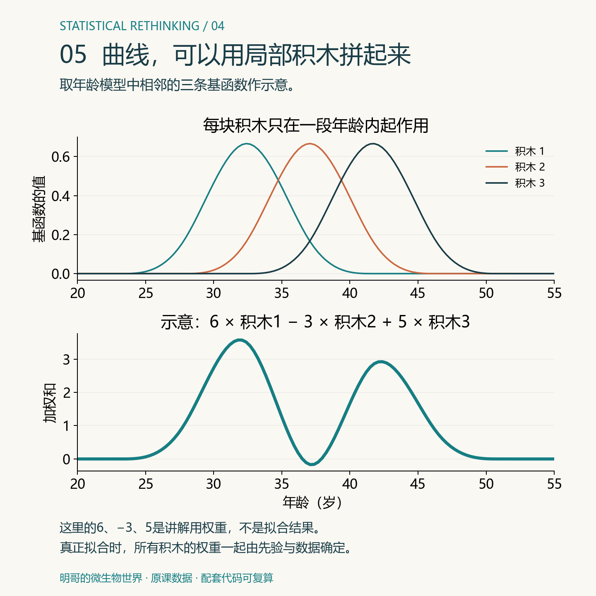

*图5｜按 PPT 第77—83页的“基函数乘权重再相加”思路重绘。取年龄样条中的三个相邻基函数，用 6、−3、5 作演示权重。这些权重用于解释计算，不是数据拟合结果。*

上图告诉我们各块在哪些年龄起作用，下图把它们加在一起。改变一块的权重，直接改变的是这块覆盖的那一段。

这就是它与全局多项式的关键区别。**但“局部”不表示最终参数彼此独立：拟合时，它们仍需要一起估计。**

原书第114页起给出了更详细的图解，PPT 第77页也明确引导读者去读那里。这里借用原书帮助理解计算，主案例继续跟随 PPT，使用年龄和身高。

## 八、年龄与身高：画出了曲线，仍没有解释生长（第84—92页）

现在横轴换成年龄，纵轴是身高。作者想用样条得到一条大致合理的平均趋势：儿童阶段增长快，成人阶段逐渐变平。

完整模型如下：

Aᵢ 是第 i 个人的年龄，Hᵢ 是身高，μᵢ 是模型给出的平均身高。α₀ 是共同基准，Bₖ 是第 k 个局部形状，wₖ 是它的权重。

求和符号表示把所有局部贡献加起来。第一行再补上实际个体围绕平均趋势的差异，标准差为 σ。

数值计算采用作者课程配套脚本中“height ~ age”这一段：20 个等间距节点位置，按其写法构造 23 个三次样条基函数。先验是：

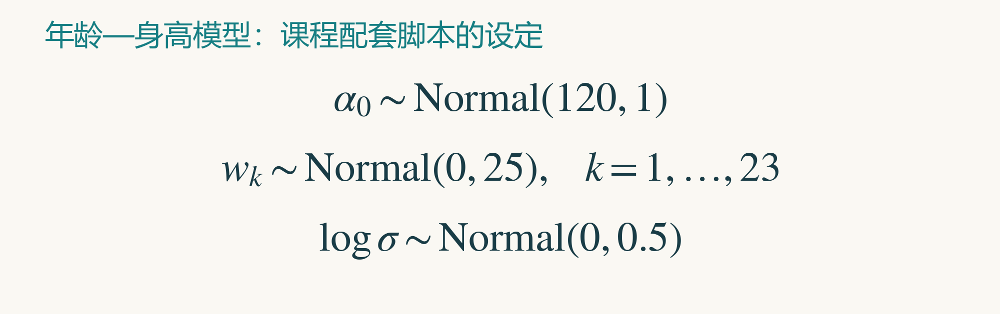

基准采用均值 120、标准差 1 厘米的正态先验；各权重采用均值 0、标准差 25 的正态先验，允许曲线在基准上下调整。最后一行给 σ 的自然对数设先验，保证 σ 为正。参数先验独立。

这些是作者脚本明确给出的教学设定，并非由 PPT 图上的形状反猜出来的。

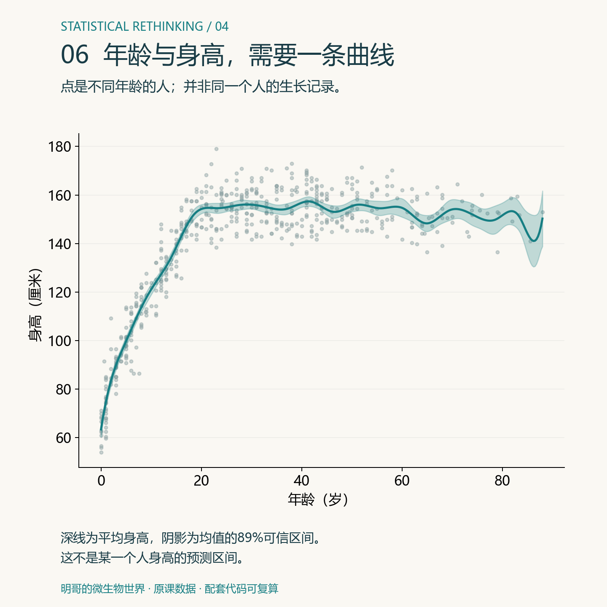

*图6｜点是不同年龄的个体。深线是平均身高，阴影是其逐点 89% 可信区间，不是新个体身高的预测区间。PPT 第87—88页还演示了逐步加入数据的过程；这里展示使用全部 544 人的结果。*

曲线抓住了儿童与成年人之间的大变化，也会在局部出现小起伏。**不能把每个起伏都解释成一个生物学事件。** 尤其数据稀疏的年龄段，形状更依赖函数和先验的设定。

还有一层容易忽略：这是不同年龄个体的横截面数据，不是对同一个人从出生跟踪到老年的生长记录。

PPT 第85—86页专门问：“年龄怎样造成变化？”年龄在这里记录的是时间积累，身体发生了发育和生长。仅仅把横轴换成年龄，并没有把这些过程写进模型。

所以作者最后提出，应尽量把科学知识放进模型，例如儿童身高增长、之后趋缓等约束。样条有能力描述曲线，**生长机制还需要另写出来**。

## 九、进阶：能不能用一个模型回答前面的多个问题？（Bonus，第95—102页）

前面为不同问题用了不同模型。作者最后补充另一条路线：把整个因果系统一起建模，再从同一个联合后验中计算不同目标。

我们已经有“给定身高和性别后的体重模型”。现在补上“给定性别后的身高模型”：

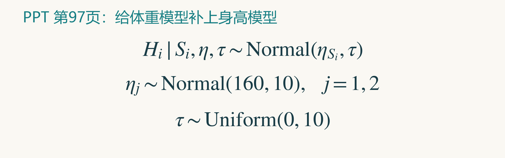

η₁、η₂ 是两组的平均身高，τ 是组内身高的标准差。这里用 η 避免和具体身高 h 混淆；PPT 代码把这组参数命名为 h。

**这三行，加上第五节的体重模型及其先验，才是这里的完整联合模型。** 身高和体重各有自己的散布参数，τ 与 σ 不能混用。

要模拟总效应：在每套后验参数下，先按女性组生成身高，再生成体重；男性组也走一遍，再计算比较。这样经过身高的路径被保留了。

要计算某个身高处的直接效应：给两组同一个身高，分别算平均体重，再相减。

两种做法的差别就在于：**身高是跟着组别一起生成，还是被固定成同一个值。**

模型模拟的是所写因果假设下的干预后果，并不意味着我们已经在现实中实施了这种干预。模拟两个独立个体得到的差值，也不能自动解释成同一个人的个体因果效应。

作者用这一段收束整讲：明确想知道什么，再设计相应模型和计算；或者先写出完整系统，再通过模拟计算各个问题。

## 配套代码：公式、数据和图怎样对应？

本篇脚本、数据、配图和运行说明已放在 GitHub，下载后可直接对照本文运行。

GitHub 配套项目：https://github.com/fuyuming/statistics-classroom/tree/main/rethinking/article04_categories_and_curves

进入项目后，先看 README 运行说明；R、Python、MATLAB 主脚本及绘图脚本都在“代码”文件夹。

[下载本篇完整项目](精读04_v3_完整项目.zip)，解压后先看 [运行说明](README_v3.md)。

本文的主模型按 PPT 第39、59、97页以及作者年龄—身高样条脚本编写。正式计算的 R、Python、MATLAB 版本使用相同数据、先验与设计矩阵。

- [R 主脚本](代码/lesson04_v3.R)：实际调用 quap，包含三种主模型和 Bonus 完整联合模型；自动调用 [R 中文绘图](代码/lesson04_plots_v3.R)。
- [Python 主脚本](代码/lesson04_v3.py)：独立计算三种主模型的二次近似，调用 [Python 中文绘图](代码/lesson04_plots_v3.py)。
- [MATLAB 主脚本](代码/lesson04_v3.m)：独立计算三种主模型的二次近似，调用 [MATLAB 中文绘图](代码/lesson04_plots_v3.m)。
- [PPT 主线教学图脚本](代码/lesson04_teaching_v3.py)：生成因果图、模拟示意及多项式形状图；[公式图片脚本](代码/render_formula_v3.py) 导出全部公式 PNG 和 SVG。

R、Python 和 MATLAB 主脚本都会原生绘制并保存六张统计图；在图形界面中运行时可以查看图形。公式图片由专门脚本导出。Bonus 联合模型目前由 R 脚本实现，Python、MATLAB 的对应范围是前面的三个主模型。

可以先做一个与原课一致的练习：在第二节的模拟世界中，把两组斜率设为相同，但保留不同的平均身高。想一想，总效应会不会因此消失？再把身高固定，看看直接比较发生什么变化。

回到这一讲最开始的问题：**模型里的参数，必须经过与问题相对应的计算，才变成我们真正要报告的答案。** 会使用分类变量和曲线，是为了把这个过程做完整。

### 来源

- 作者第四讲 PPT：https://speakerdeck.com/rmcelreath/statistical-rethinking-2023-lecture-04
- 课程主页：https://github.com/rmcelreath/stat_rethinking_2023
- 分类及联合模型脚本：https://github.com/rmcelreath/stat_rethinking_2023/blob/main/scripts/04_height_weight_sex_categorical.r
- 样条脚本，年龄—身高例子在后半段：https://github.com/rmcelreath/stat_rethinking_2023/blob/main/scripts/04_prior_pred_spline.r
- 原书：《Statistical Rethinking》第二版，§4.4、§4.5、§5.3。原书解释与课程例子不完全一致，本文按第四讲组织，不将课程第四讲称为原书第四章。

*图和数字为配套代码复算或明确标注的教学重绘；正文中的因果判断依赖作者设定的模型假设。*
