# 多控制一个变量，为什么反而会错？——看懂因果关系的四种形状

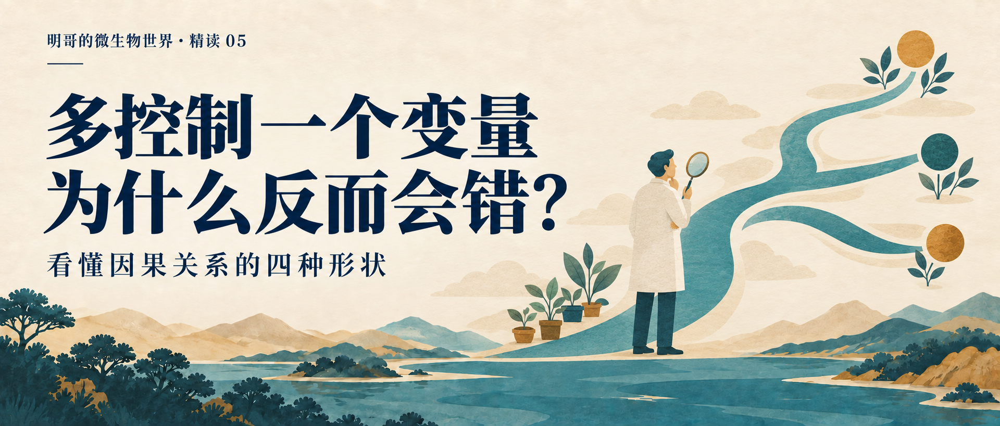

> 明哥的微生物世界 · Statistical Rethinking 精读 05
>
> 摘要：结婚率高的地方，为什么离婚率也高？抗真菌处理明明帮助植物生长，为什么加一个变量后，看起来却没用了？跟着作者第五讲，弄清“控制变量”究竟改变了什么。

大家好，我是明哥。

上一课，我们比较了同一份数据里的两个问题：两组总体差多少，以及身高相同时还差多少。两种比较保留的信息不同，答案自然也不同。

这一课再往前走一步：**放进回归模型的变量，究竟是在帮我们消除干扰，还是在制造新的误解？**

作者开场放了几张看起来很有关系的图：重金属乐队与幸福程度、华夫饼店与离婚率。图上两个量一起变化，很容易让人想出一个故事。但故事说得通，还不够。

接下来，作者用四种箭头结构解释，关联可以怎样产生，又会怎样被我们改变。它们叫叉、管、对撞和后代。先不用背名字，我们一个个看。

本文以2023年第05讲《Elemental Confounds》为主线，页码按原课PDF顺序计数，包含封面。原书第5章与第6章相关小节用于补充解释。下文的二元数字按作者给定概率精确计算，和PPT里一次随机模拟的频数有区别。

## 一、先弄清“控制”这个动作（第9—15页）

假如有人问：“在年龄相同的人里，运动多的人是不是更健康？”这里已经做了一次控制：先把比较范围限制在相同年龄，再看运动和健康的关系。

按年龄分组、只保留某一年龄段、在回归中加入年龄，都是在利用年龄信息改变比较。不过，回归怎样实现这种比较，还依赖我们写下的模型；一条直线并不能自动适合所有年龄关系。

作者把这种做法称为**条件化**。可以先把这个词读成：“已经知道某个变量的值以后，再比较其余变量。”

现在看第一种形状。

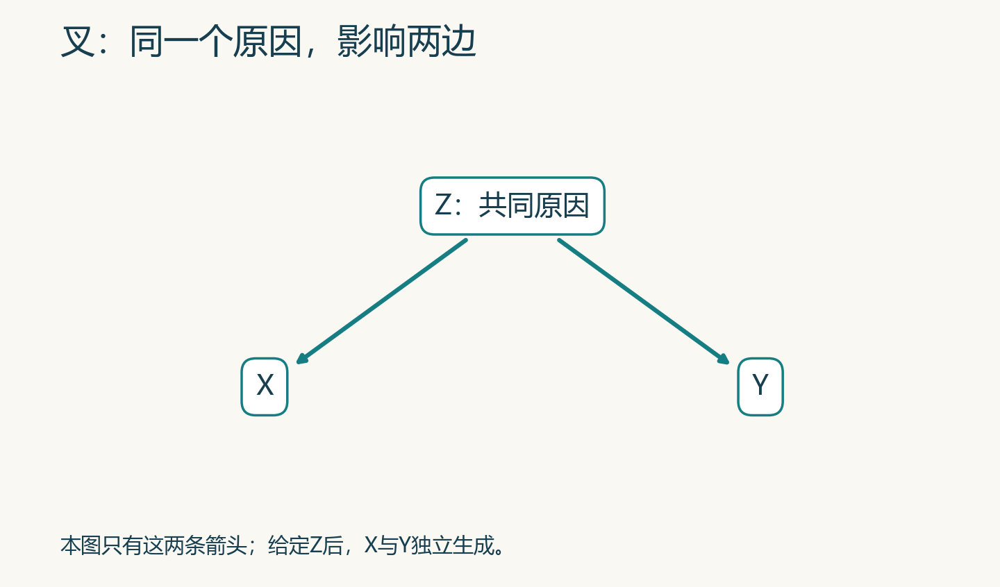

*图1｜按PPT第10页重绘。Z分别影响X和Y。箭头从原因指向结果；这里没有X到Y的箭头。*

为了把它算清楚，作者先让三个变量都只有0和1两种状态。0、1只是标签，比如“没有／有”，不是分数。

规则是：Z一半机会为0，一半机会为1。Z为0时，X和Y各有10%的机会为1；Z为1时，X和Y各有90%的机会为1。**给定Z以后，X和Y分别独立生成**，好比各抽各的签。

把这个规则想象成两类各有100人的人群，按概率换算，得到下面的期望人数。它们是帮助理解的理论数字，不是实际抽到的一批人。

| 所在人群 | X=0、Y=0 | X=0、Y=1 | X=1、Y=0 | X=1、Y=1 |
|---|---|---|---|---|
| Z=0，按100人换算 | 81 | 9 | 9 | 1 |
| Z=1，按100人换算 | 1 | 9 | 9 | 81 |
| 合在一起，按200人换算 | 82 | 18 | 18 | 82 |

先看第一行：两者都为0的概率，是90%乘90%，所以100人对应81人；两者都为1的概率，是10%乘10%，对应1人。其他格子同样计算。

如果把两组混在一起，X为1的100人里，有82人的Y也为1；X为0的100人里，却只有18人的Y为1。看上去，知道X就很能帮助判断Y。

但只看Z为0的人，X为1时，Y为1的比例是1除以10，也就是10%；X为0时，这个比例是9除以90，同样是10%。换到Z为1的人，两边又同样是90%。

**总体的关联来自两类人群混在一起。知道共同原因Z以后，X本身不再提供额外信息。** 这就是“叉”。这个结论来自眼前这套生成规则；真实研究可能还有其他路径，不能看到一个共同原因就认定问题全部解决了。

## 二、结婚率与离婚率：年龄怎样混进比较？（第16—25页）

回到作者的真实数据。一个地区的结婚率越高，离婚率也往往越高。我们能直接说“结婚率上升，导致离婚率上升”吗？

作者引入第三个量：**结婚年龄中位数**。把一个地区结婚者的年龄从小到大排列，中间的位置对应的年龄就是中位数。它描述这个地区通常多大年纪结婚。

一种待检验的解释是：结婚年龄较早的地区，结婚率可能较高，离婚率也可能较高。这样，即使结婚率对离婚率没有直接作用，两者也可能一起变化。

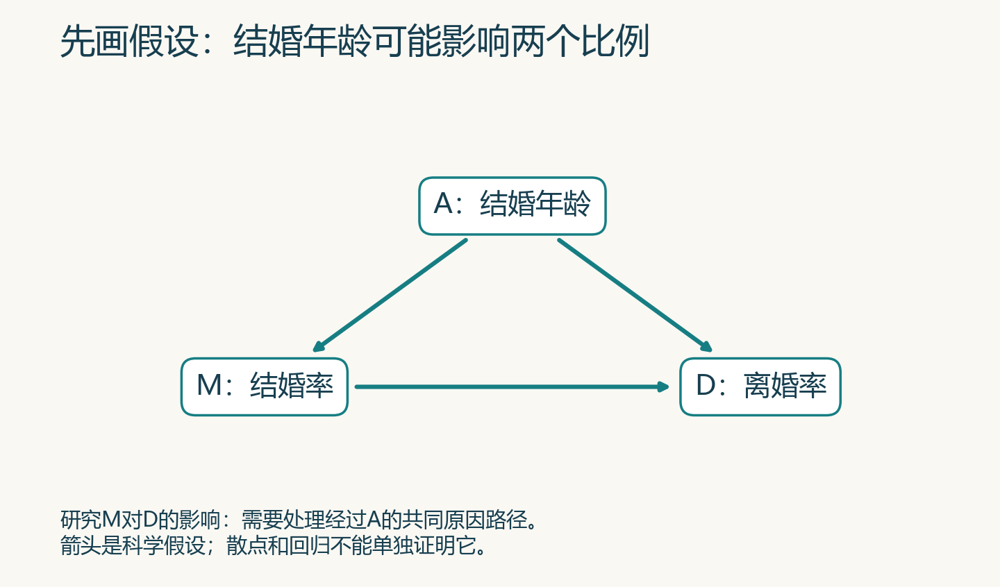

*图2｜按PPT第20—23页重绘。A为结婚年龄中位数，M为结婚率，D为离婚率。保留M到D的箭头，是让模型考察这条可能的作用；箭头并不是回归已经证明的事实。*

如果要研究M对D的影响，A就是需要处理的共同原因。我们希望比较的是：**结婚年龄相近的地区，结婚率不同时，离婚率怎样变化？**

这里一行数据代表一个地区，不是一个人。因此，后面的结果也不能直接变成“某个人晚结婚一年，离婚风险会怎样”。

作者先把三个变量做标准化。

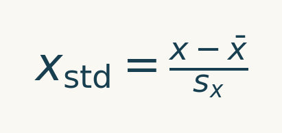

横线上方的x是原数值，带横线的x是样本均值，分母s是样本标准差。标准差可以理解为数据通常分散多远。计算就是：**先看这个值比平均值高多少，再看这段距离相当于几个标准差。**

比如，假设某项指标均值20、标准差5，原值25就变成1，原值15就变成−1。这里的20和5只是解释算法的小例子，不是教材数据的统计量。

标准化后的0表示处在平均水平，1表示比平均值高一个标准差。后面的斜率都在这个新尺度上解释，不能再当作原来的“每一岁”或“每一个百分点”。

## 三、模型里的每一项，到底在说什么？（第22—32页）

作者写下这个模型：

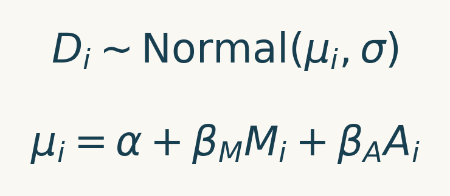

第一行说：第i个地区的离婚率Dᵢ，围绕该地区的平均预测值μᵢ波动。Normal是正态分布；这里第二个参数σ是标准差，描述模型仍未解释的地区差异。

第二行说明平均预测值怎样计算：从基准α出发，加上结婚率对应的部分，再加上结婚年龄对应的部分。

- **α：基准值。** 当结婚率和结婚年龄都处在平均水平时，模型给出的平均离婚率。
- **βM：结婚率的斜率。** 结婚年龄相同，结婚率增加一个标准差，平均离婚率改变多少个标准差。
- **βA：结婚年龄的斜率。** 结婚率相同，结婚年龄增加一个标准差，平均离婚率改变多少个标准差。
- **σ：剩余波动。** 即使两个地区的M和A相同，离婚率也不会完全一样。

这样，“加入年龄”就有了具体含义：模型在相同A下比较不同M。这个加法模型还假设，结婚率的斜率在不同年龄水平下相同。是否合理，需要科学知识和模型检查支持。

### 先验不能只写“给得宽一点”

作者没有马上拟合，而是先问：这些参数在看数据前，会画出什么样的线？

最开始，他给截距和斜率都用了标准差为10的正态先验。对已经标准化的数据，这意味着很容易生成极陡的关系：结婚年龄只变动几个标准差，预测离婚率就跳动几十个标准差。

随后，作者把先验收紧为：

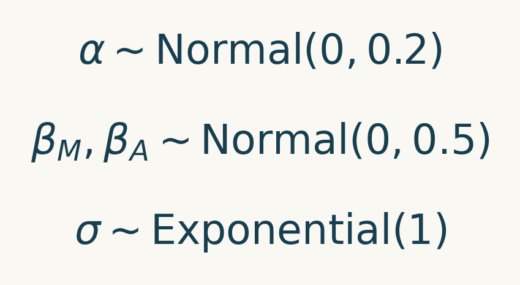

α的先验以0为中心，标准差0.2；两个斜率也以0为中心，标准差0.5。正负斜率都允许，但特别大的值获得较少权重。三者的先验彼此独立。

σ不能小于0，所以作者使用指数分布。括号里的1是速率参数；在这里，它使σ的先验均值为1。它偏向较小的剩余波动，同时允许更大的值。σ的先验也独立于前面三个参数。

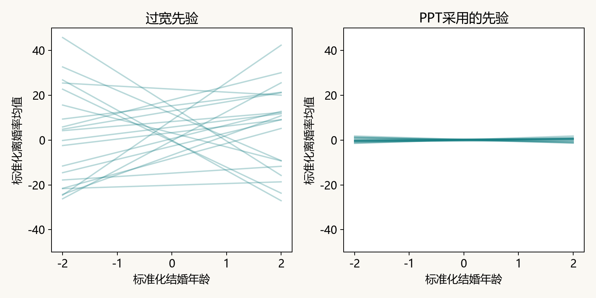

*图3｜按PPT第26—29页的参数重绘。把标准化结婚率固定在0，两边各画20条从先验抽出的平均关系线；横纵轴尺度相同。右图集中在中央正是尺度变化的结果。这里没有加入个体残差，因此是先验中的条件均值线，不是完整的新数据模拟。*

这个检查的目的，是发现我们无意中允许了什么，并非挑一套能让结果“好看”的先验。

### 拟合以后，结婚率还剩下多强的关系？

我们用作者的WaffleDivorce数据和PPT第31页的模型重新计算。R版调用quap，用峰顶附近的正态形状近似联合后验；Python与MATLAB实现同一模型的二次近似。

| 参数 | 近似后验均值 | 中间89%的后验区间 |
|---|---|---|
| 结婚率斜率βM | −0.065 | −0.306～0.176 |
| 结婚年龄斜率βA | −0.614 | −0.855～−0.372 |

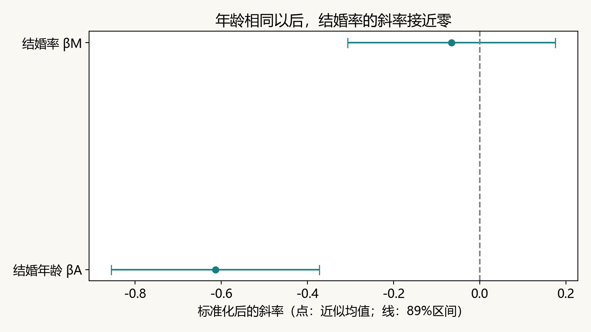

*图4｜点为近似后验均值，线为中间89%的后验区间。两个参数都在标准化尺度上；这不是单个地区的预测区间。*

结婚年龄相同以后，结婚率斜率靠近0，后验中仍容纳正、负两种方向。可以说，**在这套模型与数据下，结婚率原先的正关联，不能直接解释为明确的正向因果作用。** 不能说“已经证明结婚率没有任何影响”。

βA为负，则表示在结婚率相同的比较中，结婚较晚的地区倾向于有较低的离婚率。它是否能得到因果解释，同样取决于前面的图及没有遗漏关键共同原因等假设。

## 四、作者为什么还要“模拟一次干预”？（第33—38页）

到这里，我们仍然在描述现有地区。作者接着换了一个问题：**假如主动把结婚率从平均水平提高一个标准差，会怎样？**

不能直接拿原数据里结婚率高、低的两批地区相减，因为两批地区的结婚年龄可能也不同。

作者的模拟做法是：先从后验取出一组参数，再取一个结婚年龄；保留这个年龄，分别把结婚率设为0和1，算两种情境下的离婚率。换一组参数和年龄，继续重复。

0和1在这里是标准化后的结婚率：0代表样本平均水平，1代表高一个标准差。**相同年龄被用于两种情境，才没有把年龄构成变化一起算进去。**

如果只比较模型的平均预测值，两次计算的α和年龄项完全相同，相减后只剩βM：

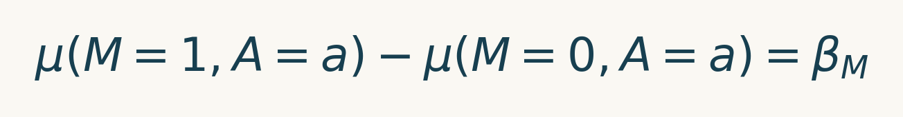

这里的小写a是固定的年龄水平，与截距α不同。整条βM后验，表达的是这项平均变化仍有多大不确定性。

PPT第34—37页的代码还做了额外一步：在两种情境里分别加入随机残差，再将两个模拟结果相减。这不仅包含参数不确定性，还包含两次预测结果各自的波动，所以分布更宽。

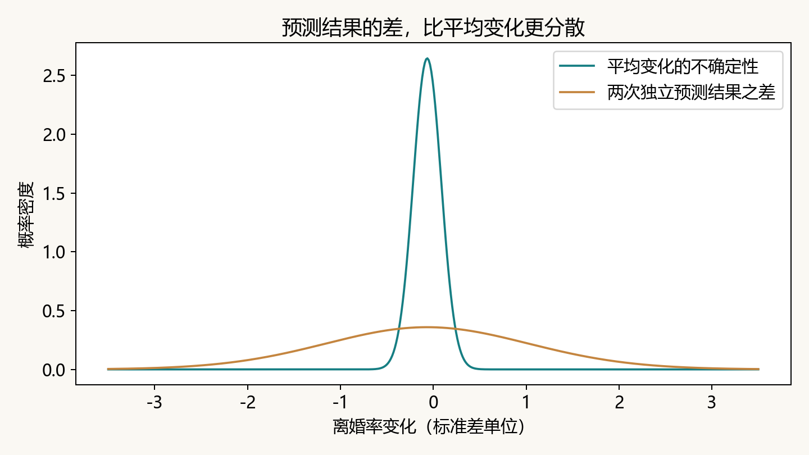

*图5｜青色为βM的近似后验，赭色为两次独立预测结果之差的分布。后者按联合后验抽样后混合计算；两边面积都为1。它不是“同一个具体地区的真实个体因果效应”的已知分布。*

理解到这里，再看作者图中的do就不神秘了：它表示我们在模型里主动设置某个变量，而不是仅仅挑出观察值碰巧相同的人。**这种模拟依赖已经写下的因果假设，不会替代真实干预的证据。**

## 五、植物、真菌与处理：控制以后，问题换了（第40—51页）

第二种形状是“管”：一个变量先影响中间变量，再由它影响结果。

作者的例子很贴近生物实验：100株植物，一半接受抗真菌处理，另一半不处理。记录初始株高、最后株高，以及是否出现真菌。

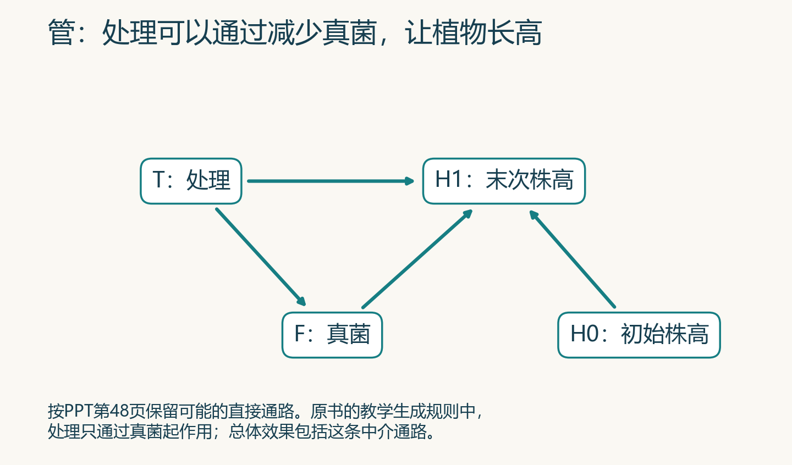

*图6｜按PPT第48页重绘。F是真菌状态，H₀与H₁分别是初始、最后株高。处理到末次株高的直接箭头在原课图中也保留；是否存在直接作用，需要具体机制判断。*

处理可能让植物长得更好，恰恰是因为减少了真菌。现在如果把真菌也放进模型，比较“真菌状态相同的植物”，就拿掉了我们本来想计入的这部分帮助。

原书第171页的教学生成规则，可以把这件事算得很直观：不处理时，出现真菌的概率是50%；处理后降到10%。没有真菌时，平均增长5个身高单位；有真菌时，少长3个单位，所以平均增长2个单位。

按每组100株的期望构成来算：

| 情境 | 无真菌／有真菌的期望株数 | 每株平均增长 |
|---|---|---|
| 不处理 | 50／50 | 50株各长5，加50株各长2，再除以100，得到3.5 |
| 接受处理 | 90／10 | 90株各长5，加10株各长2，再除以100，得到4.7 |

处理后的平均增长比不处理多1.2。这就是这套生成规则的总效应；它是机制给定的期望差，有限样本估计不会必然正好等于1.2。

但只比较无真菌的植物，两组都平均长5；只比较有真菌的植物，两组都平均长2。**真菌状态固定以后，处理的直接差是0。** 在这套规则里，处理本来就只通过减少真菌起作用。

因此，“处理有帮助”与“真菌相同时，处理没有额外作用”可以同时成立。后一个答案不能拿来否定前一个问题。

这也接上了上一节：如果改问结婚年龄A的总效应，结婚率M可能就在A到D的中介路径上。此时又把M固定住，就不再保留A的全部作用。**同一个M，换了研究问题，处理方式也可能改变。**

把真菌换成“接种后改变的菌群密度”，道理相通。是否受处理影响要看机制，不能仅凭变量在处理后才被测量来判断。

## 六、只看入选者，为什么会凭空出现关联？（第52—65页）

第三种形状叫“对撞”：两个箭头指向同一个结果。

作者举了基金申请的例子。设想200份申请，各自有新颖性与可信度两项评价。这是作者构造的教学情境，先假定两项在总体中没有关联。

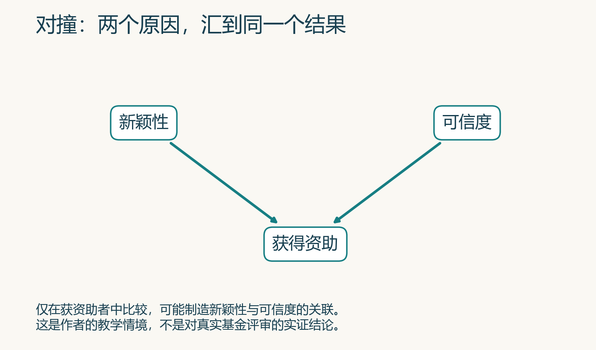

新颖、可信，都能帮助申请获得资助。如果只看获资助的申请，某一项相对弱的申请，通常需要另一项更强才能入选。于是，两项在入选者中可能呈现负关联。

这不说明“提高新颖性会损害可信度”。我们改变的是**哪些申请被拿来比较**。

PPT第55页另给了一套0／1规则，可以具体数给你看：X与Y原本独立，各有一半机会为1。只要其中至少一个为1，Z为1的概率就是90%；如果两者都是0，Z为1的概率只有20%。这里把Z为1读作“入选”。

假想总体按400份换算，四种组合各有100份。按入选概率计算：

| X、Y的组合 | 全体期望份数 | 入选概率 | 入选期望份数 |
|---|---|---|---|
| X=0、Y=0 | 100 | 20% | 20 |
| X=0、Y=1 | 100 | 90% | 90 |
| X=1、Y=0 | 100 | 90% | 90 |
| X=1、Y=1 | 100 | 90% | 90 |

在全体里，X为0或1，Y为1的比例都为50%。

只看入选者：X为0的共有110份，其中90份的Y为1，比例是90除以110，约81.8%；X为1的共有180份，其中90份的Y为1，比例是90除以180，只有50%。

**关联出现了，但生成规则里仍然没有X影响Y这回事。** 这里的负关联取决于这套筛选规则，对撞结构不保证关联总是负的。

作者接着把同一个道理放进“年龄与幸福”的模拟里：每个人出生时获得一个幸福程度，之后一生不变；年龄增加会带来更多结婚机会，幸福程度也影响结婚机会。

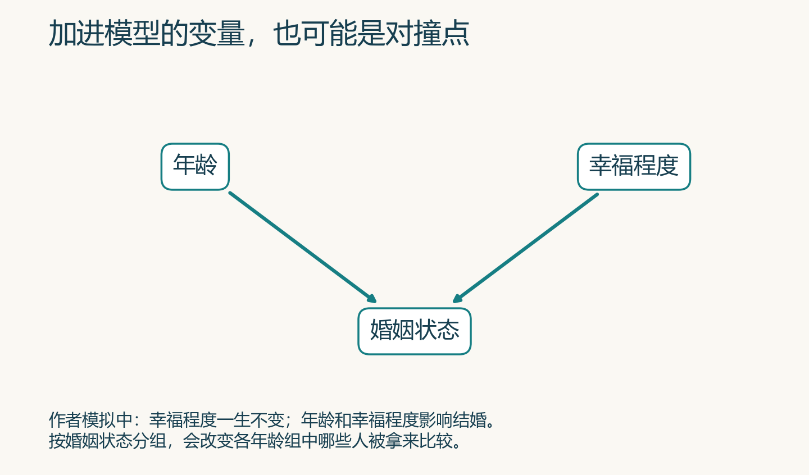

*图8｜按PPT第63页及原书第177—179页解释模拟假设。这不是现实中幸福程度不会随年龄变化的结论。*

年轻时就已经结婚的人，更偏向那些较容易结婚、幸福程度较高的人。年纪变大以后，更多幸福程度较低的人也逐渐进入已婚组，于是已婚组的平均幸福程度会随年龄降低。

未婚组中也会出现类似变化：较幸福的人更容易离开未婚组，留下者的平均幸福程度也会降低。

所以，按婚姻状态分组后，可以“发现”两组都越老越不幸福，**即使模拟中的任何一个人都从未变得更不幸福。** 原书还用回归复现了这个现象。

条件化不只发生在筛选数据时。把婚姻状态加入回归，同样可能制造这类问题。

## 七、没控制中间变量，只控制它的后代呢？（第66—71页）

最后一种，作者首先讲的是中介变量的后代。

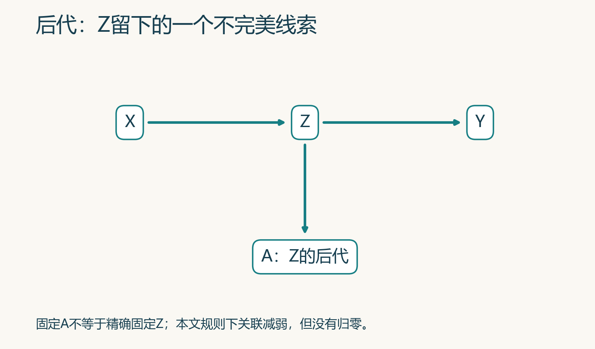

X影响Z，Z影响Y；另外，Z还会影响A。因此，看到A的值，能间接猜测Z。后代可以是经过很多步才产生的结果，不一定只是紧接着的下一步。

作者仍用0和1举例：X有一半机会为1；Z有90%的机会与X相同；Y有90%的机会与Z相同；A也有90%的机会与Z相同。给定各自上游变量后，生成时使用独立的随机抽取。

A因此像Z留下的一个不完美线索。按A分组，虽然没有真正固定Z，却会把人群分成更偏向Z为0和更偏向Z为1的两组。

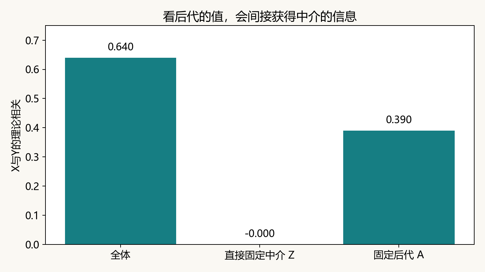

*图10｜按PPT第69页规则精确枚举。全体X与Y的理论相关为0.640；固定Z后为0；固定A后约为0.390。图中固定值取0，取1结果相同。PPT第70页是一批随机样本，数字不必与理论值相同。*

这里的相关系数只是概括“一起变化有多强”：0表示没有线性相关，正值表示偏向同向变化。我们要看的不是记住0.390，而是**控制一个带有中介信息的变量，也会改变比较**。

但不要把“减弱”直接写成“路径已经阻断”。在这个例子里，A仍会认错Z，所以固定A以后，X与Y的关联并没有消失。若A完整透露Z的信息，才会接近直接固定Z的效果。

后代的作用取决于它从哪里来。如果它是对撞变量的后代，按它筛选又可能打开原本被对撞点阻断的路径。**“后代”并没有一种通用的、永远相同的调整效果。**

## 八、回归前，先说清楚想保留哪条路（第72页）

学完四种结构，最容易产生的新误解是：“那我把变量分成四类，照表操作就行了。”

作者最后用祖辈、父母、孙辈的例子提醒我们：一个节点在不同路径上，可以扮演不同角色。

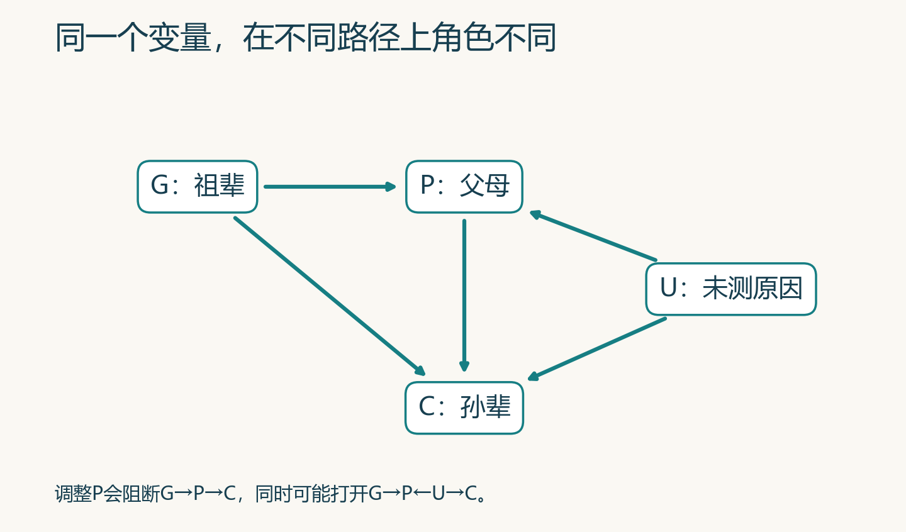

*图11｜按PPT第72页重绘。U是未测量的共同原因，同时影响父母变量P和孙辈结果C。字母指代模型中的相应变量，并非把一个人简化成单一可操控量。*

为了研究祖辈不经过父母的直接影响，我们可能想固定父母变量P。这会阻断“祖辈影响父母、父母影响孙辈”的中介路径。

但在另一条路径上，祖辈和未测原因U又同时指向P。P在这里是对撞点。固定它，可能使祖辈与U产生条件关联，而U又影响孙辈。原本想做的调整，便可能混入新的非因果关联。

所以，前面说“问直接效应才考虑控制中介”，其中的“考虑”很重要：还要检查中介与结果之间的共同原因，不能只往回归里加一个变量就结束。

| 眼前的结构 | 已经知道中间变量后，会发生什么？ | 对当前问题的提醒 |
|---|---|---|
| 叉：共同原因影响两边 | 在孤立的这套结构里，两边不再关联 | 研究一边对另一边的作用，要处理共同原因路径 |
| 管：影响经中间变量传递 | 这条中介通路被阻断 | 要总效应，就不能只拿控制中介后的系数回答 |
| 对撞：两边影响共同结果 | 原本没有的关联可能出现 | 筛选、分层、回归调整都可能触发 |
| 后代：带有上游变量的信息 | 可能间接改变对上游变量的比较 | 看它是谁的后代、携带多少信息，不能一概而论 |

回到开头的问题：多控制一个变量，为什么反而会错？因为控制不是无条件地“去掉干扰”。它会改变我们比较的人群，或者改变我们保留的作用路径。

**先说清楚想估计什么，再画出认为数据怎样产生，最后决定模型该放什么。** 贝叶斯后验能表达参数的不确定性，却不能替我们证明因果图正确。

## 配套代码：用一种熟悉的语言跑一遍

这次仍准备了R、Python和MATLAB三套脚本。先打开运行说明，选择自己熟悉的一种即可，不必三种都学。

GitHub项目：https://github.com/fuyuming/statistics-classroom/tree/main/rethinking/article05_elemental_confounds

完整项目下载：https://github.com/fuyuming/statistics-classroom/raw/refs/heads/main/rethinking/article05_elemental_confounds/精读05_v2_完整项目.zip

本地阅读也可直接下载：[精读05完整项目](精读05_v2_完整项目.zip)。

- [R主脚本](代码/lesson05_v2.R)：调用作者的quap，拟合婚姻模型，精确枚举四种二元结构，并生成两张中文图。
- [Python主脚本](代码/lesson05_v2.py)：同一模型的二次近似、四种结构的枚举，另生成先验和干预比较图，共四张中文图。
- [MATLAB主脚本](代码/lesson05_v2.m)：同一模型的二次近似与枚举，生成并保留两张中文Figure，无需额外工具箱。
- [因果图与公式图片脚本](代码/lesson05_figures_v2.py)：导出正文中的七张因果图和四张公式图片。

运行方法见[README](README_v2.md)。数字核对和实现范围见[验证说明](VALIDATION_v2.md)。植物1.2单位的理论总效应另附三语言计算；基金、幸福与祖辈例子用于解释结构，本项目不声称重跑了原书中所有后验模型。

第一次运行，先核对结婚率斜率和四种结构的理论相关。第二次，可以只改后代A的准确程度：把90%改为50%，让它不再携带Z的信息，再看看按A分组还有没有用。改前先猜，改后再解释。

### 资料来源

原课PPT：https://speakerdeck.com/rmcelreath/statistical-rethinking-2023-lecture-05

作者课程与代码：https://github.com/rmcelreath/stat_rethinking_2023

数据与R包：https://github.com/rmcelreath/rethinking

原书：McElreath, R. (2020). *Statistical Rethinking*, 2nd ed. 第5章§5.1补充婚姻与离婚模型；第6章§6.2（170—175页）解释植物与处理后偏倚，§6.3（176—182页）解释年龄、幸福与对撞偏倚。本文按第二版核对，章节编号不与第一版混用。
