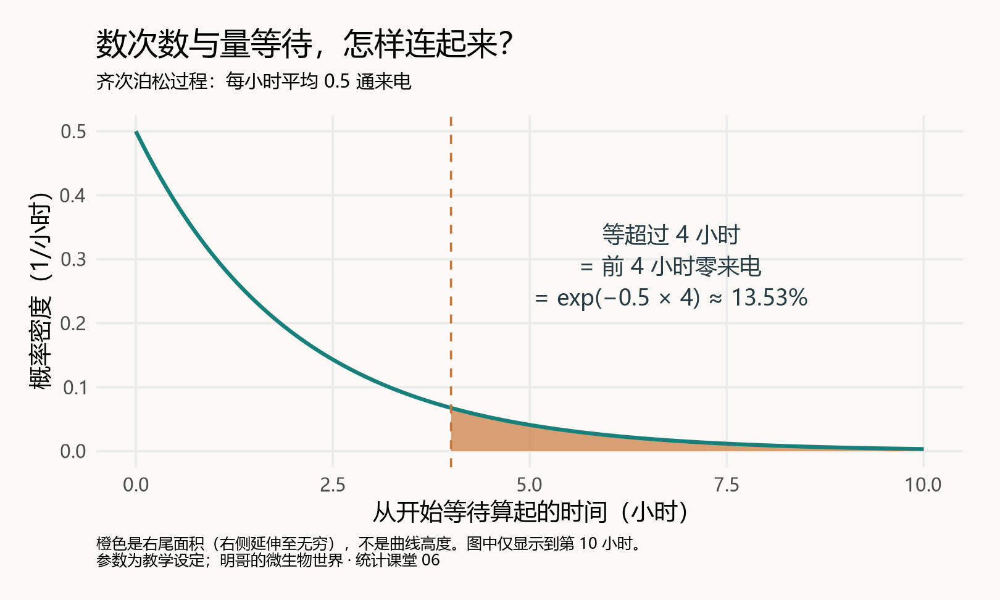
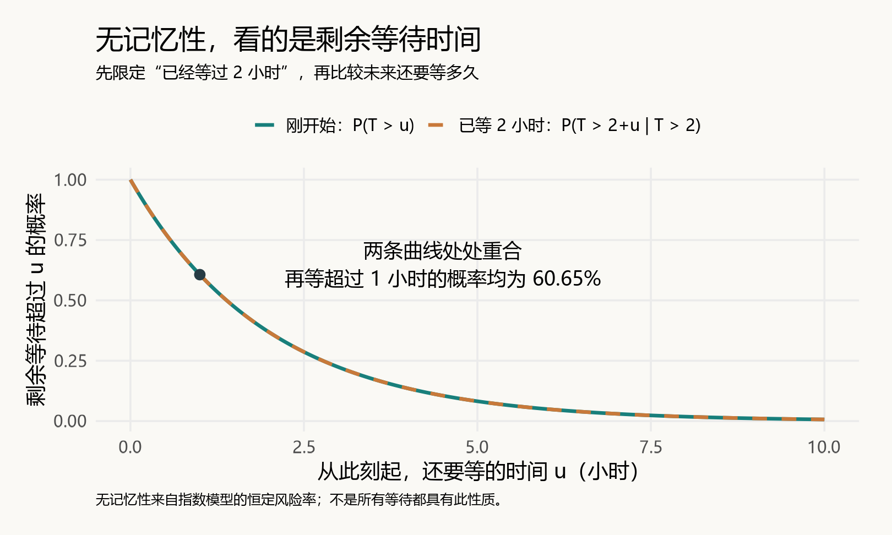
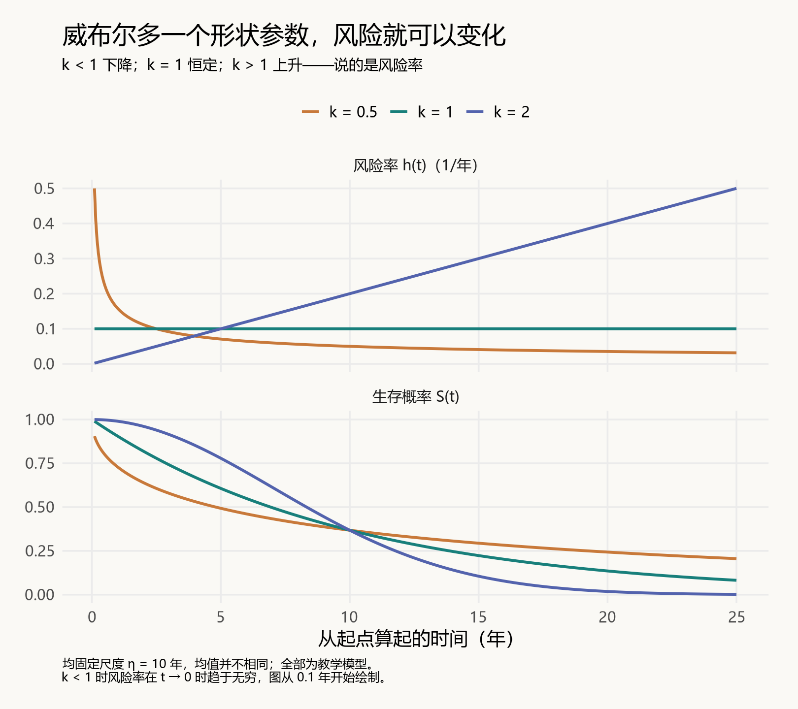
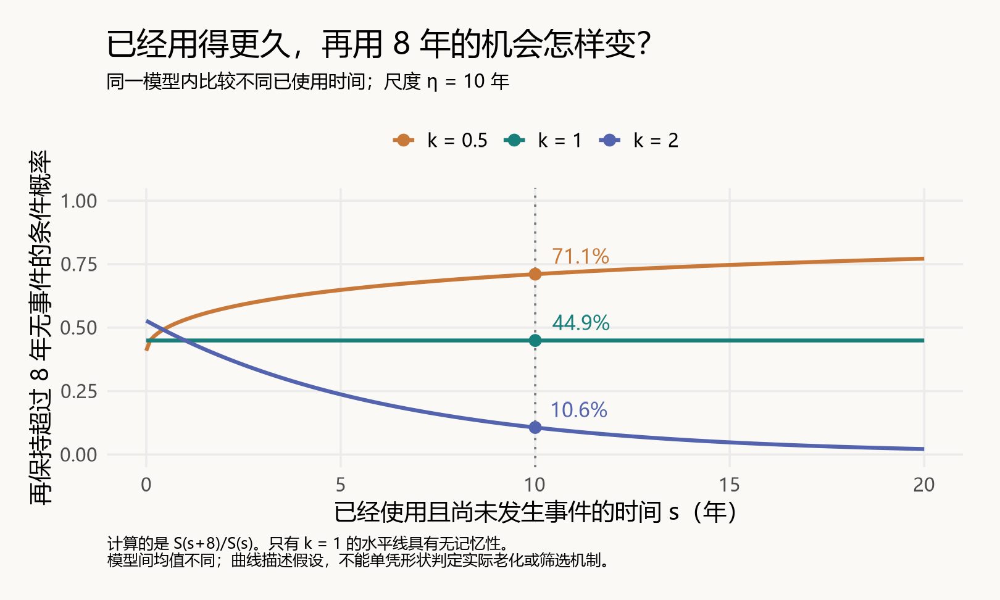

# 等待越久，就越容易等到吗？从指数分布讲到威布尔分布

> 明哥的微生物世界 · 统计课堂 06
>
> 摘要：从“还要等多久”出发，理解指数分布、条件概率与无记忆性，再看威布尔分布怎样描述随时间变化的风险。

大家好，我是明哥。

上课讲到指数分布时，我觉得自己有几个地方讲得还不够透，尤其是“风险率”和“一段时间内发生事件的概率”，容易在口头解释时混在一起。今天写下来，既是给同学们补充，也是帮自己把这些概念再理顺一次。

为什么指数分布能和泊松分布联系起来？已经等了很久，为什么还说“无记忆”？如果研究对象会衰老，这个模型还合适吗？

今天把这条线重新串起来，也往前走一步，聊聊**威布尔分布（Weibull distribution）**。

## 一、同一件事，可以数次数，也可以量时间

假设某条电话线路的来电符合一个理想模型：来电彼此不影响，发生率保持稳定，平均每两个小时一通。更准确地说，我们假设它是一个**齐次泊松过程**。

我们可以提出两种问题：

- 未来4小时，会来几通电话？这是**次数**。
- 从现在开始，到下一通电话要等多久？这是**时间**。

令 N(t) 表示 t 小时内的来电数，T 表示到下一通来电的等待时间。把下面两句话放在一起读：

> **等待超过 t 小时，恰好就是这 t 小时里一通电话都没来。**
>
> P(T > t) = P[N(t) = 0] = exp(−λt)

这里的 λ 是每小时发生率，exp(x) 就是 e 的 x 次方。

平均每两个小时一通，换算成每小时发生率就是 λ = 0.5/小时。未来4小时的期望来电数是 0.5 × 4 = 2 通。于是：

> P(T > 4) = P[N(4) = 0] = exp(−2) ≈ **13.53%**。

这样，泊松分布与指数分布就连起来了：在这个过程模型下，一个描述固定时间里的次数，另一个描述相邻事件之间的等待时间。

要留意：泊松计数的参数是 **λt**，等待时间的指数分布参数是 **λ**。时间窗口变长，期望次数会变；每小时的发生率并不会因此变大。



*图1｜超过4小时的等待，对应密度曲线右侧的面积。平均每两个小时一通，不等于固定每2小时来一通。所有配图均为设定参数下的模型曲线。*

这一步使用了完整的齐次泊松过程假设。仅凭“某一段时间的计数像泊松分布”，还不足以推出所有等待间隔都服从指数分布。模型关系参考：NIST：https://www.itl.nist.gov/div898/handbook/apr/section1/apr161.htm

## 二、指数分布的核心，不只是那条下降的曲线

描述等待时间时，先分清三个量：

| 量 | 回答什么问题 | 指数分布中的表达式 |
| --- | --- | --- |
| 生存函数 S(t) | 到 t 时，事件还没发生的概率是多少？ | exp(−λt) |
| 分布函数 F(t) | 到 t 时，事件已经发生的概率是多少？ | 1 − exp(−λt) |
| 概率密度 f(t) | 事件时间在 t 附近有多集中？ | λ exp(−λt) |

这里的“生存”是数学用语：可以指人或动物仍然存活，也可以指仪器还没故障、下一通电话还没到来。

**密度曲线的高度不是概率，某个时间区间下的面积才是概率。** 对连续时间模型，“恰好在某一个精确时刻发生”的概率为0；我们通常关心一段时间内是否发生。

接下来，才是理解指数分布最关键的量：**风险率 h(t)**。

它问的是：

> **在已经持续到 t、事件仍未发生的条件下，接下来一小段时间内，事件发生得有多快？**

在很短的时间 Δt 内，条件事件概率近似为 h(t) × Δt。风险率的单位是“每小时”或“每年”，本身不是一个概率。

它与密度的关系是：

> h(t) = f(t) / S(t)
>
> 指数分布中：h(t) = λ。

为什么密度明明下降，风险率却不变？因为**越往后，还没有发生事件的对象也越少**。密度以最初全部对象为基准；风险率则以持续到当前仍未发生事件的对象为基准。指数模型中，两者分子分母按相同比例下降，比值便保持不变。

这也解释了一个容易混淆的数字：若 λ = 0.1/年，未来一年内发生事件的条件概率是：

> 1 − exp(−0.1 × 1) ≈ **9.52%**，并不是直接拿0.1当作10%。

**“风险概率”这几个字，最好再说具体一点：从起点算，还是已知持续到现在？未来多长时间？** 同一个模型下，下面三个量不同：

| 问题（λ = 0.1/年） | 计算 | 结果 |
| --- | --- | --- |
| 从起点算，10年内发生事件 | 1 − S(10) | 63.21% |
| 已持续10年未发生事件，接下来1年内发生 | 1 − S(11)/S(10) | 9.52% |
| 从起点算，事件落在第10到11年之间 | S(10) − S(11) | 3.50% |

第二行只看已持续到10年的对象；第三行以最初所有对象为基准。所以，一个是条件概率，一个是无条件的区间概率，分母不同，数值也不同。

对于连续事件时间模型，已知事件到 t 尚未发生，未来 Δ 年内发生的概率，准确表达为：

> **P(t < T ≤ t + Δ | T > t) = 1 − S(t + Δ)/S(t)。**

风险率 h(t) 则是把这个短区间的条件概率除以区间长度，再让长度趋近于0得到的瞬时发生率。它可以大于1，因为单位是“每年”，而不是百分比。例如恒定风险率为2/年时，一年内事件概率是 1 − exp(−2) ≈ 86.47%，不会是200%。

如果知道整段时间内的风险率，令 H(t) = ∫₀ᵗ h(v)dv 表示累积风险，就有：

> S(t) = exp[−H(t)]；
>
> 未来 Δ 年的条件事件概率 = 1 − exp{−[H(t + Δ) − H(t)]}。

H(t) 虽然没有单位，也不是概率。**风险率通过一段时间的累积，才能转换成这段时间的事件概率。** 指数模型因为风险率恒定，才简化成 1 − exp(−λΔ)。风险率定义：NIST：https://www.itl.nist.gov/div898/handbook/apr/section1/apr123.htm

指数分布的平均等待时间为 1/λ。因此，λ = 0.5/小时对应平均等待2小时。这个平均值描述许多次等待的整体水平，不是下一次来电的时间表。

## 三、“无记忆”，究竟忘掉了什么？

还是这条电话线路。

刚开始等的时候，超过1小时仍没有来电的概率是：

> P(T > 1) = exp(−0.5) ≈ **60.65%**。

现在已经等了2小时，电话仍没有来。接下来再等1小时，仍等不到的概率是多少？

首先把问题写对：总等待需要超过3小时，但我们已经知道它超过了2小时。

> P(T > 3 | T > 2)
>
> = P(T > 3) / P(T > 2)
>
> = 0.22313 / 0.36788
>
> ≈ **60.65%**。

这个结果和刚开始等1小时完全一样。

分母不能省略。22.31%是从起点看，所有等待中超过3小时的比例；60.65%是在那些已经等过2小时的等待中，最终还会超过3小时的比例。

更一般地：

> **P(T > s + u | T > s) = exp(−λu) = P(T > u)。**

这就是无记忆性：已知事件尚未发生，**剩余等待时间的分布不随已经等待的时长改变**。



*图2｜横轴从“此刻”重新计算剩余等待。实线与虚线重合，表示整个剩余等待分布相同。*

已经过去的2小时当然真实存在。无记忆性说的是未来等待的概率分布；它既不保证马上来电，也不要求必须再等2小时。

如果公交车严格按固定间隔到站，或者电话高峰即将到来，等待时间就不能照搬这个结论。**先判断过程是否近似符合假设，再使用无记忆性。**

## 四、回到课堂：已经活了10年，再活8年怎么算？

课堂里有一道猫寿命的例题。这里按《生物统计学》第6版第76页例3-19的指数模型设定改编，并把第二问明确写成条件概率：

> 假设总寿命 X 从出生开始计算，服从 λ = 0.1/年的指数分布。
>
> ① 活过15年的概率是多少？
>
> ② 已经活过10年，再活过8年的概率是多少？

第一问直接算右尾概率：

> P(X > 15) = exp(−0.1 × 15) ≈ **22.31%**。

第二问中，“再活8年”意味着总寿命超过18年；“已经活过10年”是已知条件：

> P(X > 18 | X > 10)
>
> = S(18) / S(10)
>
> = exp(−1.8) / exp(−1)
>
> = exp(−0.8) ≈ **44.93%**。

这里为什么是相除？可以把它想成：先找到所有活过10年的对象，再看其中多少还活过18年。**条件概率改变了计算比例时的分母。**

若计算 S(10) − S(18)，得到约20.26%，回答的是“从出生算，在10到18年之间死亡”的概率，是另一个问题。

还要分清：λ = 0.1 是题目给定的模型参数；10岁是第二问的年龄条件。不能因为“已经10岁”，就用1/10来估计 λ。即使知道平均寿命是10年，也不能单凭这一点确定寿命服从指数分布。

算到这里，恰好可以追问一句：**真实生命会衰老，为什么模型却说已活10年后的剩余寿命，与刚出生时的寿命分布相同？**

因为题目预先采用了恒定风险率的指数模型。这是模型的结果，不是“猫不会衰老”的生物学结论。

## 五、如果风险会变化，就走到威布尔分布

仪器可能越用越容易故障；有些对象的早期故障风险较高，持续运行一段时间后，观察到的风险反而下降。

我们需要一个允许风险率随时间变化的模型。常用的选择之一是**两参数威布尔分布**。

用 k 表示形状参数，用 η（eta）表示尺度参数：

> **S(t) = exp[−(t/η)<sup>k</sup>]**
>
> h(t) = (k/η) × (t/η)<sup>k−1</sup>，t > 0。

先看公式里决定风险变化的幂次 k − 1：

| 形状参数 | 随时间变化的风险率 | 可以帮助描述的情境 |
| --- | --- | --- |
| k < 1 | 下降 | 早期故障较多，后续条件风险降低 |
| k = 1 | 恒定 | 指数模型描述的恒定风险阶段 |
| k > 1 | 上升 | 随使用时间增加的磨损风险 |

这些情境帮助理解模型，不是仅凭拟合出一个 k 就证明了相应机制。威布尔模型定义与应用：NIST：https://www.itl.nist.gov/div898/handbook/apr/section1/apr162.htm



*图3｜上图比较风险率，下图比较生存概率。三条生存曲线都下降，但对应的风险率可以下降、恒定或上升。固定尺度η = 10年，三个模型的均值并不相同。*

当 k = 1 时：

> S(t) = exp(−t/η)。

令 λ = 1/η，就回到了指数分布。因此，**指数分布是威布尔分布在形状参数等于1时的特例**。

尺度 η 的含义也值得单独记一下：无论 k 是多少，在 t = η 时，都有 S(η) = exp(−1) ≈ 36.79%。也就是说，到这个时间点，约63.21%的对象已发生事件。

η 的单位是时间，k 没有单位。**η 一般不是平均寿命**；仅在 k = 1 时，两者相等。不同资料可能用其他符号，使用软件时要核对 `shape` 与 `scale` 的定义。R的威布尔分布说明：https://stat.ethz.ch/R-manual/R-devel/library/stats/html/Weibull.html

## 六、换成威布尔，“已经用了多久”就可能重要了

沿用“已经持续10年，再持续8年”的问题。这次把对象想成一件尚未故障的仪器，事件定义为首次故障。

条件概率的基本规则仍然是：

> **P(T > s + u | T > s) = S(s + u) / S(s)。**

这个规则并不专属于指数分布。把威布尔生存函数代进去：

> exp{−[((s + u)/η)<sup>k</sup> − (s/η)<sup>k</sup>]}。

只有 k = 1 时，式子里的 s 才会消掉。其余情况下，已经使用的时长通常会影响未来的条件概率。

固定尺度η = 10年，得到下面这组教学计算：

| 形状 k | 从起点算，保持超过8年无故障 | 已用10年，再保持超过8年无故障 |
| --- | --- | --- |
| 0.5 | 40.88% | 71.06% |
| 1 | 44.93% | 44.93% |
| 2 | 52.73% | 10.65% |

**重点是横着比较同一行。** 风险递减时，已经持续到10年的对象，后续8年的无事件概率更高；风险递增时则相反。指数模型恰好处在中间：前后相等。

不同模型固定的是尺度，不是平均寿命，所以不能据此宣称某个模型代表的仪器“总体更耐用”。



*图4｜横轴是已经使用且尚未故障的时间，纵轴是再保持超过8年无故障的条件概率。只有k = 1的曲线是水平线。*

普通的两参数威布尔模型也有边界：它的风险率只能单调变化或保持恒定，不能用一条这样的曲线完整描述“先下降、再平稳、最后上升”的浴盆形风险。

## 七、放到自己的研究里，先定义“什么事件、从何时开始”

这套方法可以用来思考仪器首次故障，也可以用来研究微生物相关的时间问题。

例如：以样本开始观察为时间零点，以**首次检出某种微生物**为事件，记录每份样本等待了多久。这个变量具有时间属性，但不能因此直接宣布它服从指数或威布尔分布。

“首次检出”还受到检测限与观察间隔影响。若每天检查一次，昨天阴性、今天阳性，只能知道事件发生在两次检查之间；这个检出时间也不等于微生物真正出现的精确时刻。

做实际分析时，先问清三件事：

1. **起点和事件是否一致？** 不同样本的时间应有可比较的定义。
2. **观察结束还没发生事件的对象怎样记录？** 不能删掉，也不能把最后观察时间当作事件时间。
3. **恒定、递增或递减的风险假设，是否得到数据支持？** 图像、拟合诊断和研究背景需要共同判断。

这些问题通向生存分析。今天先把模型含义弄清楚；如何处理不完整观察、估计参数和检查拟合，可以另开一篇。

## 八、进一步建模：应该用Gamma回归吗？

如果再加入培养条件、处理组别等解释变量，就从“用一个分布描述时间”走到了“用回归模型解释时间的差异”。但这一步**不自动等于Gamma回归**。

Gamma回归可以用于严格大于0的连续响应。例如每份样本的事件时间都完整观测到了，研究重点是“不同条件下，平均等待时间怎样变化”，可以考虑Gamma回归及其他正值响应模型，再检查模型是否适合数据。

采用常见的log连接时，它写成：

> log E(T | x) = β₀ + β₁x。

这表示解释变量影响的是**条件平均时间**。在其他变量不变时，x增加1单位，平均时间乘以 exp(β₁)；这个倍数不是风险比。通常的Gamma GLM还假设条件方差与条件均值的平方成比例。R的Gamma模型与连接函数：https://stat.ethz.ch/R-manual/R-devel/library/stats/html/family.html

指数分布确实是Gamma分布在形状参数等于1时的特例。但普通Gamma回归不会自动把形状固定为1，因此通常不具有指数模型的恒定风险率与无记忆性。威布尔分布与Gamma分布则是两个不同的分布家族，不能把威布尔回归统称为Gamma回归。

若问题是“某因素如何影响首次检出的时间，以及持续到某时刻后的风险”，尤其观察结束时还有样本尚未检出，就更自然地进入**生存回归模型**：

| 研究目标与数据情况 | 可考虑的模型 |
| --- | --- |
| 正值时间均被完整观测，重点比较条件均值 | Gamma回归等正值响应模型 |
| 事件时间与未发生事件的随访记录，假设给定解释变量后风险恒定 | 指数生存回归 |
| 允许给定解释变量后的风险随时间单调变化 | 威布尔生存回归 |
| 重点研究因素与风险率的关系，不预设基线风险的具体分布形式 | Cox比例风险模型，需检查比例风险假设 |

例如观察到第30天仍未检出，我们只知道时间超过30天。这条记录对模型有信息，不能当成“第30天发生”，也不能简单删除。普通 `glm(..., family = Gamma(...))` 不会自动处理这样的删失记录；需要相应的生存似然或支持删失的模型。

R的 `survival::survreg()` 可以拟合指数与威布尔生存回归，其常见表达是加速失效时间模型，系数解释为时间尺度的变化。R生存回归说明：https://stat.ethz.ch/R-manual/R-devel/library/survival/html/survreg.html

因此，本篇沿着“恒定风险—变化风险—事件时间”的主线，后续最顺的延伸是指数与威布尔生存回归；Gamma回归可以在比较正值连续响应模型时单独展开。具体选择仍取决于研究问题、观测方式和拟合诊断。

## 九、用R核对：先写事件，再调用函数

下面这几行可直接运行。`lower.tail = FALSE` 表示计算右尾概率，也就是“超过这个时间”的概率。

```r
# 1. 等超过4小时：rate的单位是每小时
p_wait <- pexp(4, rate = 0.5, lower.tail = FALSE)
cat(sprintf("等待超过4小时的概率：%.2f%%\n", 100 * p_wait))

# 2. 已活过10年，再活过8年：分子是18，不是8
p_cat <- pexp(18, rate = 0.1, lower.tail = FALSE) /
         pexp(10, rate = 0.1, lower.tail = FALSE)
cat(sprintf("已活过10年，再活过8年：%.2f%%\n", 100 * p_cat))

# 3. 威布尔模型：shape无单位，scale的单位是年
p_device <- pweibull(18, shape = 2, scale = 10,
                    lower.tail = FALSE) /
            pweibull(10, shape = 2, scale = 10,
                    lower.tail = FALSE)
cat(sprintf("已用10年，再保持超过8年无故障：%.2f%%\n", 100 * p_device))
```

依次得到 **13.53%、44.93%、10.65%**。

完整配套脚本包含逐题说明、计算结果、四张图的生成代码和课后小练习。计算部分只需基础R；绘图部分另需 `ggplot2`、`showtext` 和中文字体。脚本用UTF-8保存，并分别说明文字编码与绘图字体问题。

下载配套脚本与结果：https://github.com/fuyuming/statistics-classroom/tree/main/stats_classroom/article06_exponential_weibull（进入仓库首页，选择 **Code → Download ZIP** 后解压）。本篇没有真实观测数据，配套CSV是模型计算结果，不是实验数据。

最后留一道小题：事件发生率为每小时2次。如果已经等了1小时，接下来再等超过半小时的概率是多少？先写出条件概率，再用R核对。答案和解释都在脚本里。

我们学会一个分布，不只是记住它的曲线和公式，还要能说清：**它在描述什么，采用了什么假设，以及换一个条件，答案为什么会变。**

这里是“明哥的微生物世界”。下一次遇到“还要等多久”的问题，希望大家能先把时间起点、事件和条件写下来。

---

**课堂与阅读来源**

- 课堂猫寿命模型改编自李春喜《生物统计学》第6版，第76页例3-19；第二问在本文中明确按条件概率表述。来电桥接、仪器比较与配图为教学补充。
- NIST：指数分布：https://www.itl.nist.gov/div898/handbook/apr/section1/apr161.htm；NIST：威布尔分布：https://www.itl.nist.gov/div898/handbook/apr/section1/apr162.htm。
- R官方文档：指数分布：https://stat.ethz.ch/R-manual/R-devel/library/stats/html/Exponential.html；R官方文档：威布尔分布：https://stat.ethz.ch/R-manual/R-devel/library/stats/html/Weibull.html。

*本文配图由配套代码生成；全部数值例子用于解释模型，未拟合真实寿命或微生物检出数据。*
