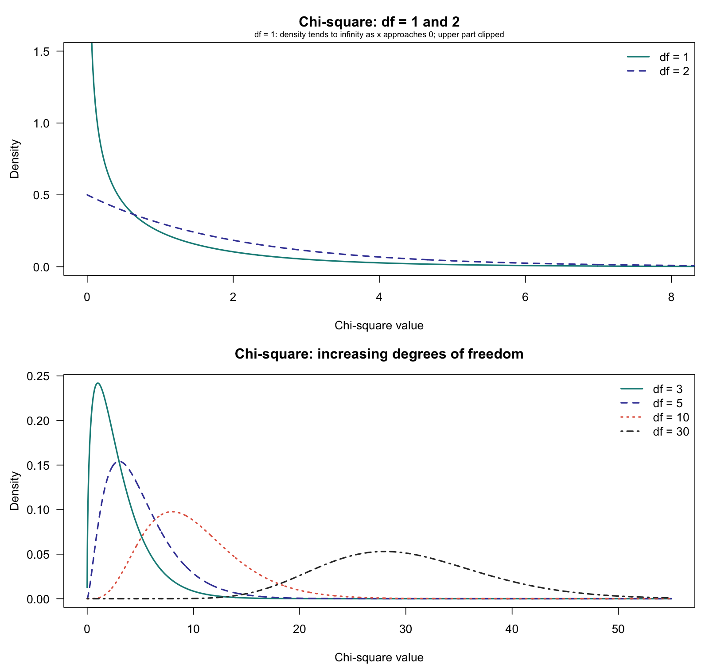
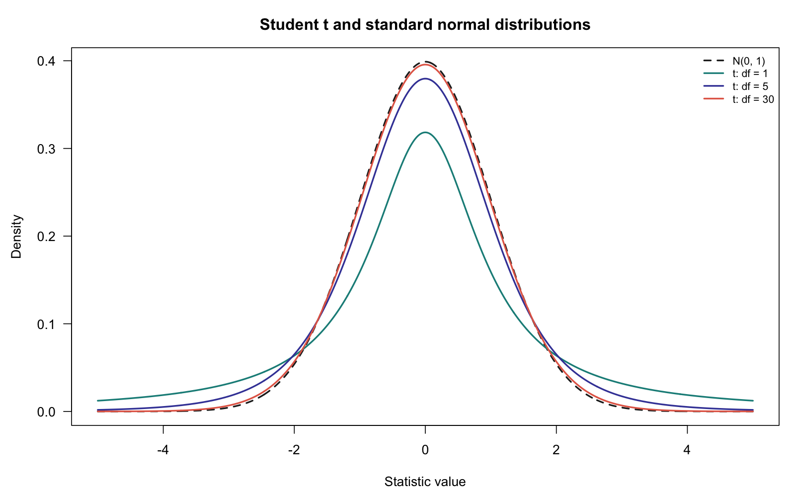
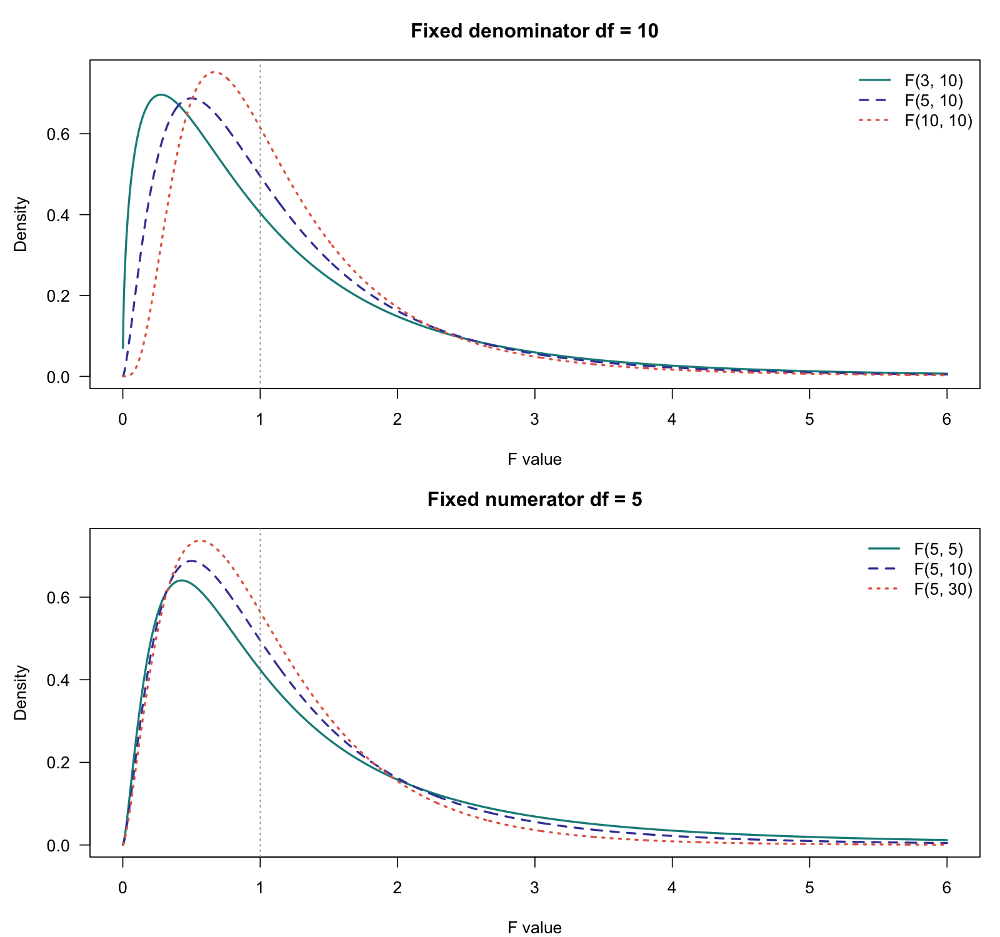

# 正态、χ²、t、F，为什么统计学总绕不开这几个分布？

> 明哥的微生物世界 · 统计课堂 07
>
> 摘要：小样本做 t 检验和方差分析，为什么总要强调正态性？大样本时，为什么又不必把正态性检验当作使用前提？从这两个问题出发，把正态、χ²、t 和 F 分布串起来。

大家好，我是明哥。

学统计时，大家大概都听过这样一句话：小样本做 t 检验、方差分析，要注意正态性。

这句话不难记。但再追问一步，就没那么容易回答了。

**我们用的明明是 t 检验，为什么要关心正态分布？方差分析用的是 F 分布，怎么也要提正态性？**

还有，大样本时，我们又会说可以借助中心极限定理。这是不是意味着，不必先做一次正态性检验，等到 P＞0.05，才允许使用这些方法？

要把这些问题说清楚，得先看看正态、χ²、t 和 F 之间的关系。

今天不从一排概率密度公式开始。咱们先想一件实际的事：拿到一小批数据，算出均数和标准差之后，我们到底还不知道什么？

## 一、数据只有一批，均数却可以有一个分布

假设我们测量某种微生物在固定培养条件下的一个连续指标，每次取 10 个独立培养物，算出一个均数。

如果重新做一批实验，再取 10 个独立培养物，均数大概率会变，标准差也会变。

把这个过程在头脑里重复很多次，就有了两种不同的分布。

一种是**单个培养物测量值的分布**。另一种是**每批样本均数的分布**，也就是均数的抽样分布。

前者描述个体之间的差异，后者描述我们估计均数时的抽样波动。不能把两者混在一起。

现在先采用一个明确的模型：每个观测相互独立，都来自均数为 μ、方差为 σ² 的正态总体。用 X̄ 表示样本均数，n 表示样本量，那么：

> **X̄ ∼ N(μ, σ²/n)**
>
> **Z = (X̄ − μ) / (σ/√n) ∼ N(0, 1)**

符号“∼”表示“服从某种分布”。σ/√n 是样本均数的标准差，也称均数的标准误。

这个式子说的是：均数离总体均数有多远，要放到它自己的抽样波动中衡量。

**在正态总体模型下，这个结果并不要求样本量很大。** 只取几个独立观测，样本均数仍然服从正态分布。

困难在另一个地方：现实中，我们往往不知道总体标准差 σ。

手里能算出来的，通常只有样本标准差 S。把 σ 换成 S，看起来只改了一个字母，统计量的分布却可能变了。

为什么？先请 χ² 分布出来。

## 二、χ² 分布，为什么和“平方和”有关？

χ² 读作“卡方”。它的一个基本构造很直接：

> 如果 Z₁、Z₂、…、Zₖ **相互独立，且都服从标准正态分布**，那么：
>
> **U = Z₁² + Z₂² + ⋯ + Zₖ² ∼ χ²(k)**

把每个标准正态变量平方，再加起来，就得到自由度为 k 的卡方变量。

这里有两个条件不能省：**标准正态、相互独立。** 随便拿一组数平方求和，不能就说它服从 χ² 分布。

平方之后没有负值，因此 χ² 分布只取非负值。它还是一族曲线，自由度不同，形状也不同；自由度较小时右偏明显，增大后逐渐趋于对称。不能把所有 χ² 曲线都说成同一种“倒 J 形”。



*图1｜上图展示自由度 1、2，下图展示自由度 3、5、10、30。上下图坐标范围不同；自由度 1 的密度在零点附近趋于无穷，上图截去了超过纵轴范围的部分。自由度增大时，分布向右移动，右偏程度减轻；密度高度不是概率，区间下的面积才是概率。*

它与样本方差有什么关系？

我们计算样本方差时，也是先求每个观测与样本均数的偏差，再平方求和，最后除以 n−1。

对于前面那个正态总体的独立样本，有一个关键结果：

> **U = (n−1)S² / σ² ∼ χ²(n−1)**

注意，服从这里的标准 χ² 分布的是经过缩放的 **(n−1)S²/σ²**，不能直接把 S² 写成 χ² 分布。

为什么自由度是 n−1，而不是 n？

因为我们先用同一批数据估计了均数。所有观测减去这个均数以后，偏差之和必须等于 0。前 n−1 个偏差确定后，最后一个就被限制住了。

这也提醒我们：这些偏差本身并不相互独立。正态模型下，可以把这份残差平方和转换为 n−1 个独立标准正态变量的平方和；这一步才把它与 χ² 分布接了起来。

**χ² 分布让我们能够描述：换一批样本，估计出来的方差会怎样波动。**

## 三、把 σ 换成 S，为什么就走到了 t 分布？

回到刚才没解决的问题。

总体标准差不知道，只能用样本标准差，那么自然会写出：

> **T = (X̄ − μ) / (S/√n)**

分子仍然是均数的偏差，分母变成了估计的标准误。

这时，不只是分子在变，分母也在变。有的样本算出的 S 大一些，有的小一些。我们必须把这部分不确定性算进去。

把这个式子拆开，就能看见前面两个分布：

> Z = (X̄ − μ) / (σ/√n)
>
> U = (n−1)S² / σ²，ν = n−1
>
> **T = Z / √(U/ν) ∼ t(ν)**

其中 Z 服从标准正态分布，U 服从 χ²(ν) 分布。还有一个关键条件：**Z 与 U 相互独立。**

独立正态样本恰好有一个很好的性质：样本均数与样本方差相互独立。因此，这几步能够完整接上，得到精确的 t 分布。

**这才是“小样本 t 检验为什么强调正态性”的数学来由。** 正态假设同时保证了分子的分布、分母中方差的分布，以及两者的独立性。

做单样本均数检验时，把 μ 换成零假设指定的 μ₀。在零假设成立时，这个统计量就服从自由度 n−1 的中心 t 分布。R 官方 t 分布说明：https://stat.ethz.ch/R-manual/R-devel/library/stats/html/TDist.html

### t 分布的尾巴，为什么比正态分布厚？

直观地说，分母是一把从样本中估出来的尺子。它有时会偏小，把同样大小的均数偏差放大成更大的 T 值。

把分子、分母的随机变化一起考虑，t 分布就比标准正态分布更容易出现绝对值较大的结果，表现为两侧尾部更厚。



*图2｜自由度越小，t 分布尾部越厚；自由度增大后逐渐接近标准正态。图中展示自由度 1、5、30 的 t 曲线与标准正态曲线；全部曲线由文末 R 脚本生成，坐标数据一并提供。*

例如样本量 n＝11，自由度为 10。双侧 5% 检验的 t 临界值约为 2.228，标准正态临界值约为 1.960。

在前述正态模型及零假设下，如果已经用 S 算出了 T，却仍以 |T|＞1.96 判为显著，实际第一类错误率约为 **7.84%**，而不是 5%。这个数可以直接用 t 分布计算，不必靠模拟估计。

分布不同，界值就不同；界值用错，原先想控制的错误率也会变。

还要记住：**服从 t 分布的是这个比值统计量，不是原始数据，也不是样本均数本身。**

## 四、F 分布，又是怎么接进来的？

如果已经有两个相互独立的卡方变量，分别除以各自的自由度，再相除，就得到 F 分布：

> U ∼ χ²(d₁)，V ∼ χ²(d₂)，且 U、V 相互独立。
>
> **F = (U/d₁) / (V/d₂) ∼ F(d₁, d₂)**

所以 F 分布带两个自由度：分子一个，分母一个。R 官方 F 分布说明：https://stat.ethz.ch/R-manual/R-devel/library/stats/html/Fdist.html



*图3｜上图固定分母自由度为 10，改变分子自由度；下图固定分子自由度为 5，改变分母自由度。F(d₁,d₂) 中前一个数是分子自由度，后一个数是分母自由度。灰色竖线仅标记 F＝1，并非均值线；图中只展示 0～6 范围，右尾还会继续延伸。*

现在想想，前面说过样本方差与 χ² 的关系。两个独立正态样本的方差拿来作比值，是不是就有可能接到这里？

确实如此。**在两个总体方差相等的零假设下，样本方差之比 S₁²/S₂² 服从 F(n₁−1, n₂−1)。** 这是检验两个正态总体方差是否相等的经典 F 检验。

但方差分析也使用 F，这又是为什么？

经典单因素方差分析把波动分成组间与组内两部分。当观测独立、各组正态且具有共同方差，并且各组总体均数相等时，组间平方和与组内平方和除以共同的总体方差，分别服从独立的 χ² 分布。再各自除以自由度，取比值，就得到：

> **F = 组间均方 / 组内均方**
>
> 若有 g 个组、总样本量为 N，零假设下：
>
> **F ∼ F(g−1, N−g)**

因此，F 分布既出现在两个总体方差的比较中，也出现在多个总体均数的比较中。检验的问题不同，构造出的统计量却可以有相同类型的参考分布。

这里先认清关系，具体怎样分解平方和，留到讲检验用途时再展开。

顺便留意：零假设下，两个均方都估计同一个总体方差，**不意味着它们比值的期望恰好等于 1**。分母也是随机的，“比值的期望”不能直接用“期望的比值”代替。

## 五、为什么 t 的平方，恰好又是 F？

把 t 的构造平方：

> T = Z / √(U/ν)
>
> **T² = Z² / (U/ν)**

Z 是标准正态变量，所以 Z² 就是自由度为 1 的卡方变量。它与分母中的 U 独立。

再看 F 的构造，正好对上了：

> **若 T ∼ t(ν)，则 T² ∼ F(1, ν)。**

这不是说“t 分布和 F 分布是同一个分布”，而是说，一个 t 变量平方后，会得到特定自由度的 F 分布。

因此，同一批两个独立组的数据，用**合并方差的双侧 t 检验**和**经典单因素方差分析**比较均数，会得到 F＝t²，并给出相同的 P 值。

这里要把“合并方差”“双侧”“经典单因素”说清楚，不能随便挑两个名字里带 t 和 F 的检验，就说它们等价。

现在，四种分布的关系可以合到一张小表里：

| 从什么出发 | 怎样组合 | 得到什么 |
| --- | --- | --- |
| k 个独立标准正态变量 | 平方后求和 | χ²(k) |
| 标准正态 Z 与独立的 U∼χ²(ν) | Z / √(U/ν) | t(ν) |
| 两个独立的 χ² 变量 | 各除以自由度，再相除 | F(d₁, d₂) |
| T∼t(ν) | 平方 | F(1, ν) |

独立性不是公式旁边可有可无的小字。正是这些条件，让运算之后的分布能够确定下来。

## 六、大样本时，还要先通过正态性检验吗？

现在回到开头的另一个问题。

**对均数的 t 检验和常规条件下的方差分析，大样本时，通常不需要把“通过原始数据的正态性检验”作为使用前提。**

原因就在中心极限定理。

例如，在独立同分布、总体方差有限且非零等条件下，随着样本量增加，标准化的样本均数趋近标准正态。再用能够一致估计 σ 的 S 替代 σ，学生化的均数统计量也趋近标准正态。

与此同时，大自由度的 t 分布本身也接近标准正态。因此，即使原始总体并非正态，大样本下仍可能利用 t 方法作可靠的近似均数推断。

**趋近正态的是均数的抽样分布，不是原始数据的分布。** 一批右偏数据，收集得更多，并不会自动变成对称的钟形。

经典方差分析也有相应的大样本近似依据。在独立、共同方差等条件下，各组样本量增加，可以放宽对组内正态性的要求；较均衡的设计通常也更稳健。Penn State 方差分析课程：https://online.stat.psu.edu/stat800/Lesson09

所以，更合适的理解是：

> **小样本时，正态假设为经典 t、F 推断提供精确的分布依据；大样本时，在相应条件下，可以借助渐近近似放宽正态性要求。**

不过，别把“大样本”机械地理解为“超过 30 就都可以”。偏斜越严重、极端值影响越大，近似达到可用程度需要的样本量就可能越多。方差分析要关注各组的样本量，不能只看总数很大。

独立性、方差齐性也是另外的问题。中心极限定理不会把同一培养物的重复读数变成独立样本，也不会把两个不同的总体方差变成相同。方差不齐时，均数比较可考虑 Welch 方法。

这里尤其要划清范围：**这些关于均数推断的结论，不能直接照搬到两个样本方差之比的经典 F 检验。** 方差比的分布对非正态更敏感，大样本并不自动保证它仍能按经典 F 分布校准。

### 小样本 P＞0.05，就能证明正态吗？

也不能。

小样本的正态性检验，可能没有足够能力识别偏离；没有检出异常，不等于证明总体正态。大样本则可能把很轻微、对均数推断影响不大的偏离也检出。

因此，正态性检验可以提供信息，但不适合充当“P＞0.05 用 t，P＜0.05 换方法”的自动开关。

要结合数据产生过程、图形、偏斜和异常值判断。独立组比较关心各组内的分布或模型误差，不是把所有组混在一起看正态性；配对 t 检验关心的是**配对差值**的分布。

## 七、知道分布的关系，还要知道它用在哪里

最后，把常见用途放在一起，但今天不展开每一种检验的操作。

| 分布 | 常见应用 | 主要回答什么问题 |
| --- | --- | --- |
| t | 均数的 t 检验 | 均数与指定值、或两个均数之间是否存在差异？ |
| t | 经典线性回归中单个系数的检验 | 在模型其余项给定的情况下，某个系数是否等于指定值（常为 0）？ |
| F | 经典线性回归的整体显著性检验 | 所有非截距系数是否同时为 0？ |
| F | 两总体方差比的经典 F 检验 | 两个正态总体的方差是否相等？ |
| F | 方差分析中的 F 检验 | 多个总体的均数是否相等？ |
| χ² | 拟合优度检验 | 观察到的类别频数是否符合指定的理论比例？ |
| χ² | 列联表独立性或同质性检验 | 分类变量是否有关联，或不同总体的类别比例是否相同？ |
| χ² | 正态总体单个方差的检验 | 总体方差是否等于指定值？ |

### 回归分析里，为什么也会遇到 t 和 F？

看过线性回归软件输出的同学，会发现每个系数旁边常有一个 t 值，模型整体又有一个 F 值。

它们仍然接在前面这条关系上。

在模型设定正确、设计矩阵满秩，且给定自变量后的误差独立、正态、同方差的经典线性回归中，单个系数的检验统计量为：

> **t =（估计系数 − 零假设指定值）/ 该系数的估计标准误**

若总共估计 p 个系数（包含截距），样本量为 n，在零假设下，它服从自由度 n−p 的 t 分布。

含截距模型的整体 F 检验，则把完整模型与“只有截距”的模型比较，检验的是：**所有非截距系数是否同时为 0。** 它显著，表示有证据反对这些系数全为零；不表示每个系数都显著，也不意味着模型已经足够准确或具有因果解释。Penn State 回归模型评价课程：https://stats-web.quarto.pub/stat501q_dev/Lesson06.html

只有一个自变量、包含截距时，斜率为零的双侧 t 检验与模型整体 F 检验，仍然满足 **F＝t²**。多个自变量时，单个系数的 t 检验对应的是检验同一个系数的部分 F 检验，不能拿它的平方去对应整个模型的 F 值。

### 回归也要求“Y 正态、方差齐”吗？

如果把“Y 正态”说完整，应当是：**给定自变量 X 后，响应变量 Y 的条件分布为正态。** 以一元线性回归为例：

> **Yᵢ = β₀ + β₁xᵢ + εᵢ**
>
> 给定各个 xᵢ，误差 εᵢ 相互独立，且服从 N(0, σ²)。
>
> 等价地，**Yᵢ 在 xᵢ 处服从 N(β₀ + β₁xᵢ, σ²)**。

随着 x 改变，Y 的均数沿回归线改变，但围绕这条线的波动方差保持为同一个 σ²。这就是回归中的**同方差性**。Penn State 线性回归模型说明：https://online.stat.psu.edu/stat462/node/93/

把不同 x 处的数据混在一起，就混合了不同均数的分布。因此，“各个 x 处的 Y 条件正态”，不等于“所有 Y 混在一起必须正态”。例如只在低、高两个浓度附近取样，每处的响应都可以围绕各自的均数正态波动，合在一起却可能出现两个峰。

这和独立样本 t 检验、方差分析的前提，确实有共同之处：

| 经典方法 | 正态性针对谁？ | 同方差性指什么？ |
| --- | --- | --- |
| 两独立样本合并方差 t 检验 | 各组内的总体分布 | 两组总体方差相等 |
| 经典单因素方差分析 | 各组内的总体分布，等价地说模型误差 | 各组具有共同总体方差 |
| 经典线性回归的 t、F 检验 | 给定 X 后 Y 的条件分布，等价地说误差 | 不同 X 处的误差方差相同 |

三者也都要求相应观测或误差独立。方差分析可以写成以组别指示变量为自变量的线性模型；两个组的均数比较又是其中的简单情形。因此，它们共享一套数学结构。NIST 模型假设说明：https://itl.nist.gov/div898/handbook/pri/section2/pri245.htm

不过，同方差性是**模型的假设**，不能笼统叫作“满足 F 分布的方差齐”。它同时影响经典回归中系数的标准误、t 检验和整体 F 检验，并非只影响 F 检验。

也要分清：两方差比的 F 检验把“总体方差相等”放在零假设中检验；均数比较的经典 t 检验、方差分析和普通线性回归，则把同方差性作为常规推断的前提。

实际诊断通常借助残差：看残差与拟合值的关系，判断是否存在曲线趋势、漏斗形波动，再用 Q–Q 图等观察正态性。残差是误差的估计，并非真实误差本身。

这些正态条件保证的是经典模型下有限样本的精确 t、F 推断；计算最小二乘系数本身不要求正态。大样本下可以在适当条件下放宽正态性，但**样本量增大不会自动消除异方差造成的常规标准误问题**。方差不齐时，均数比较可以考虑 Welch 方法，回归则可考虑异方差稳健标准误及相应检验；它们不能再直接套用上述有限样本精确分布的保证。


所以，均数比较、方差分析、线性回归里反复出现 t 和 F，有共同的数学依据。

### 如果 Y 是二项、泊松或负二项分布呢？

上次课讲过的这些分布，也能接到回归分析里。这就走到了**广义线性模型（GLM）**：根据响应变量的性质，为给定 X 后的 Y 选择合适的条件分布，再用连接函数把条件均数与自变量的线性组合联系起来。

| 响应与模型 | 给定 X 后的分布 | 常用连接函数 |
| --- | --- | --- |
| 二分类结局的 Logistic 回归 | Bernoulli，即一次试验的二项分布；成组成功次数可用二项分布 | logit(p)＝log[p/(1−p)] |
| 计数资料的泊松回归 | 泊松分布 | log(μ) |
| 具有额外离散的计数资料的负二项回归 | 负二项分布 | log(μ) |

这些模型**不要求 Y 条件正态，也不要求普通残差正态**。它们同样不沿用普通正态线性模型的恒定方差要求，而是采用各自的均数—方差关系：泊松模型的条件方差等于条件均数 μ；二项计数的条件方差为 m p(1−p)，m 为试验次数；常见负二项参数化的条件方差为 μ＋μ²/θ，θ＞0 控制额外离散。R 的分布族与连接函数说明：https://www.stat.ethz.ch/R-manual/R-devel/library/stats/html/family.html、负二项均数与方差说明：https://www.stat.ethz.ch/R-manual/R-patched/library/MASS/html/rnegbin.html

这里仍然说的是给定 X 后的分布和波动。例如，不能只因所有计数混在一起的方差大于均数，就认定需要负二项模型；不同 X 对应的均数差异，本身也会增加总体波动。

模型改变后，检验依据也会改变。常见二项、泊松回归输出中的系数检验采用大样本 Wald z 检验；符合相应正则条件的嵌套模型比较，常用似然比检验及其 χ² 近似，不能一律称为经典 t 检验、F 检验。R 的 GLM 系数检验说明：https://stat.ethz.ch/R-manual/R-devel/library/stats/help/summary.glm.html

**不要求正态，不等于不需要假设。** 仍要检查条件均数、连接函数和方差结构是否合适，并考虑观测是否独立。这里先把入口接上，具体模型留待后续展开。


### 分类资料为什么又能用 χ²？

看到这里，可能会有一个新的疑问：χ² 不是从正态分布构造出来的吗？为什么还能检验分类资料？

因为，**一个分布的构造方式，并不限定它只能用于那一种原始数据。**

Pearson χ² 检验把观察频数与期望频数的偏离组合起来。在零假设和适当的大样本条件下，这个统计量近似服从 χ² 分布。它不要求原始分类资料服从正态分布。

例如，检验四类后代表型的比例是否符合 9∶3∶3∶1，关注的是分类频数与理论比例的吻合程度，不是要求四个类别排成一条钟形曲线。

所以，今天讲的“由标准正态变量构造 χ²、t、F”，与实际分析中“某个统计量精确或近似服从这些分布”，需要联系起来理解，也需要分清适用条件。

## 八、自己算一下，关系就更具体了

用 R 可以核对两件事：t 与 F 的分位点关系，以及错用正态临界值后的错误率。

```r
# t 的双侧 5% 临界值，平方后等于相应 F 的上侧 5% 临界值
qt(0.975, df = 10)^2
qf(0.95, df1 = 1, df2 = 10)
# 两个结果均约为 4.964603

# 若统计量实际服从 t(10)，却以 1.96 为双侧界值
2 * pt(1.96, df = 10, lower.tail = FALSE)
# 约 0.07844，即 7.84%
```

把自由度从 10 改成 5、30、100，再看一看。t 与 F 的对应关系仍然成立，而错用 1.96 得到的错误率会逐渐接近 5%。严格说，1.96 本身还是标准正态临界值的四舍五入值。

### 下载完整脚本、教学数据与运行结果

本篇配套资料：https://github.com/fuyuming/statistics-classroom/tree/main/stats_classroom/article07_normal_chisq_t_f

下载整个仓库 ZIP：https://github.com/fuyuming/statistics-classroom/archive/refs/heads/main.zip

也可以进入仓库首页，选择 **Code → Download ZIP**。解压后进入 `stats_classroom/article07_normal_chisq_t_f`，用 RStudio 打开 `代码/normal_chisq_t_f.R`，点击 **Source** 完整运行。只需要基础 R，无须安装额外包。

脚本包含文章数值的核对、χ²、t／正态、F 三张分布图的生成、正态与卡方构造 t 的模拟，以及两组比较、一元回归中 t²＝F 的演示。配图坐标、理论计算表、模拟抽样值及运行输出均已提供。

`数据/teaching_data.csv` 是专为演示恒等关系编写的 12 行人工教学数据，**不是真实实验数据**；`运行结果/construction_draws.csv.gz` 是指定模型下的模拟数据。正文的 7.84% 则是理论概率计算结果。文件含义、运行步骤和核对结果见同目录 README。

学这几个分布，不只是为了记住哪张表对应哪个检验。更有用的是，每次算出一个统计量之后，都能接着问：

**为什么拿这个分布作参照？它是精确结果，还是大样本近似？这批数据是否支持那些条件？**

这里是“明哥的微生物世界”。把这条关系理顺，再看 t 检验、方差分析和卡方检验，公式背后的理由就清楚多了。
