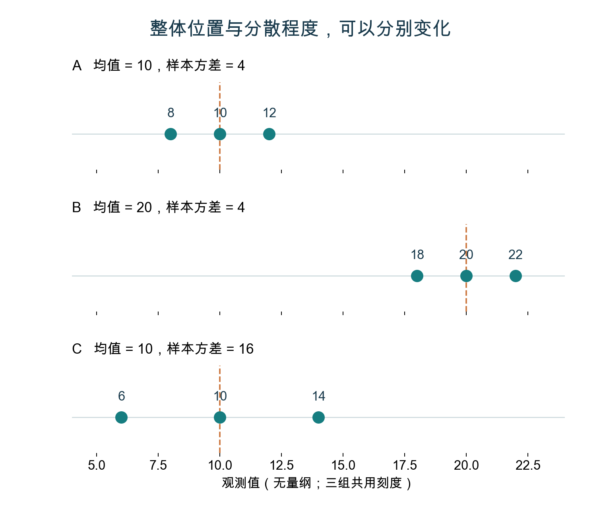
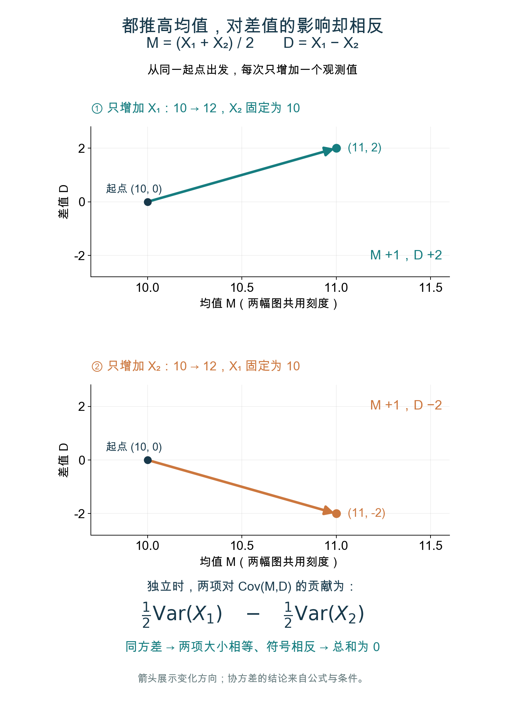
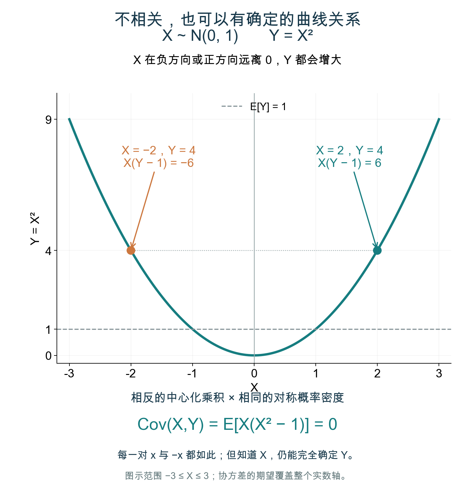
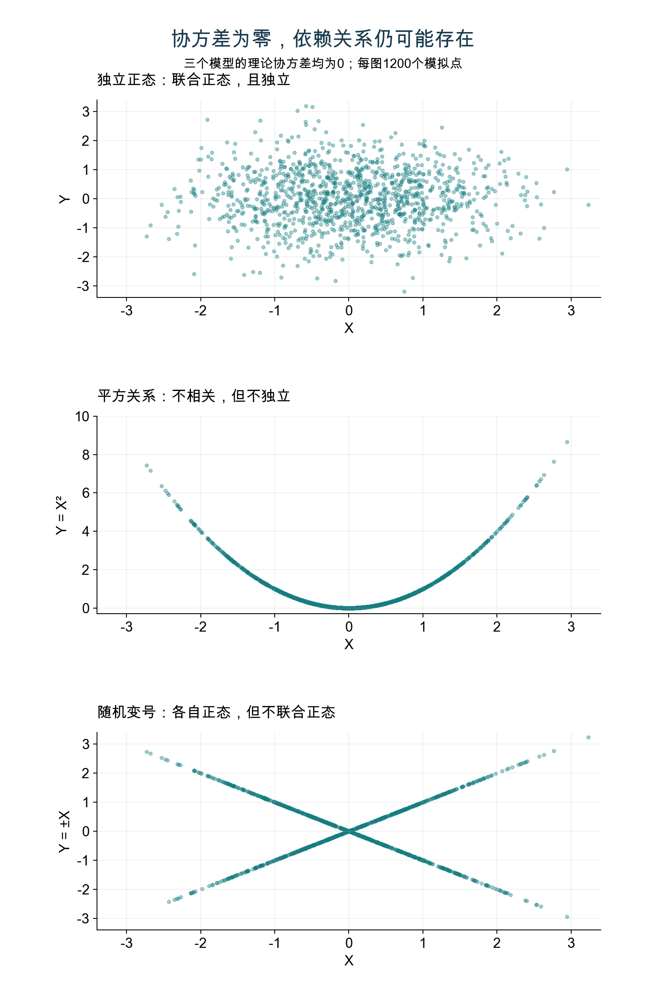

# 减去均值之后：为什么正态样本的均值与方差相互独立？

> 明哥的微生物世界 · 统计课堂 08
>
> 摘要：从方差公式里一步“减去均值”说起，分清计算上的先后顺序和统计上的独立性；再往下追，看清楚协方差为什么会等于零，以及正态分布在这里究竟起了什么作用。

*封面｜沿用第5次医学统计学课程封面，已去除授课教师姓名。图中日期为课程日期。*

大家好，我是明哥。

讲 t 统计量的构造时，我们常说一句话：

> **来自同一个正态总体的独立同分布样本，其样本均值与样本方差相互独立。**

这句话听着顺，但对着方差公式看一眼，很容易卡住。

> 样本均值：X̄ = (X₁ + ⋯ + Xₙ) / n
>
> 样本方差：S² = Σ(Xᵢ − X̄)² / (n − 1)

Σ 表示把 n 项加起来。这里用的是分母为 n − 1 的样本方差，n 至少为 2。

**明明要先算均值，再用均值算方差，怎么还能说它们独立？**

沿着这个问题往下追，还会遇到两个疑问：

1. 为什么协方差会恰好等于零？
2. 为什么到了正态分布这里，“不相关”就能推出“独立”？

今天把这几步连起来。

## 一、“独立”要放到一次次抽样中理解

先固定一个正态总体，它的均值是 μ，方差是 σ² > 0。每次从中独立抽取 n 个观测值，样本量也保持不变。

第一次抽样，算出一对“均值、方差”；第二次抽样，又得到一对；如此重复下去。

我们说的“独立”，具体指的是**样本均值和样本方差在重复抽样中的分布关系**：

> **知道这一次抽样的均值是多少，不会改变这一次样本方差的概率分布。**

换句话说，如果只挑出“样本均值高于某个门槛”的那些样本，样本方差的条件分布仍然与筛选前相同。不会因为筛选了较高的均值，就系统性地偏大或偏小。

这里很容易混淆两个带“方差”的说法，先把它们分开：

> **样本均值的方差：**
>
> Var(X̄) = σ² / n。
>
> **样本方差的抽样分布：**
>
> (n − 1)S² / σ² ∼ χ²(n − 1)。

第一个式子说，样本均值在一次次抽样中有多大波动。第二个式子说，样本方差经过缩放后，服从自由度为 n − 1 的卡方分布。“∼”表示“服从……分布”。

**σ²/n 是样本均值的方差，不能把它当成样本方差的分布。** 上面筛选样本后保持不变的，是 S² 的整个分布，也就是第二个式子所描述的分布。

因此，仅仅看到“平均样本方差差不多”还不足以证明独立。有限次数的模拟会有随机差异；理论要求整个条件分布与原分布相同。

一份已经拿到手的数据，均值与方差都可以算成确定的数。只盯着这一次计算的先后顺序，很容易错过“独立”真正描述的抽样分布关系。

## 二、减去均值，是为了把整体位置消掉

先看三组人为构造的数据。

| 数据 | 样本均值 | 样本方差 |
| --- | --- | --- |
| 8、10、12 | 10 | 4 |
| 18、20、22 | 20 | 4 |
| 6、10、14 | 10 | 16 |

第一组整体加上10，就变成第二组。均值从10变成20，方差却没有变。

因为每个观测值增加10，均值也增加10，相减之后的偏差仍然是 −2、0、2。

第三组的均值仍然是10，但三个点离中心更远，方差就增大了。

**均值描述这组数据的整体位置；方差描述它们围绕自身中心有多分散。** 减去均值，正是在把位置消掉，留下围绕中心的偏差。

*图1｜三组人工教学数据使用同一条横轴。整体平移会改变均值，却不改变样本方差；围绕同一个中心展开，则可以改变方差。图中竖虚线表示各组均值。*

不过，这个例子只说明：**均值不能单独决定方差。它还没有证明二者统计独立。** 要走到独立，需要继续看抽样分布的性质。

## 三、只抽两个数，把方差公式拆开看

设 X₁、X₂ 相互独立，都来自 N(μ, σ²)。N 表示正态分布，括号里依次是总体均值和方差。

把这两个观测值换一种方式描述：

> 中点：M = (X₁ + X₂) / 2
>
> 两点之差：D = X₁ − X₂

M 就是样本均值。D 有正负，表示差的方向；它的绝对值表示两点之间的距离。

因为样本量 n = 2，方差公式里的分母 n − 1 等于1。再注意到：

> X₁ − M = D / 2
>
> X₂ − M = −D / 2

所以：

> S² = (D / 2)² + (−D / 2)²
>
> **S² = D² / 2。**

公式里原来出现的样本均值，化简后**消失了**。此时的样本方差，完全由两点之间的差决定。不过，符号消失本身还不构成独立性的证明。

因此，只要证明 M 与 D 独立，就能推出 M 与 D² / 2 独立，也就是样本均值与样本方差独立。

## 四、协方差为什么恰好等于零？

协方差记作 Cov，方差记作 Var。协方差的定义是：

> Cov(A, B) = E[(A − E[A])(B − E[B])]

E 表示期望，可以理解为相应随机量的理论平均值。两个变量经常一起高于各自均值、或者一起低于各自均值，乘积就倾向于为正；一个高、另一个低，乘积就倾向于为负。

从这个定义出发，利用乘法展开和期望的线性性质，可以得到：**常数可以提出，加减可以逐项展开。**

代入 M 和 D：

> Cov(M, D)
>
> = Cov((X₁ + X₂) / 2, X₁ − X₂)
>
> = ½ Cov(X₁ + X₂, X₁ − X₂)

再把最后一项展开成四项：

> = ½ [Cov(X₁, X₁) − Cov(X₁, X₂)
>
> 　　+ Cov(X₂, X₁) − Cov(X₂, X₂)]

一个变量与自身的协方差，就是它的方差；而 Cov(X₁, X₂) = Cov(X₂, X₁)，所以中间两项抵消。

于是：

> Cov(M, D) = ½ [Var(X₁) − Var(X₂)]
>
> = ½ (σ² − σ²)
>
> **= 0。**

这里可以停一下：中间两项相消用的是协方差的对称性，并不需要先把它们各自写成0。最后得到0，用的是 X₁、X₂ 方差相同。

直观上，在本例独立、同方差的条件下，X₁ 增大，会同时把 M 和 D 往上推；X₂ 增大，会把 M 往上推、把 D 往下拉。这两种相反的共同变化，在协方差中恰好抵消。

把这个方向画出来：先设 X₁ = X₂ = 10，此时 M = 10、D = 0。只把 X₁ 增加到 12，得到 M = 11、D = 2；回到同一起点，只把 X₂ 增加到 12，则得到 M = 11、D = −2。

*图2｜两幅图使用相同的坐标尺度。横轴是均值 M，纵轴是差值 D。只增加 X₁，箭头向右上；只增加 X₂，箭头向右下。数据是人工设置的变化示例，不是随机抽样结果，也不把两个箭头当作协方差的估计。*

为什么在本例中恰好抵消？独立时，X₁ 对协方差的贡献为 (½)×1×Var(X₁)，X₂ 的贡献为 (½)×(−1)×Var(X₂)，交叉项为 0。两者方差相同，贡献才会大小相等、符号相反。**图帮助我们看见方向，公式和条件解释为什么总和为 0。**

**算到这里，只证明了 M 与 D 不相关。正态假设还没有真正上场。**

## 五、不相关，为什么还不能直接说独立？

看一个简单的反例：

> X ∼ N(0, 1)，Y = X²。

知道 X，就能完全确定这个会随 X 改变的 Y，所以它们不独立。但它们的协方差却等于 0。

这一步用到协方差的另一个常用表达式：

> Cov(A, B) = E[AB] − E[A]E[B]。

**它是不是很像方差的计算公式？两者确实来自同一种展开。**

把协方差定义中的乘积展开：

> Cov(A, B) = E[(A − E[A])(B − E[B])]
>
> = E[AB − A·E[B] − E[A]·B + E[A]E[B]]。

E[A]、E[B] 是确定的数，可以从期望符号中提出。因此：

> Cov(A, B)
>
> = E[AB] − E[A]E[B] − E[A]E[B]
>
> 　 + E[A]E[B]
>
> **= E[AB] − E[A]E[B]。**

最后三项是“减去两次，再加回一次”，所以合起来只减去一次 E[A]E[B]。

再令 B = A，一个变量与自身的协方差就变成了方差：

> Var(A) = Cov(A, A)
>
> **= E[A²] − (E[A])²。**

这就是熟悉的“平方的期望减去期望的平方”。协方差把其中的“自身平方”推广成“两个变量的乘积”：E[A²] 对应 E[AB]，(E[A])² 对应 E[A]E[B]。

这里是随机变量的理论公式，要求相应二阶矩有限，不需要正态或独立假设。**E[A²] 与 (E[A])² 不要混淆：前者先平方再取期望，后者先取期望再平方。**

代入 Y = X²：

> Cov(X, Y) = E[X·X²] − E[X]E[X²]
>
> = E[X³] − E[X]E[X²]
>
> **= 0。**

原因是标准正态分布关于0对称，E[X] 和 E[X³] 都为0。

画出来就更容易理解：Y = X² 是一条抛物线。X 向正方向或负方向远离 0 时，Y 都会增大。协方差中的正负贡献抵消了，非线性关系却保留着。

*图3｜理论关系 Y = X²，设 X ∼ N(0,1)。X = −2 和 X = 2 都对应 Y = 4。由于 E[X] = 0、E[Y] = 1，协方差定义中的中心化乘积 X(Y − 1) 在这两处分别为 −6 和 6。曲线是函数图，不是概率密度图，也不是模拟样本。*

这里不只是一对点恰好抵消。对任意 x，与它对称的 −x 都对应相同的 x²；中心化乘积 x(x² − 1) 则符号相反。标准正态分布在这两个对称位置的概率密度相同，所以对整个实数轴取加权积分时，正负贡献相互抵消。

**相互抵消的是协方差中的贡献，Y = X² 这条确定关系并没有消失。**

**独立**要求知道一个变量后，另一个变量的分布不变；**不相关**仅仅说协方差为零。在二阶矩存在时，独立可以推出不相关，反方向一般不成立。

## 六、各自正态，也不等于联合正态

读到这里，很自然会接着问：M 和 D 都是正态变量，为什么就能把“不相关”升级成“独立”？

这句话里还缺少一个关键条件：**M 和 D 联合服从正态分布。**

“各自正态”只交代分别观察两个变量时的分布。“联合正态”还约束它们**一起变化的方式**：任意常数 a、b 构成的 aX + bY 都服从正态分布，允许方差为零的退化情形，也就是某些组合取固定值。

各自正态并不足够。设 X 是标准正态变量，再独立抛一枚公平硬币：正面时令 Y = X，反面时令 Y = −X。

由于正态分布对称，Y 仍然服从标准正态分布。两者的协方差也是0，因为正、反两种情形的贡献抵消。

但它们**不独立**：无论硬币怎样，始终有 |Y| = |X|。知道 X 的绝对值，就知道 Y 的绝对值。

它们也**不联合正态**。比如 X + Y，有一半的概率恰好为 0，另一半随 2X 变化。它既不是连续的正态变量，也不是一个固定值，因此不满足联合正态的定义。

*图4｜三个模型的理论协方差都为0。上图为两个独立标准正态变量；中图为 X ∼ N(0,1)、Y = X²；下图为 X ∼ N(0,1)、Y 随独立公平硬币取 X 或 −X。只有上图相互独立且联合正态。每幅图显示模型模拟的1200对观测值，有限样本的协方差不必恰好为0。坐标范围有所截断，中图纵轴与其余两图不同；图形帮助理解，证明仍依靠模型性质。*

回到本文的 X₁、X₂。我们一开始就假设它们独立且正态。**独立正态变量的任意线性组合仍然正态**，因此 X₁、X₂ 联合正态。

M 和 D 也满足这个条件，因为对任意 a、b：

> aM + bD
>
> = (a / 2 + b)X₁ + (a / 2 − b)X₂。

右边仍然是独立正态变量的线性组合，所以是正态变量。这样才证明了 M、D 联合正态。

这里没有预先假设 M 和 D 独立；用到的是原始观测值 X₁、X₂ 独立，因此不是循环论证。联合正态的定义和随机变号反例，可参阅在线教材：https://www.probabilitycourse.com/chapter5/5_3_2_bivariate_normal_dist.php

## 七、联合正态为什么能让“不相关”推出“独立”？

这一步可以直接从密度公式看出来。不必记住整个公式，只关注它什么时候能拆成两部分。

把一对联合正态变量分别标准化，记作 U、V。它们的均值都为0，方差都为1，相关系数记作 ρ。对于 |ρ| < 1，联合密度为：

> f(u,v) = [1 / (2π√(1 − ρ²))]
>
> × exp{−(u² − 2ρuv + v²) / [2(1 − ρ²)]}。

这里 exp 表示以 e 为底的指数函数；u、v 是两个变量可能的取值；密度要对区域积分，才能得到落入该区域的概率。

当协方差为0时，ρ = 0。把它代进去，连接 u 和 v 的交叉项 −2ρuv 消失，密度变成：

> f(u,v) = [1 / (2π)] × exp[−(u² + v²) / 2]
>
> = {exp(−u² / 2) / √(2π)}
>
> 　 × {exp(−v² / 2) / √(2π)}
>
> **= fᵤ(u) × fᵥ(v)。**

前一部分只含 u，后一部分只含 v，恰好分别是两个标准正态变量的密度。

**联合密度等于两个边缘密度的乘积，正是独立的判定条件。** 对任意两个区间积分，就得到“同时落入两个区间的概率，等于各自落入区间的概率之积”。

现在可以看到正态假设的作用了：在联合正态这个分布家族里，零协方差足以让联合密度拆开；一般分布没有这样的保证。相关证明见：https://statproofbook.github.io/P/mvn-ind.html

于是，我们终于把两个数的例子接通了：

> M、D 联合正态，且 Cov(M,D) = 0
>
> → M 与 D 独立
>
> → M 与 D² / 2 独立
>
> → 样本均值与样本方差独立。

注意，**样本方差本身不服从正态分布**。这里应用“联合正态且不相关”的对象是 M 和 D，然后才把结论传递给 D 的平方。

## 八、样本量增加以后，这个道理还能成立吗？

可以。对 n 个独立同分布的正态观测值，把每个观测值减去样本均值，记作偏差 Rᵢ = Xᵢ − X̄。

因为观测值彼此独立且方差相同：

> Cov(X̄, Xᵢ) = σ² / n
>
> Var(X̄) = σ² / n。

第一式来自均值的 n 项中，只有 Xᵢ 与自身贡献方差，其他协方差都为0。因此：

> Cov(X̄, Rᵢ)
>
> = Cov(X̄, Xᵢ) − Var(X̄)
>
> = 0。

样本均值和整个偏差向量都是原始正态样本的线性变换，联合正态。均值与每个偏差的协方差都为0，因而均值与**整个偏差向量**独立。

样本方差完全由这些偏差的平方和计算出来，自然也与均值独立。这里用的是联合正态向量的性质；一般情况下，不能只凭一个变量与其他变量分别独立，就断定它与整个向量独立。

偏差之间倒没有彼此独立，因为它们相加必须为0。这是另一个关系，不妨碍样本均值与整个偏差向量独立。

## 九、这正是 t 统计量需要的那块拼图

回到开头。对于来自同一个正态总体的独立同分布样本，有：

> Z = (X̄ − μ) / (σ / √n)，服从标准正态分布；
>
> Q = (n − 1)S² / σ²，服从自由度为 n − 1 的卡方分布。

由于样本均值与样本方差独立，Z 和 Q 也独立。于是：

> T = Z / √[Q / (n − 1)]
>
> = (X̄ − μ) / (S / √n)
>
> **服从自由度为 n − 1 的 t 分布。**

分子表示样本均值偏离总体均值多少；分母 S / √n 是用样本标准差 S 估计的均值标准误。检验总体均值时，用假设值 μ₀ 替换 μ，在原假设成立时得到上述 t 分布。

正态样本的均值、方差及相应抽样分布，可参阅宾州州立大学课程第26课：https://online.stat.psu.edu/stat414/Lesson26

用独立的标准正态变量和卡方变量构造 t 分布，亦见 R 官方说明：https://stat.ethz.ch/R-manual/R-devel/library/stats/html/TDist.html

**这套条件给出的是有限样本下的精确 t 分布。** 非正态总体中，不能直接照搬“样本均值与样本方差独立”；适当条件下的大样本近似，是另一条推理路径。

## 十、自己算一遍：先核对，再改动

和前面的统计课堂一样，这次准备了 R、Python 和 MATLAB 三套脚本。用自己熟悉的一种跑通即可，它们读取同一份共享数据，方便对照结果。

先核对三组人工数据的均值与方差，再计算 M、D，验证协方差展开式和 S² = D² / 2。随后比较两种总体：

- 正态总体 N(10,4)。
- “8 加上一个均值为 2 的指数变量”。

两者的总体均值都为 10、方差都为 4，但分布形状不同。

每种模型重复抽样20,000次，每次取10个独立观测。本次固定种子模拟中，按样本均值筛选后，得到下面的结果：

| 总体模型 | 全部样本的平均S² | X̄ < 9.5时的平均S² | X̄ > 10.5时的平均S² |
| --- | --- | --- | --- |
| 正态 | 4.011 | 3.995 | 4.036 |
| 平移后的指数 | 4.004 | 1.419 | 8.047 |

这里“平均 S²”是许多份样本各自算出方差后，再对这些方差取平均，**不能**把所有观测混起来计算一个方差。

正态模型的三个数相近；指数模型中，筛出均值较大的样本时，平均样本方差也明显增大。**这展示了条件的作用，但几个平均数相近不足以证明独立。** 完整脚本还保存了条件分位数、每次抽样的统计量和模拟误差说明。

第一次运行，核对上表；第二次，把筛选门槛从9.5、10.5改为9、11，观察入选样本数和结果波动。图2可以改动单个观测值，检查箭头终点；图3可以核对 x 与 −x 的中心化乘积；图4的三种模型也可以逐个画出来，对照它们的理论关系。

- R / RStudio：打开“均值与方差的独立性.Rproj”，运行“代码/mean_variance.R”。
- Python / Spyder：把本篇目录打开为项目，运行“代码/mean_variance.py”。
- MATLAB：把当前文件夹切到本篇目录，运行“代码/mean_variance.m”。

安装、字段含义和结果文件的位置都写在项目 README 中。三套脚本均包含计算与配图；重新生成共享模拟数据的 Python 脚本也一并提供。

本篇完整项目：https://github.com/fuyuming/statistics-classroom/tree/main/stats_classroom/article08_mean_variance_independence

全仓库 ZIP：https://github.com/fuyuming/statistics-classroom/archive/refs/heads/main.zip

下载并完整解压后，进入 stats_classroom/article08_mean_variance_independence 文件夹。请保留数据、代码与配套绘图文件的目录关系。

最后回到最初的疑问：算方差时，当然用到了样本均值，但减去它是为了找到围绕中心的偏差。统计上的独立，要看这些量在重复抽样中怎样一起变化。

> **在独立同分布的正态样本中，知道样本中心在哪里，并不会改变它围绕自身中心有多分散的概率分布。**

这里是“明哥的微生物世界”。下次看到“均值与方差独立”，希望我们能同时想起它的抽样情境、正态条件，以及公式里那一步“减去均值”的作用。

---

*本文数值例子与四张统计配图均用于教学，不包含真实观测数据。图1、图2为人工构造数据，图3为理论函数曲线，图4为指定模型的模拟结果；封皮沿用课程封面。*
